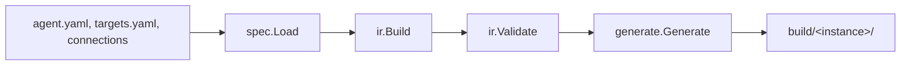

# Contributing a target

This guide is for anyone adding a new target, or changing what an existing one does. A target is the
driver that turns one authored package into a project one orchestrator runs. This repository ships four
today: `livekit`, `pipecat`, `slng` and `twilio`. The freshest worked example is the in-progress
`twilio` target (Twilio ConversationRelay), and this guide points at its real files throughout. Read
[CLAUDE.md](CLAUDE.md), [CONTRIBUTING.md](CONTRIBUTING.md) and
[docs/ARCHITECTURE.md](docs/ARCHITECTURE.md) first. This page goes one level deeper into the code a
target contribution actually touches.

## What it does

A target contribution adds or changes one driver: what it can do, what it refuses, what it writes to
disk, and what a person still has to do by hand. It never changes what an author writes in `agent.yaml`.
The authoring surface is shared across every target on purpose, so a package still means the same thing
after a fourth or fifth target ships.

## The pipeline

Every target goes through the same four stages. A target cannot skip one, or interpret a package
differently from another target.



1. **`spec.Load`** reads the authoring files. `internal/spec` holds the Go structs that are the schema
   of that surface. Strict decoding rejects any field it does not know.
2. **`ir.Build`** resolves names, bindings and routes into one target-independent tree, owned by
   `internal/ir`.
3. **`ir.Validate`** checks that tree against the target's capability table in `internal/target`, the
   one rulebook every target reads.
4. **`generate.Generate`** validates again, then dispatches to exactly one driver in
   `internal/generate`, which writes the native project into `build/<target-instance>/`.

Nothing runs a package after that: the generated project carries no Unmute dependency and runs on its
own. `internal/cli` is the only layer that talks to accounts or the network (`unmute deploy`, `unmute
pull`). Everything upstream of it is offline.

## Words that mean different things

Four words get used loosely elsewhere and have to stay precise here.

- **Target.** The driver that owns one output shape: `livekit`, `pipecat`, `slng`, `twilio`. Declared in
  `targets.yaml` as `provider:`.
- **Model vendor.** Who serves a model a role binds: `openai`, `google`, `deepgram`, `elevenlabs`.
  Declared under `models:` and looked up in the provider catalogue, never in the target list.
- **Carrier or transport.** How a phone call reaches the agent: a SIP trunk, a media WebSocket,
  ConversationRelay. Declared in `connections/*.yaml` as `carrier:` and `transport:`, never on the
  target.
- **Compute host.** Who runs the process: the author's own machine or container for `livekit`, `pipecat`
  and `twilio`, SLNG's own infrastructure for `slng`.

`twilio` is confusing because it is two of these at once. It is a **target** (`provider: twilio`, its
own driver, its own rows in [internal/target/table.go](internal/target/table.go)), and also a
**carrier** on the `livekit` and `pipecat` routes (`carrier: twilio` in a connection file, where the
model vendors and the compute host are whatever that package binds). The `Providers` list and the
`Retired` map in `table.go` state the split directly: `deepgram` was retired as a *target* (never
emitted a runnable project) and remains a fine model *vendor*, for example `slng/deepgram/nova:3-en`.
Every diagnostic the twilio target prints opens with the words `twilio target`, so a reader can tell a
target refusal from a carrier fact. The route key [`TelephonyKey`](internal/target/telephony.go) carries
all three ideas at once: `Provider`, `Transport`, `Carrier`.

## Two kinds of target: code and body

Not every target emits a Python project. [internal/generate/artifact.go](internal/generate/artifact.go)
defines `ArtifactKind`:

- `CodeTarget`: a runnable project, Python plus a Dockerfile plus a runbook.
- `BodyTarget`: a deployment body for a platform that runs the agent itself, nothing to run locally.

`artifactKind()` maps `livekit`, `pipecat` and `twilio` to `CodeTarget`, and `slng` to `BodyTarget`.

Two further questions sit in [internal/target/table.go](internal/target/table.go):

- **`IsCode(provider)`**: is this a framework code target, with a version to pin and a support window?
  True for `livekit` and `pipecat` only.
- **`EmitsProject(provider)`**: does this driver write something a person can run, pin and version at
  all? True for `livekit`, `pipecat` and `twilio`.

Twilio is `EmitsProject: true`, `IsCode: false`. It emits a real project (an `aiohttp` app, a
`Dockerfile`, a `pyproject.toml`), so `EmitsProject` says yes. It runs on no framework, so `IsCode` says
no: no LiveKit Agents or Pipecat version, no support window, no per-target `pins:`. This ripples through
the tree: [internal/target/pace_test.go](internal/target/pace_test.go) used to branch on `EmitsProject`
and had to move to `IsCode` when twilio landed, because a pace setting needs a turn-taking model and
twilio's turn is decided by ConversationRelay.

A provider joins `Providers` only once its driver owns its whole output. `vapi` and `deepgram` sat there
for a while, validating cleanly and then failing at `compile` with "driver is not implemented", which
taught an author nothing until the last step.

## The capability table says yes, no or warn

`internal/target/table.go` is the one rulebook every stage reads. A `Capability` is a `Tag` (`Core`,
`Warn`, `Gated`, `Provisional`) plus a `Note`.

`Table.Fields` is seeded by `field()`, which only seeds providers where `IsCode(provider)` is true.
`slng` and `twilio` are deliberately left unseeded, so every row for them is written by hand: `slng`'s
sit inline in the big `field(...)` calls through `Default()`, and `twilio`'s all live in one function,
[`twilioFields()`](internal/target/twilio_target.go), merged in by `addTwilio(t Table)`.

This is enforced. `TestDefaultTableIsCompleteAndTyped`
([internal/target/table_test.go](internal/target/table_test.go)) fails if any row for any provider in
`Providers` has no tag, which is what a new `Field` constant does the moment one target's answer is
missing. `TestTwilioRowsAreDeliberate` checks the mechanism directly: that `field()` really leaves
twilio unseeded, and that every field has an entry in `twilioFields()`. `TestSlngRowsAreDeliberate` does
the same for slng.

A `Gated` row must say why and what to do instead: both agreement tests check that a note starts with
`"<target> target"` and names an alternative after a final `": "`. Twilio's notes are written by
`twilioOnlyOne`, `twilioSpeech` and `twilioNoTool` in the same file.

`Warn` is rationed: `TestDefaultTableIsCompleteAndTyped` fails if more than one row across the whole
table carries it, because a warning prints on every compile of an otherwise-correct package. Today's one
warn row is `FieldToolInterruption` on LiveKit.

`Table.Roles`, `Table.History`, `Table.Controls` and `Table.FallbackSlots` are the other provider-keyed
structures. `TestEveryProviderHasAFallbackSlot` holds the fallback slots, and
`TestSlngRowsAreDeliberate` holds Roles and History for every provider, both in
[internal/target/table_test.go](internal/target/table_test.go). A new target answers every one, or the
matching test fails.

## The provider catalogue

Model vendors live in `internal/target/catalog.go` plus one file per framework:
[catalog_pipecat.go](internal/target/catalog_pipecat.go),
[catalog_livekit.go](internal/target/catalog_livekit.go), and
[catalog_twilio.go](internal/target/catalog_twilio.go). Each `Entry` is one (framework, role, vendor)
triple: how to install it, how to import it, and the constructor shape a template fills in (`CallSpec`).

Twilio's listen and speak rows describe no Python code: ConversationRelay does that speech on Twilio's
side, so the "constructor" is the `<ConversationRelay>` TwiML noun and each `FieldSpec.Arg` is a TwiML
attribute (`speechModel`, `ttsProvider`). The think rows are real SDK calls, `AsyncOpenAI` or
`genai.Client`.

Every entry needs a `Verified` date and a `Docs` URL, or `TestCatalogInvariants`
([internal/target/catalog_test.go](internal/target/catalog_test.go)) fails. Catalogue resolution is
pinned as a golden file,
[internal/generate/testdata/golden/catalog_resolution.txt](internal/generate/testdata/golden/catalog_resolution.txt).
Regenerate it rather than hand-editing:

```sh
go test ./internal/generate -run TestCatalogResolutionGolden -update-catalog
```

## Framework versions vs your own pins

`livekit` and `pipecat` each support exactly one exact framework version at a time: `supportWindows` in
[internal/target/driver.go](internal/target/driver.go), read by `CheckVersion`. Raising the ceiling is a
deliberate, verified bump, described in the comment beside each row.

Twilio has neither a version nor a support window, because it targets no framework.
`TestSupportWindowsAreWellFormed` and `TestEveryShippedDriverHasAWindow`
([internal/target/versions_test.go](internal/target/versions_test.go)) only check `LiveKit` and
`Pipecat`, and `TestTwilioRowsAreDeliberate` asserts the negative directly: `Window(Twilio)` returns `ok
== false`.

What twilio has instead is [`TwilioPins`](internal/target/twilio_target.go): an internal, exact pin list
(`aiohttp`, `google-genai`, `openai`, `pydantic`, `twilio`) baked into the driver, which a package
cannot move. [internal/ir/validate_twilio.go](internal/ir/validate_twilio.go)'s
`validateTwilioTargetValues` refuses `version:` and `pins:` on this target by name. LiveKit's
`PinFloors` is a different thing again: a per-*plugin* floor an author may raise above, which twilio has
no equivalent of, since it installs nothing per plugin.

## Schemas come from Go structs

`internal/spec` derives the authoring (unresolved) JSON Schema straight from its own Go structs.
`internal/ir/schema.go` does the same for the resolved schema. **Nobody hand-writes a `.json` schema
file.** Adding `twilio` as a legal `provider:` value was a one-line change to `enumOptions()` in
`schema.go`, held to `TestProviderEnumMatchesTargetSet` so the enum cannot drift from
`internal/target.Providers`.

**A new authored field is a list, never a Go map**, with one permanent exception for JSON-Schema-shaped
fields (`input:`, `output:`, `params:`) and a shrinking debt allowlist for the rest.
[internal/spec/no_dictionaries_test.go](internal/spec/no_dictionaries_test.go)'s
`TestNoNewDictionaryInTheAuthoringSurface` walks every field under `spec.Package` and `spec.Manifest`
and fails on an unlisted map. Twilio added no authored field: its turn settings ride the existing
`params:` of a `models.turn` entry, so this test needed no change.

**Diagnostics point at the source where they can.** `internal/ir/build.go` uses `pkg.Location(...)` and
`pkg.KeyLocation(...)` to attach a file and line to a build error. `ir.Validate` works on the resolved
tree, so a target refusal there, such as those in `internal/ir/validate_twilio.go`, carries no line.
It opens with the target's name and says what to write instead.

## Share code, don't duplicate it

A new target reuses driver-shared Go wherever the shape is the same, and writes its own template only
where the target is genuinely different. `envRef`, `pyQuote` and the `primitiveTypes` table in
[internal/generate/artifact.go](internal/generate/artifact.go) are used by every Python-emitting driver.
[`googleVertexClient`](internal/generate/google.go) is one string constant of Python, written once for
the LiveKit and Pipecat drivers, and reused verbatim by `buildTwilioData` in
[internal/generate/twilio_v1.go](internal/generate/twilio_v1.go) when a binding sets `vertexai: true`.
Nobody re-derived the Vertex host logic for the third target. Each driver's Python and text templates
are embedded with `//go:embed` and rendered through `text/template`
([internal/generate/templates/twilio_v1/](internal/generate/templates/twilio_v1/), loaded by
`twilio_v1.go`'s `twilioTemplates`).

Templates can call a Go method or field that no longer exists, and nothing in `go vet`, `golangci-lint`
or `deadcode` catches it: `template.Execute`'s reflection is invisible to static analysis. This is a
real failure mode: an over-engineering pass once flagged six scaffold methods as dead code, and all six
were called only from `agent.yaml.tmpl`. The gate is
[internal/scaffold/template_symbols_test.go](internal/scaffold/template_symbols_test.go)'s
`TestTemplatesOnlyCallSymbolsThatExist`, which checks every capitalised name in every template action
against a real Go declaration in the tree.

## Telephony: transport, environment, and no writes to the carrier

Every telephony route, across every provider, is one entry in
[`TelephonyRoutes()`](internal/target/telephony.go), keyed by `TelephonyKey{Provider, Transport,
Carrier}`. A `TelephonyRoute` states its `Features` (`inbound`, `outbound`, `cold_transfer`, `source.*`
call-context facts, each tagged with a note, docs link and date), its `RequiredEnvironment` /
`OptionalEnvironment`, its `Processes` and `PublicEndpoints` (what the operator runs and exposes), and
its `ManualSteps` (what it cannot automate, in the operator's own words). Twilio's route runs one
`application` process, exposing `/voice`, `/conversation`, `/connect-action` and `/healthz`.

**`DeployOnlyEnvironment`** names connection keys only a deploy step reads, never the running app.
Twilio's `phone_number_sid` is the example: it points a number at the app, and `app.py` never reads it.
`buildTelephonyPlan` ([internal/ir/build.go](internal/ir/build.go)) splits a connection's environment
into `RequiredEnvironment` and `DeployEnvironment` from this list, and the twilio template writes the
second group into `.env.example` under its own "Deploy only" comment. Connection environment values are
**names of environment variables, never secrets**: `connections/*.yaml` writes `account_sid:
TWILIO_ACCOUNT_SID`, and the compiled app reads `os.environ["TWILIO_ACCOUNT_SID"]` at start-up.

`buildTelephonyPlan` also decides a route's coordination shape. Twilio sets `services =
[]string{"application"}` and `coordination = "in_process"`: one process and no Redis, because the
whole call and its admission counter fit in one process. `validateTelephonyPlan` in
[internal/ir/validate.go](internal/ir/validate.go) accepts `in_process` on the twilio route only.

**Signature validation checks a configured public origin, never forwarded request headers.** `app.py`
checks every request with Twilio's own `RequestValidator` against the exact URL Twilio was told to call
(`os.environ[ENV_PUBLIC_URL]` plus the request's own path and query), never against `X-Forwarded-*`
headers a proxy could rewrite. See `signed()` in
[app.py.tmpl](internal/generate/templates/twilio_v1/app.py.tmpl).

**This repository does not write to a carrier account without an explicit command.** `slng` is the only
target `unmute deploy` pushes to. `livekit` and `pipecat` are compiled with `unmute compile` and
deployed by that platform's own tool. `twilio` is compiled with `unmute compile` and hosted by the
author, and nobody's number, trunk or webhook is touched. See `noSlngTargetGuidance` in
[internal/cli/deploy.go](internal/cli/deploy.go).

## Getting authors onto the target

`unmute init` writes a package through `internal/scaffold`.
[`Data.SetTarget(provider)`](internal/scaffold/scaffold.go) resets every target-dependent field, and
twilio's branch returns early with its own starter: one phone channel, bindings measured for this
target, no framework version or pins. `Preflight(data)` then runs the real compiler against the
scaffolded files before `unmute init` writes anything.
[internal/scaffold/twilio_preflight_test.go](internal/scaffold/twilio_preflight_test.go)'s
`TestTwilioScaffoldPassesPreflight` holds this for twilio.

The console (`internal/tui`) discovers targets from `targetcap.Providers` rather than naming them
(`orderTargets` reads the list, while `targetLabel` and the menu labels name each target, and
`advancedTargetFields` offers framework fields only where `IsCode` is true).
[internal/tui/default_target_test.go](internal/tui/default_target_test.go)'s
`TestConsoleOffersNothingValidateRefuses` holds one sentence: the console may hide an option the table
refuses, it may never offer one the table refuses.

`unmute dev` refuses twilio by name, in `runDevWeb`
([internal/cli/dev_web.go](internal/cli/dev_web.go)): Twilio listens and speaks on its own
infrastructure and reaches only a public HTTPS origin, so a browser loop would test something the target
never does. The refusal names the fix: compile, then follow the README to host it.

## Four places to update when behaviour changes

A change to what a target emits, accepts or refuses updates four surfaces in the same commit, each with
its own gate:

1. The emitted README template ([README.md.tmpl](internal/generate/templates/twilio_v1/README.md.tmpl)).
   On a telephony route it must carry the route's manual steps word for word, held by
   `TestTelephonyManualStepsSurviveIntoTheRunbook`
   ([internal/generate/telephony_agreement_test.go](internal/generate/telephony_agreement_test.go)).
   Pages, skill references and example READMEs are also refused if they quote CLI output that is gone,
   by [internal/docsite/retired_output_test.go](internal/docsite/retired_output_test.go).
2. The source example's `README.md` under `examples/`, or the acceptance package under
   `internal/voice-agents-tests/` for one not reader-facing.
   [internal/generate/examples_test.go](internal/generate/examples_test.go)'s
   `TestPublicExamplePackages` holds the exact, hardcoded list of directories under `examples/`: a new
   public example joins that list on purpose.
3. The matching page under `docs-site/`, checked against framework versions by
   [internal/target/providers_docsite_test.go](internal/target/providers_docsite_test.go)
   (`TestTargetVersionDocsiteMatchesWindows`) and against telephony facts by
   [internal/target/telephony_docs_test.go](internal/target/telephony_docs_test.go).
4. The shipped skill, `internal/skill/assets/`, whose facts are held by
   [internal/skill/agreement_test.go](internal/skill/agreement_test.go) and whose named commands are
   held by [internal/cli/skill_bundle_test.go](internal/cli/skill_bundle_test.go)
   (`TestSkillBundleNamesRealCommands`).

Twilio's four are [README.md.tmpl](internal/generate/templates/twilio_v1/README.md.tmpl), the
acceptance package's [README](internal/voice-agents-tests/relay-desk/README.md),
[docs-site/targets/twilio.mdx](docs-site/targets/twilio.mdx), and the "The twilio target" section of
[internal/skill/assets/references/package.md](internal/skill/assets/references/package.md).

## Proving it works

Evidence levels are distinct, and a change should say which one it has:

- **L1 to L3** are `make test`: unit tests, in-process command tests, and byte-pinned golden files.
  Offline, zero Python, zero network. Twilio's own live in
  [internal/generate/twilio_v1_test.go](internal/generate/twilio_v1_test.go) (`TestTwilioGolden`,
  `TestTwilioTwiMLTemplate`) and
  [internal/ir/validate_twilio_test.go](internal/ir/validate_twilio_test.go)
  (`TestTwilioBaselineValidatesClean`).
- **L4 smoke** (`make smoke`, build tag `smoke`) proves the emitted Python imports and runs against real
  provider SDKs. Opt-in, needs Python, never in the default suite or the pull request gate.
- **Real-model text scripts** drive the compiled agent through a scripted text conversation, no audio,
  no phone: [scripts/text_run_livekit.py](scripts/text_run_livekit.py),
  [scripts/text_run_pipecat.py](scripts/text_run_pipecat.py), and twilio's own
  [scripts/text_run_twilio.py](scripts/text_run_twilio.py), with `--fake` (an in-process signed fake
  ConversationRelay client, offline and deterministic) and `--real` (the real model and key, still no
  real call).
- **Coval runs** are advisory: `make sim TEST_SET=<id>`. Twilio has no Coval test set yet, so say so
  rather than report an untested route as passing.
- **Real carrier acceptance on a deployed agent** is the only thing that proves a phone call works, and
  nothing local stands in for it (see [docs/ARCHITECTURE.md](docs/ARCHITECTURE.md), "Where a phone call
  is exercised"). No real Twilio call has been placed through this target: its compile report says so in
  its own `evidence` field, "real Twilio call: none yet" (`twilioReport` in
  [internal/generate/twilio_v1.go](internal/generate/twilio_v1.go)). Do not describe a call that was not
  made.

## Official docs and who owns what

Link the primary source beside each integration point, not a summary of it, and know which side of the
line a fact sits on. Twilio's driver keeps its source pages in one place,
[`TwilioDocs`](internal/target/twilio_target.go): ConversationRelay, WebSocket messages, webhook
security, `<Connect>`, `<Hangup>`, onboarding, and phone numbers, each a real `twilio.com/docs` URL, and
the emitted README links the same URLs back to the author. ConversationRelay does the speech-to-text,
the text-to-speech and the turn taking. This app owns everything past that: conversation history, tool
execution, and admission (how many calls run at once). Getting this backwards means reimplementing
something the carrier already handles, or refusing a feature it already handles.

Build the smallest complete vertical slice first (advisory). Twilio's first release is deliberately
narrow: one agent, one phone channel, two think vendors, local tools plus one builtin, complete at that
size rather than a wide surface with half of it unverified.

## Twilio, exactly as implemented

Read from [internal/target/twilio_target.go](internal/target/twilio_target.go),
[internal/ir/validate_twilio.go](internal/ir/validate_twilio.go),
[internal/generate/twilio_v1.go](internal/generate/twilio_v1.go) and
[internal/generate/templates/twilio_v1/](internal/generate/templates/twilio_v1/). No real Twilio call
has been made against it.

- **One cascade agent.** `architecture: cascade` only, one entry in `agents:`. `ir.validateTwilioTarget`
  refuses a second agent, any `controls:`, `variables:` or `shapes:`: no second agent or task exists to
  hand state to.
- **One inbound phone channel.** Kind `telephony`, `inbound: true`, `outbound: false`
  (`validateTwilioChannels`).
- **Speech is ConversationRelay's job.** Listen, speak and turn taking become attributes on one
  `<ConversationRelay>` element (`twilioRelayXML`). A `models.turn` entry carries settings only
  (`speechTimeout`, `interruptSensitivity`, `ignoreBackchannel`, checked by `CheckTwilioTurnParam`). A
  turn model, placement, endpointing delay or pace is refused by name (`validateTwilioSpeech`).
- **Thinking is one HTTP call.** OpenAI Chat Completions (`AsyncOpenAI`) or native Gemini
  `generateContent` (`genai.Client`, including Vertex AI), chosen by the bound vendor.
  `validateTwilioThink` refuses a request parameter the app's request shape does not have.
- **Tools are local handlers, plus one builtin.** `execution: local` and `execution: builtin`
  (`end_call`) only, everything else refused by name. A local tool's schema must be a flat object of
  primitive fields (`flatSchemaProblems`): the app validates with a generated Pydantic model and has no
  general JSON Schema engine.
- **One process, bounded call slots.** `capacity.max_sessions` becomes `MAX_SESSIONS` in `app.py`, one
  process, one replica.
- **Manual hosting, no account writes.** The author hosts the app behind HTTPS, sets `public_url`, and
  points the number at `/voice` themselves. `phone_number_sid` is deploy-only, never read by the app.
- **`unmute dev` refuses it.** Twilio only reaches a public origin, so there is no local browser loop to
  serve.

The acceptance package is
[internal/voice-agents-tests/relay-desk](internal/voice-agents-tests/relay-desk): one agent, one phone
channel, one read-only local tool (`opening_hours`) plus `end_call`, and two target instances
(`twilio-openai` and `twilio-gemini`, the latter on Vertex AI in `eu`). It is not a public example. It
is what this repository dials against to prove the target's whole first-release surface, held to one
bar: it validates and generates on every target it declares.

## A short checklist for a new target (advisory)

This is guidance, not a gate. Nothing here is checked beyond what is already cited above.

1. Decide `ArtifactKind`, `IsCode` and `EmitsProject` first. Every later stage assumes them.
2. Write every capability row by hand in one file, and let `TestDefaultTableIsCompleteAndTyped` and your
   own `TestYourTargetRowsAreDeliberate` find what you missed.
3. Add catalogue entries only for what the driver really calls, each with a `Verified` date and a `Docs`
   link.
4. Reuse driver-shared Go before writing a new template helper.
5. Add the telephony route, if it has one, with `DeployOnlyEnvironment` split out from
   `RequiredEnvironment` from the start.
6. Wire `scaffold.Data.SetTarget` and let `Preflight` prove the starter package compiles before writing
   a single doc page.
7. Update all four documentation surfaces in the same commit, and run `make test` to find the ones
   missed.
8. Write the acceptance package under `internal/voice-agents-tests/` first, and be honest about the
   evidence: offline tests, a smoke run, a text-harness call and a real carrier call are four different
   things.
