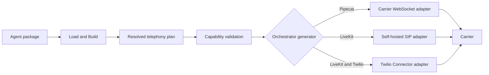
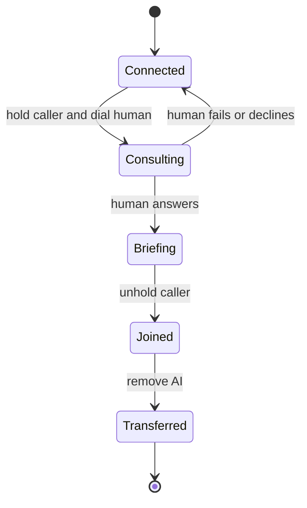

# Telephony architecture and implementation plan

Status: Proposed. Updated July 20, 2026.

Unmute must share telephony intent, planning, and call context across
orchestrators while keeping carrier media and call-control behavior in small,
carrier-specific adapters. This design supports local and self-hosted
deployments for Pipecat and LiveKit without requiring Pipecat Cloud or LiveKit
Cloud. It also scales from Twilio to Telnyx, Plivo, and Exotel without building
a new media gateway.

<!-- prettier-ignore -->
> [!NOTE]
> This design requires amendments to the locked v1 schema before implementation.
> Until those amendments land, this file is a plan, not a statement of current
> behavior.

## Decision

Unmute will share the control plane and leave the media plane with each
orchestrator's supported transport. The implementation follows these rules:

- Compile one resolved telephony plan before target generation.
- Keep carrier-specific webhook, metadata, outbound, and transfer behavior in
  carrier adapters.
- Reuse Pipecat's existing carrier serializers inside the Pipecat target only.
- Use self-hosted LiveKit SIP as the default multi-carrier LiveKit route.
- Treat LiveKit's Twilio Connector as an optional Twilio-only route while it is
  Beta.
- Run the same generated artifact locally and in production. Only the public
  URL and deployment environment change.
- Fail during validation when a carrier and route cannot provide a requested
  direction or control.
- Don't create a universal audio gateway or reimplement carrier serializers.

The provider seam is real because at least four carriers need separate
implementations. The media gateway is speculative and remains excluded.

## Scope

The first complete telephony implementation covers the behavior users need to
test and deploy phone agents.

### Goals

The implementation must provide the following behavior:

- Receive inbound calls.
- Start outbound calls.
- Hydrate call-start system variables.
- Hang up calls reliably.
- Perform cold human transfers where the selected route supports them.
- Perform warm human transfers where the selected route supports them.
- Detect voicemail for outbound calls where the selected route supports it.
- Run locally through a public tunnel.
- Run on customer infrastructure through public TLS ingress.
- Scale horizontally for ordinary calls and document the extra coordination
  required for warm transfers.
- Emit all Python code through Go `text/template` files.

### Non-goals

The first implementation deliberately excludes work that a carrier or
orchestrator already performs.

- Unmute does not provision phone numbers, carrier applications, or SIP trunks.
- Unmute does not proxy or transcode audio between Pipecat and LiveKit.
- Unmute does not provide a built-in tunnel client in the first release.
- Unmute does not promise the same transfer implementation on every route.
- Unmute does not expose raw carrier webhook payloads to agent prompts or tools.
- Unmute does not claim a carrier capability until an official source and a
  smoke test prove it.

## Current repository state

The repository already contains the compiler seams needed for this work, but
the generated artifacts don't yet form a complete telephony runtime.

- `internal/spec/package.go` declares telephony channel direction and target
  strings for `transport`, `carrier`, and `destinations`.
- `internal/ir/build.go` resolves destinations but mostly copies carrier and
  transport strings into the IR.
- `internal/target/table.go` gates controls by orchestrator, carrier, and
  transport.
- `internal/generate/artifact.go` already emits multiple deterministic files
  and a compile report.
- The Pipecat template currently registers WebRTC and Daily transport
  parameters, but it doesn't emit carrier WebSocket ingress, inbound markup,
  outbound call creation, or call-context hydration.
- The LiveKit template currently emits SIP outbound calls and native SIP
  transfers, but it doesn't emit inbound trunk or dispatch configuration.
- `unmute dev` starts a browser or console runtime. It doesn't expose a public
  telephony endpoint or run a telephony deployment plan.
- Variables with `source: call_start` aren't hydrated from carrier call data.
- `CONTEXT.md` defines a Connection, but `SCHEMA.md` and the implementation have
  no Connection surface.

The first schema task must reconcile Connection ownership. The implementation
must not add more provider-specific strings directly to `Artifact` or the CLI.

## What scales across carriers

Twilio, Telnyx, Plivo, and Exotel share enough behavior for one plan and one
normalized call context. They don't share enough behavior for one media or
call-control implementation.

### Shared call shape

All four Pipecat integrations follow the same broad sequence:

1. The carrier receives or creates a phone call.
2. The carrier obtains call instructions from configured markup or a webhook.
3. The instructions open a bidirectional WebSocket to the generated artifact.
4. Pipecat parses the first messages and selects the carrier serializer.
5. The agent runs until the stream ends or a call-control operation ends it.

Local and deployed artifacts use this sequence unchanged. Local development
uses a tunnel that forwards public HTTPS and WSS traffic to the container.
Production uses TLS ingress that supports long-lived WebSockets.

### Carrier differences

Each carrier adapter owns the differences listed below. The compiler never
tries to hide them behind unchecked configuration.

| Concern | Twilio | Telnyx | Plivo | Exotel |
|---|---|---|---|---|
| Inbound setup | TwiML or webhook | TeXML application | XML answer server | App Bazaar Voicebot |
| Primary call ID | Call SID | Call Control ID | Call UUID | Call SID |
| Caller metadata | Webhook or lookup | WebSocket start data | Webhook and stream data | WebSocket start data |
| Outbound control | Calls resource | Voice Call Control | Calls resource | Voice call resource |
| Pipecat serializer | Twilio | Telnyx | Plivo | Exotel |
| Stream encoding | Carrier serializer owns it | Carrier serializer owns it | Carrier serializer owns it | Carrier serializer owns it |
| Custom call data | Stream parameters | Query or encoded body | Query or encoded body | Limited; query data may be removed |
| Cold transfer | Verified carrier control | Verified carrier control | Verified carrier control | Unverified |
| Warm primitives | Conference participants | Conference participants | Multi-party call | Unverified |

The relevant Pipecat guides document inbound, outbound, local tunnel, and
self-hosted WebSocket behavior:

- [Twilio WebSocket integration](https://docs.pipecat.ai/pipecat/telephony/twilio-websockets)
- [Telnyx WebSocket integration](https://docs.pipecat.ai/pipecat/telephony/telnyx-websockets)
- [Plivo WebSocket integration](https://docs.pipecat.ai/pipecat/telephony/plivo-websockets)
- [Exotel WebSocket integration](https://docs.pipecat.ai/pipecat/telephony/exotel-websockets)

Official carrier documentation must remain the source for call-control claims.
Twilio documents
[Media Streams](https://www.twilio.com/docs/voice/media-streams), active
[Call updates](https://www.twilio.com/docs/voice/api/call-resource), and
[Conference participants](https://www.twilio.com/docs/voice/conference).
Telnyx documents both its
[transfer command](https://developers.telnyx.com/api-reference/call-commands/transfer-call)
and [conference commands](https://developers.telnyx.com/docs/voice/programmable-voice/voice-api-commands-and-resources).
Plivo documents
[active call control](https://docs.plivo.com/docs/voice/api/calls) and
[multi-party calling](https://docs.plivo.com/docs/voice/xml/conference). Exotel
documents inbound and outbound streaming, but its warm-transfer behavior is not
verified. Unmute must fail that capability until it is proven.

## Architecture

The architecture resolves portable intent once, then selects a route and emits
only the carrier and orchestrator code needed by that target.



### Authoring layer

The Agent declares what a phone channel must do. A Connection declares which
carrier account supplies it. The target selects the media route used by the
orchestrator.

The proposed package addition is one file per external connection:

```text
connections/
  primary_phone.yaml
```

The proposed connection shape stores environment variable names, never secret
values:

```yaml
# connections/primary_phone.yaml
kind: telephony
provider: twilio
environment:
  account_sid: TWILIO_ACCOUNT_SID
  auth_token: TWILIO_AUTH_TOKEN
  from_number: TWILIO_PHONE_NUMBER
```

The target binds its carrier and connection while preserving the existing
transport vocabulary:

```yaml
targets:
  pipecat:
    provider: pipecat
    version: "1.5.0"
    transport: carrier-websocket
    carrier: twilio
    connection: primary_phone
```

The `environment` keys are provider vocabulary. Build validates required and
unknown keys against the selected carrier definition. The values are
environment variable names and remain safe to commit.

The first implementation supports one telephony Connection per target. It must
fail clearly when a package requests multiple telephony channels that need
different connections. Add per-channel target bindings only when a real agent
needs that topology.

### Resolved telephony plan

`ir.Build` must turn channel, Connection, target, and capacity inputs into one
resolved plan. Validation and generation consume this same value.

The plan contains the following resolved facts:

- Channel name and inbound or outbound directions.
- Connection name and carrier.
- Media route: carrier WebSocket, LiveKit SIP, or LiveKit Connector.
- Required controls and their proven capability results.
- Symbolic transfer destinations resolved for the target.
- Required environment variable names.
- Public HTTP and WSS endpoint descriptions.
- Normalized call-context sources.
- Generated process and file requirements.
- Manual carrier or trunk configuration steps.
- Capacity and coordination requirements.

The plan belongs in `internal/ir`, close to the other resolved target facts.
The existing `internal/target` table remains the single capability rulebook.
Don't create a second telephony capability table.

### Carrier definition

The compiler needs a small carrier definition for validation and rendering. It
is data, not a runtime client interface.

Each definition records these facts:

- Canonical carrier name.
- Required and optional Connection environment keys.
- Supported Pipecat serializer and package extra.
- Supported media routes.
- Inbound and outbound support.
- Control support by route.
- Call-context field mapping.
- Verified documentation URL and verification date.

Add Twilio directly first. When Telnyx is added, extract only the duplicated
definition and rendering logic. Don't build a carrier framework before two
working implementations prove the seam.

### Generated carrier adapter

The generated Python project contains only the selected carrier adapter. It
doesn't ship every carrier SDK or a runtime plugin registry.

Every generated adapter provides the same behavior to its orchestrator without
requiring a Python base class:

- Validate inbound webhook authenticity.
- Return or describe the carrier's stream instructions.
- Start an outbound call.
- Normalize the initial call context.
- End the active call.
- Perform a cold transfer when supported.
- Coordinate a warm transfer when supported.
- Translate provider errors into stable runtime errors.

The Go generator selects and renders the implementation with a `switch`, which
matches the repository's existing target-generator pattern. The generated
runtime doesn't interpret Unmute configuration.

### Normalized call context

Carrier payloads use different names and identifiers. The adapter normalizes
only the fields the Agent can use portably.

```text
provider
connection
call_id
stream_id
direction
from_number
to_number
```

Transfer coordination may also retain provider-private call-leg and conference
IDs. Those values stay inside the telephony runtime and never become portable
Agent variables.

The normalized values hydrate matching `source: call_start` system variables
before the greeting or first model turn runs. Missing required values cause the
call to fail before conversation starts.

### Pipecat route

Pipecat receives carrier audio directly over WebSocket. Unmute reuses Pipecat's
parser, transport, and carrier serializer instead of implementing audio frames.

The generated Pipecat project adds these routes to its existing application:

- An inbound instruction or webhook route when the carrier requires one.
- A carrier WebSocket route.
- An authenticated outbound trigger route.
- Carrier status callback routes when required.
- Health and readiness routes.

The Pipecat adapter constructs the upstream serializer with the normalized
stream and call identifiers. The serializer continues to own carrier audio
messages and automatic call termination where Pipecat provides it.

### LiveKit routes

LiveKit needs two explicit routes because its provider-neutral production path
and its Twilio WebSocket path have different feature sets.

#### Self-hosted SIP

Self-hosted SIP is the default LiveKit route for multiple carriers and full
telephony features. The generated Agent keeps LiveKit's native outbound,
voicemail, and transfer behavior.

The generated artifact documents or emits configuration for these runtime
processes:

- LiveKit Server.
- Redis required by the self-hosted LiveKit deployment.
- LiveKit SIP.
- The generated LiveKit Agent worker.

Carrier trunk and number changes remain manual. Unmute may emit deterministic
trunk and dispatch configuration files or commands, but it doesn't execute
them automatically. See the
[LiveKit SIP server guide](https://docs.livekit.io/transport/self-hosting/sip-server/)
for the underlying deployment topology and public SIP and RTP requirements.

#### Twilio Connector

The LiveKit Twilio Connector mirrors the Pipecat Media Streams topology and can
target a self-hosted LiveKit server. It is currently Beta and Twilio-specific.

The generated webhook creates a connector session, receives a WSS URL, and
returns TwiML that points Twilio at that URL. The connector creates a LiveKit
participant and dispatches the Agent. The
[LiveKit Twilio Connector guide](https://docs.livekit.io/telephony/connectors/twilio/)
documents inbound and outbound calls and states that self-hosted LiveKit is
supported.

This route requires a spike before it can claim warm-transfer parity. If the
spike fails, LiveKit SIP remains the supported transfer route.

## Human transfers

Human transfer is a route capability, not an orchestrator-wide or
carrier-wide boolean. Validation resolves the requested mode against the full
combination of orchestrator, media route, and carrier.

### Cold transfer

Cold transfer replaces or redirects the active caller leg and removes the AI
after the carrier accepts the transfer.

- Pipecat carrier WebSocket routes use the selected carrier's call-control
  operation.
- LiveKit SIP uses LiveKit's native SIP transfer.
- LiveKit Twilio Connector uses Twilio call control only after the connector
  spike proves cleanup behavior.

The operation must preserve the original call if the destination fails when
the carrier supports that behavior. Otherwise, validation or generated docs
must state the carrier limitation.

### Warm transfer

Warm transfer needs at least three participants and a durable state transition.
For carrier WebSocket routes, the common behavior is conference-first even
though every carrier uses different operations.



The carrier adapter implements these operations:

1. Put the caller and AI media leg in a conference or multi-party call.
2. Hold the caller without ending the AI media stream.
3. Dial the human destination.
4. Brief the human using the selected supported briefing mode.
5. Join the caller and human.
6. Remove the AI participant.
7. Restore the original call or end cleanly when any step fails.

Twilio, Telnyx, and Plivo expose conference primitives that can support this
shape. Each implementation still requires an independent smoke test. Exotel
warm transfer remains gated until official documentation and a runtime proof
establish the required operations.

### Transfer coordination state

Ordinary inbound, outbound, hangup, and cold-transfer calls can remain
stateless across replicas because the active WebSocket stays on one process and
the carrier owns call state.

Warm transfer needs idempotent coordination across asynchronous callbacks. The
first local implementation may use an in-memory call registry. A deployment
with warm transfer and more than one replica must use Redis for callback
deduplication, state transitions, and short-lived locks. This is a known
ceiling, not a reason to require Redis for simple calls.

The state key uses the carrier and call ID. Records expire after the maximum
call duration plus a short cleanup window. Provider callbacks may be retried,
so every transition must be idempotent.

## Local development

Local telephony uses the same generated application as deployment. A tunnel is
the only extra network hop.

The first CLI implementation adds this form:

```text
unmute dev ./agent --target pipecat --telephony \
  --public-url https://agent-test.example-tunnel.dev
```

The command performs these steps:

1. Compile the selected target.
2. Validate required carrier and model environment variables.
3. Start the generated telephony process or processes.
4. Wait for local readiness.
5. Print the exact inbound webhook, WSS, outbound trigger, and status URLs.
6. Print the manual carrier configuration required for the selected adapter.
7. Stream or retain logs using the existing `--verbose` behavior.
8. Stop the complete process group on interruption.

The CLI doesn't install or run ngrok in the first release. You run any tunnel
you prefer and pass its stable HTTPS URL. Add managed tunnel support only when
repeated user friction justifies another dependency and credential path.

A container alone is insufficient. The carrier must still have credentials, a
voice-enabled number, and a configured route to the public URL.

## Self-hosted deployment

The generated artifact remains independent of Unmute after compilation. The
deployment must expose carrier ingress and provide the selected orchestrator
infrastructure.

### Pipecat deployment

The Pipecat container terminates one long-lived WebSocket per active phone call.
The deployment must provide the following runtime behavior:

- Public HTTPS and WSS on TCP 443.
- WebSocket upgrade support and timeouts longer than the maximum call duration.
- Graceful shutdown that stops accepting calls and drains active streams.
- Horizontal scaling based on active sessions, not HTTP request rate alone.
- Carrier credentials and model credentials through environment secrets.
- Redis only when multi-replica warm transfer is enabled.

### LiveKit deployment

The LiveKit Agent worker connects to the selected self-hosted LiveKit Server.
The SIP route additionally requires reachable SIP and RTP infrastructure. An
HTTP tunnel alone doesn't make a local SIP deployment reachable from a carrier.

The Twilio Connector route requires public webhook ingress, but Twilio sends
media to the connector URL returned by LiveKit. It doesn't send media to the
Agent worker container.

### Scaling model

One carrier call maps to one Pipecat WebSocket session or one LiveKit room
participant. Capacity reporting must include the selected route and any extra
edge process without storing machine sizes in the Agent package.

The first production implementation uses these scaling rules:

- Scale Pipecat workers by active call sessions.
- Scale LiveKit Agent workers with LiveKit's worker dispatch model.
- Scale stateless webhook handlers by request load.
- Keep a WebSocket on the replica that accepted it for its lifetime.
- Use Redis only for warm-transfer coordination or the selected LiveKit
  topology.
- Use carrier call IDs as correlation IDs in logs and traces.

## Security and reliability

Telephony endpoints cross public trust boundaries. These protections are part
of the minimum implementation and cannot be deferred.

- Validate each carrier's webhook signature before returning call instructions.
- Reject stale signed requests where the carrier supports timestamps.
- Authenticate outbound trigger routes independently of carrier credentials.
- Validate phone numbers and SIP destinations before placing calls.
- Resolve model-invoked transfers through authored symbolic destinations.
- Redact credentials, phone numbers, and raw webhook bodies from normal logs.
- Treat duplicate carrier callbacks as normal and process them idempotently.
- Apply short request timeouts to carrier control calls.
- Retry only operations documented as safe to retry.
- Return provider-appropriate success responses quickly, then process status
  events asynchronously when the carrier requires it.
- Drain active calls during shutdown and report forced termination.
- Expose separate liveness and readiness routes.

## Compiler and artifact changes

The implementation must deepen existing seams instead of adding carrier logic
to every generator and CLI path.

### Source and IR

The first schema and compiler changes touch these files:

- Amend `SCHEMA.md` with Connections, target connection selection, and the
  one-telephony-connection v1 invariant.
- Align `CONTEXT.md` and `ORCHESTRATOR_SHARED_CONFIGURATION.md` with the adopted
  shape.
- Add strict Connection loading under `internal/spec`.
- Add resolved Connection and telephony plan types under `internal/ir`.
- Resolve the plan in `ir.Build`.
- Validate it in `ir.Validate` through `internal/target`.

The authoring and IR schemas continue to derive from Go structs. No JSON schema
file is hand-authored.

### Capability table

`internal/target/table.go` remains the rulebook. Telephony rows must resolve by
orchestrator, route, carrier, direction, and control.

The table needs explicit facts for these features:

- Inbound calling.
- Outbound calling.
- Hangup.
- Cold transfer.
- Warm transfer.
- DTMF send and receive.
- Hold.
- Voicemail detection.
- IVR navigation.
- Supported warm-transfer briefing modes.

An emitter-agreement test must fail when validation marks a telephony feature
supported but the selected generator doesn't emit it.

### Generated artifact

The generated artifact needs a telephony runtime plan in addition to files and
notes. It records only portable runtime facts:

- Processes and their commands.
- Local health addresses.
- Public endpoint paths and protocols.
- Required environment names.
- Manual carrier configuration steps.
- Whether shared transfer coordination is required.

The CLI consumes this plan. It must not infer Twilio, Telnyx, Pipecat, or
LiveKit behavior from provider names.

`compile-report.json` must include the resolved telephony route, required
environment names, public endpoints, manual steps, and coordination
requirements. It must never include secret values.

### Templates

Python remains generated code under `internal/generate/templates`. The target
generators render only the selected route and carrier.

Expected generated files include these roles, although exact names may change
to match each target's existing project layout:

- Pipecat application with carrier HTTP and WSS routes.
- Carrier-specific emitted call-control module.
- LiveKit Agent worker.
- LiveKit connector webhook when selected.
- Self-hosted LiveKit and SIP configuration when selected.
- Environment example and compile report.
- Deployment README with provider-specific manual steps.

Don't add a maintained Python package to this repository.

## Implementation phases

The implementation order proves the risky seams early and extracts reuse only
after duplication exists.

### Phase 0: Align the decisions

This phase changes documentation and schema decisions without emitting new
runtime behavior.

1. Amend the locked schema with Connection files and target selection.
2. Decide the compatibility path for existing `carrier` and `transport`
   strings.
3. Keep automatic carrier and trunk provisioning excluded.
4. Define the normalized call-start variables.
5. Define route-specific telephony capability rows.

Acceptance requires `SCHEMA.md`, `CONTEXT.md`, and the compiler specification to
describe one consistent ownership model.

### Phase 1: Resolve and validate the plan

This phase builds the compiler foundation without pretending telephony works.

1. Load Connections with strict filename and line-aware errors.
2. Resolve the target's telephony plan in `ir.Build`.
3. Add route and carrier capability rows.
4. Fail unsupported inbound behavior that currently validates green.
5. Add telephony details to the compile report.
6. Add table and agreement tests.

Acceptance requires `go test ./...` to pass with zero Python and every
unsupported route to fail before generation.

### Phase 2: Ship Pipecat with Twilio

This phase proves the complete carrier WebSocket route with one carrier.

1. Emit the inbound TwiML or webhook route.
2. Emit the Twilio WebSocket route using Pipecat's parser and serializer.
3. Hydrate normalized call-start variables.
4. Emit an authenticated outbound trigger.
5. Emit hangup and cold-transfer operations.
6. Add webhook signature validation and callback idempotency.
7. Add local tunnel instructions and production ingress requirements.
8. Add golden and opt-in smoke tests.

Acceptance requires one real inbound call, one real outbound call, one failed
outbound call, one hangup, and one cold transfer against Twilio.

### Phase 3: Prove warm transfer on Twilio

This phase resolves the largest call-lifecycle risk before copying it to other
carriers.

1. Prove the conference-first topology with a Pipecat media participant.
2. Hold and unhold the caller.
3. Dial and brief the human.
4. Remove the AI without ending the human call.
5. Restore or terminate cleanly after failure.
6. Add Redis coordination for multi-replica deployment.
7. Record the supported briefing modes in the capability table.

Acceptance requires successful, declined, unanswered, and failed warm-transfer
smokes with duplicate callback delivery.

### Phase 4: Add Telnyx as the second carrier

This phase proves that the carrier seam scales. Extract shared template data
and normalized behavior only where Twilio and Telnyx duplicate it.

1. Add the verified Telnyx carrier definition.
2. Emit TeXML and use Pipecat's Telnyx serializer.
3. Map Telnyx call metadata to normalized call context.
4. Add outbound, hangup, and cold transfer through Telnyx call control.
5. Prove conference warm transfer independently.
6. Run the same carrier contract and smoke scenarios.

Acceptance requires adding Telnyx without changing Pipecat pipeline logic or
LiveKit Agent logic.

### Phase 5: Add Plivo and Exotel

This phase adds carriers one at a time and preserves fail-loud capability
gates.

1. Add Plivo XML, serializer, call context, outbound, and verified controls.
2. Prove Plivo multi-party warm transfer before enabling it.
3. Add Exotel App Bazaar instructions, serializer, call context, and outbound.
4. Keep Exotel cold and warm transfer gated until official behavior is proven.
5. Document Exotel's custom outbound data limitation.
6. Run the shared contract and carrier-specific smoke scenarios.

Acceptance requires no conditional carrier logic outside the telephony plan,
carrier rendering, and generated carrier module.

### Phase 6: Complete self-hosted LiveKit telephony

This phase makes LiveKit Cloud optional for the supported SIP route.

1. Emit or document self-hosted LiveKit Server, Redis, and SIP topology.
2. Emit deterministic trunk and dispatch inputs without applying them.
3. Hydrate call-start variables from the SIP participant.
4. Verify inbound, outbound, voicemail, cold transfer, and warm transfer.
5. Extend `unmute dev --telephony` to run the local worker and report which
   public SIP and RTP endpoints remain external.

Acceptance requires the generated Agent to run against self-hosted LiveKit and
LiveKit SIP without LiveKit Cloud.

### Phase 7: Spike the LiveKit Twilio Connector

This phase decides whether the Twilio WebSocket route is useful enough to
support beside SIP.

1. Run the Connector against a self-hosted LiveKit server.
2. Prove inbound and outbound calls from the generated webhook.
3. Verify connector participant metadata and Agent dispatch.
4. Prove cold transfer cleanup.
5. Attempt the conference-first warm-transfer topology.
6. Keep unsupported controls gated and document the SIP alternative.

Acceptance requires a pinned LiveKit version, a dated documentation link, and
an opt-in smoke test. If warm transfer or self-hosted operation is unstable,
ship SIP only and keep the Connector experimental.

### Phase 8: Finish local and deployment ergonomics

This phase removes repeated manual work after both orchestrators have a proven
route.

1. Add `unmute dev --telephony --public-url` as a plan executor.
2. Print exact carrier configuration and test-call steps.
3. Add graceful multi-process shutdown.
4. Add deployment health, readiness, and drain behavior.
5. Update user documentation that currently says Pipecat inbound works without
   explaining the missing generated route.
6. Consider built-in tunnel support only after measuring demand.

Acceptance requires a new user to complete local inbound and outbound tests by
following generated instructions without reading target template code.

## Verification strategy

Tests follow the repository's existing L1 through L4 split. Default Go tests
remain independent of Python, carrier accounts, and network access.

### L1: Pure Go tests

L1 verifies the resolved plan and capability rulebook.

- Connection required-key and unknown-key validation.
- Route selection by orchestrator, carrier, and transport.
- Direction and control gating.
- Call-start variable satisfiability.
- Required environment collection.
- One-telephony-connection invariant.
- Carrier definition metadata and verification links.

### L2: Command tests

L2 verifies the CLI without starting real carrier or Python processes.

- `unmute validate` diagnostics for unsupported carrier routes.
- `unmute compile` reports and generated file selection.
- `unmute dev --telephony` process planning.
- Missing public URL and environment errors.
- Process shutdown and readiness failures.

### L3: Golden tests

L3 verifies deterministic generated projects.

- One golden for every enabled carrier and orchestrator route.
- Provider-specific routes, environment names, and manual steps.
- No unselected carrier dependency or code.
- Compile-report endpoints and coordination requirements.
- Static Python syntax through the existing opt-in checks where applicable.

### L4: Smoke tests

L4 proves emitted Python against pinned upstream packages and real carrier
sandboxes or test accounts.

- Import and instantiate every selected Pipecat serializer.
- Validate signed webhook fixtures.
- Exercise inbound stream start parsing.
- Create and cancel an outbound test call.
- End and cold-transfer an active call.
- Exercise warm-transfer success and failure when enabled.
- Run LiveKit SIP against self-hosted LiveKit.
- Run the Twilio Connector only when that route is selected.

Credentialed carrier smokes remain opt-in and never enter the default PR gate.

## Adding another carrier

A carrier is complete only when its real route works. Adding a catalogue row
without emitted behavior must not make validation pass.

Use this sequence:

1. Link official inbound, outbound, media, security, and transfer docs.
2. Record a verification date in the carrier definition.
3. Define required Connection environment keys.
4. Select an existing media route or fail if none fits.
5. Map carrier IDs and numbers to normalized call context.
6. Render inbound instructions and outbound call control.
7. Reuse the orchestrator's native serializer or SIP path.
8. Enable only controls proven by official docs and smoke tests.
9. Add agreement, golden, and opt-in smoke tests.
10. Update the carrier matrix in this file and the user documentation.

This sequence makes new carriers additive. A carrier doesn't change the Agent
intent schema, Pipecat pipeline, LiveKit Agent, or another carrier adapter.

## Risks and decisions to revisit

The plan keeps uncertain behavior gated rather than designing around guesses.

- **Connection schema:** This is a locked-schema amendment and must be accepted
  before code changes begin.
- **Warm transfer:** Conference semantics and private briefing differ by
  carrier. Capability rows remain carrier- and route-specific.
- **LiveKit Connector:** It is Beta and Twilio-only. SIP remains the stable
  multi-carrier path.
- **Multiple phone channels:** The first implementation supports one telephony
  Connection per target. Add channel-to-connection target bindings when a real
  package needs more.
- **Shared coordination:** Redis is required only for multi-replica warm
  transfer or by the selected LiveKit topology.
- **Automatic provisioning:** It remains excluded. Reopen the schema decision
  only if generated manual steps become the dominant source of setup failures.
- **Universal gateway:** It remains excluded unless native Pipecat serializers,
  LiveKit SIP, and the LiveKit Connector all fail a concrete requirement.

## Next steps

Implementation starts with a decision change, not runtime code.

1. Review and approve the proposed Connection and target-binding shape.
2. Amend `SCHEMA.md` and the compiler specification.
3. Implement the resolved telephony plan with all new capabilities gated.
4. Build Pipecat plus Twilio end to end.
5. Prove warm transfer, then add Telnyx as the second carrier and extract the
   demonstrated seam.
