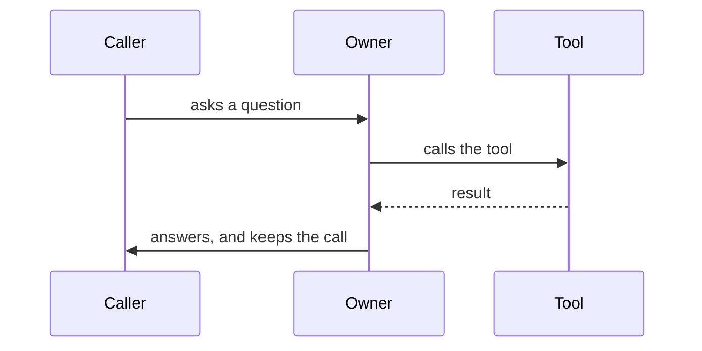
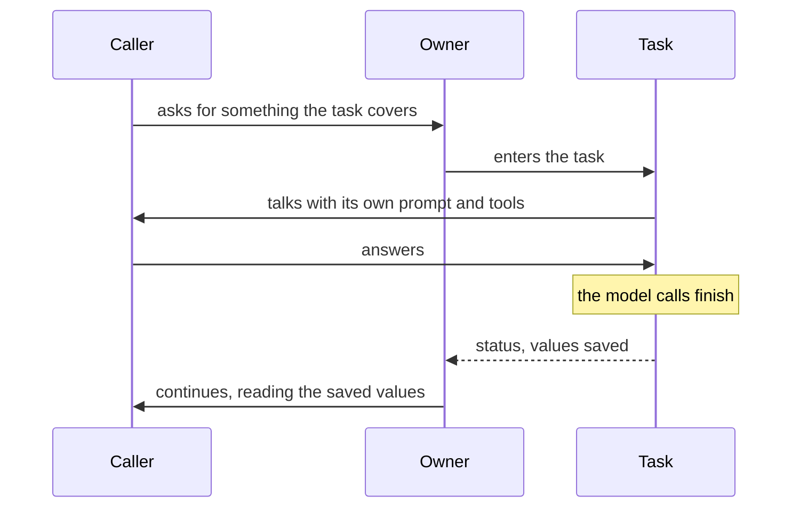
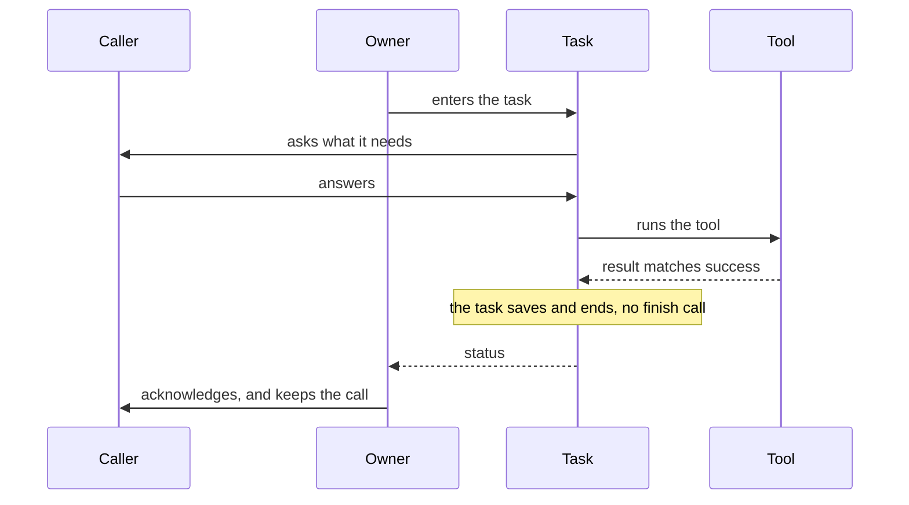
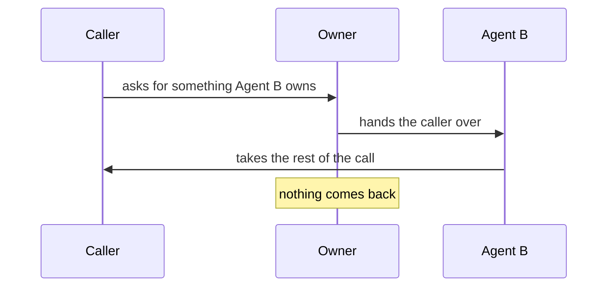

One agent with a good prompt and a few tools handles more than you would expect.
When it stops being enough, there are three shapes to reach for.

New here? Read [How a package fits together](/build/how-a-package-fits-together)
first. It is one page, it answers "I want two agents, each with tasks, where do I
start?", and everything below assumes it.

<Note>

These shapes need a code target, Pipecat or LiveKit. SLNG compiles one agent
with one prompt, so it refuses tasks, task groups and handoffs today.
`unmute validate` says so and names the way out: fold the step into the
agent's instructions, or compile to LiveKit or Pipecat.

Tasks on SLNG are coming.

</Note>

| Shape | What it is | Where it is taught |
|---|---|---|
| **Task** | one step the agent runs, which saves typed values and returns | [Tasks](/build/orchestration/tasks) |
| **Task group** | several tasks in a fixed order, sharing what they learn | [Task groups](/build/orchestration/task-groups) |
| **Handoff** | one agent gives the caller to another, and does not get them back | [Handoffs](/build/orchestration/handoffs) |

The difference that matters most is whether control comes back. A task returns. A
handoff does not.

None of these is how you reach a person: that is an
[escalation](/transfers/overview), and what it can do depends on the phone route.

Whichever shape you reach for, you write it the same way: as a name in one of
the agent's five lists. [The five things an agent can
do](/build/how-a-package-fits-together#the-five-things-an-agent-can-do) shows
the lists and which ones come back.

## What each shape does to the call

Each picture answers two questions: who is talking to the caller, and does
control come back to the agent that started.

### A tool

The agent stays in charge. It calls the tool, reads the result, and keeps
talking.

### A task

The owner enters the task. The task talks to the caller with its own prompt and
tools. When the model calls `finish`, the values in `assign:` are saved and the
owner continues, reading them through its own placeholders.

### A task with `finish:`

The same, except the tool decides. When the tool's result matches `success:`,
the task saves and ends by itself. The model makes no `finish` call, and the
owner speaks next.

### A handoff

The first agent hands the caller to a second agent. The second agent owns the
rest of the call. Nothing comes back.

## Read one example against the other

Two shipped packages are the same salon, built two ways.
[`examples/salon-concierge-single-prompt`](https://github.com/slng-ai/unmute/tree/main/examples/salon-concierge-single-prompt)
is one agent with one prompt: no tasks, no handoffs, no variables.
[`examples/salon-concierge`](https://github.com/slng-ai/unmute/tree/main/examples/salon-concierge)
is the structured one, with tasks, a task group, handoffs and saved values.
Read one against the other to see what the structure bought.

## Read them in order, then choose

Start with the first page: it adds one task to the package you already have,
one key at a time. The next three pages are one shape each, with the example
package that uses it. The last page is the one to come back to when you are
deciding: it pairs the symptom you have with the shape that fixes it, and says
what each shape costs.

<Columns cols={2}>
  <Card title="Your first task" icon="footprints" href="/build/orchestration/first-task">
    From no task to a task that says what success looks like, on your own package.
  </Card>
  <Card title="Tasks" icon="list-checks" href="/build/orchestration/tasks">
    Run a step, keep the answer.
  </Card>
  <Card title="Task groups" icon="list-ordered" href="/build/orchestration/task-groups">
    A fixed order, and shared context.
  </Card>
  <Card title="Handoffs" icon="users" href="/build/orchestration/handoffs">
    Two agents, two sets of rules.
  </Card>
  <Card title="Choosing a structure" icon="git-branch" href="/build/orchestration/choosing-a-structure">
    Which split to reach for, and what it costs.
  </Card>
</Columns>
