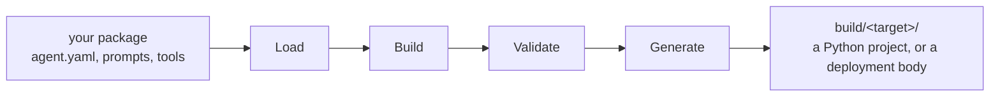

Unmute is a compiler. You write one package. It reads that package, resolves it
against one target, and writes what the target runs: a Python project for
Pipecat or LiveKit, a deployment body for SLNG.

Nothing of Unmute is left in what it writes.



## The four stages

<Steps>
  <Step title="Load">
    Unmute reads your files: [`agent.yaml`](/reference/agent-yaml),
    [`targets.yaml`](/reference/targets-yaml), your tool files, your
    [connections](/reference/connections-yaml), your prompts, and your local
    Python handlers.

    Decoding is strict. An unknown field is an error, not a shrug, and every
    error carries the file and the line.
  </Step>
  <Step title="Build">
    Names become one description of the agent. Model names point at model
    definitions. The names in an agent's lists are resolved to the tasks, task
    groups, handoffs and tools they mean. Per-target overrides are applied, and
    a telephony route is picked from what the target declares.

    This description knows nothing about Pipecat or LiveKit.
  </Step>
  <Step title="Validate">
    The description is checked against what your chosen target can do.

    Something the target **cannot** do stops the build, before anything is
    written. Something it does **differently** while keeping your contract is a
    warning: the build finishes and the warning tells you the difference.
  </Step>
  <Step title="Generate">
    One driver turns the description into files for one target.

    `validate` and `compile` run the same first three stages, so a package that
    validates cannot surprise you at compile time.
  </Step>
</Steps>

## What you get

`unmute compile` writes one directory per target under `build/`. Name the
package, as in `unmute compile my-agent`, or leave the argument out to compile
the directory you are standing in.

<CodeGroup>
```text Pipecat
build/pipecat/
├── bot.py              # the agent
├── tools/              # your local handlers, copied
├── dev_metrics.py      # per-turn timings, read by unmute dev
├── pyproject.toml      # pinned dependencies
├── Dockerfile
├── .dockerignore
├── compose.dev.yaml
├── pcc-deploy.toml
├── .env.example        # exactly the variables you supply
├── README.md           # the runbook for this build
└── compile-report.json
```

```text LiveKit
build/livekit/
├── agent.py            # the agent
├── tools/              # your local handlers, copied
├── dev_metrics.py      # per-turn timings, read by unmute dev
├── pyproject.toml      # pinned dependencies
├── Dockerfile
├── .dockerignore
├── compose.dev.yaml
├── .env.example        # exactly the variables you supply
├── README.md           # the runbook for this build
└── compile-report.json
```

```text SLNG
build/slng/
├── agent.json          # the deployment body unmute deploy pushes
├── tools/              # one JSON body per tool
└── README.md           # the runbook for this build
```
</CodeGroup>

A code target is a normal Python project. You can read it, run it, and deploy
it. It does not import Unmute.

On SLNG there is nothing to run yourself: `unmute deploy` pushes `agent.json`
and SLNG runs the agent.

<Warning>
  Treat `build/` as output. Edit the package and compile again. Anything you
  change inside `build/` is overwritten on the next compile.
</Warning>

Two files in every build answer "what did it decide?": `README.md` is the
runbook for that build, and `compile-report.json` records every binding,
resolved route and derived number the compiler used.

## Where to go next

<Columns cols={2}>
  <Card title="Build the agent" icon="graduation-cap" href="/build/your-first-agent">
    Start the guided path with the smallest real agent.
  </Card>
  <Card title="Targets" icon="boxes" href="/targets/overview">
    What a target is, and what each compiled project looks like.
  </Card>
</Columns>
