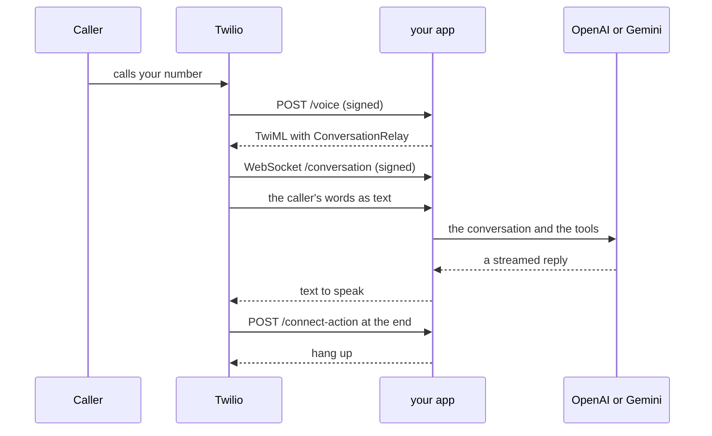

A `twilio` target writes a small Python web app. Twilio
[ConversationRelay](https://www.twilio.com/docs/voice/twiml/connect/conversationrelay)
does the listening and the speaking on Twilio's side. The app thinks with one
model, runs your local tools, and streams the reply back as text. You host the
app yourself, and it answers inbound phone calls.



1. A caller rings your Twilio number, and Twilio asks your app's `/voice` what to do.
2. The app answers with TwiML that hands the call to ConversationRelay.
3. ConversationRelay opens a WebSocket to `/conversation`. It turns speech into
   text for the app, and the app's text into speech.
4. The app sends the conversation to the model, runs any tool the model asks
   for, and streams the reply back.
5. To end the session, the app sends `end` and waits up to five seconds for
   Twilio to close the WebSocket. Closing it first can fail the session with
   [error 64105](https://www.twilio.com/docs/api/errors/64105). Twilio then
   asks `/connect-action`, and the app hangs up.

On this page:

- [The package](#the-package) - the shape, in full
- [What the package may carry](#what-the-package-may-carry) - and what is refused
- [What compiling writes](#what-compiling-writes) - the files
- [Host it](#host-it) - the manual steps
- [How the app behaves](#how-the-app-behaves) - signatures, calls at once, interruptions, tools
- [What is not verified yet](#what-is-not-verified-yet) - read before you rely on it

## The package

```yaml agent.yaml
version: 1
name: relay-desk
architecture: cascade
entry_agent: desk
models:
  think:
    reasoning:
      provider: openai
      model: gpt-5.6-luna
      params:
        reasoning_effort: none
        parallel_tool_calls: false
  listen:
    transcriber:
      provider: deepgram
      model: nova-3-general
      language: en-US
  speak:
    voice:
      provider: elevenlabs
      model: flash_v2_5
      voice: UgBBYS2sOqTuMpoF3BR0
      language: en-US
  turn:
    relay:
      params:
        speechTimeout: 800
        interruptSensitivity: medium
        ignoreBackchannel: true
agents:
  desk:
    instructions: instructions.md
    think: reasoning
    speak: voice
    tools:
      - opening_hours
      - end_call
tools:
  - opening_hours
  - end_call
conversation:
  greeting:
    speaks_first: agent
    text: "Hello, how can I help with the desk today?"
  interruption:
    enabled: true
channels:
  phone:
    kind: telephony
    inbound: true
    outbound: false
capacity:
  peak_sessions: 2
  max_sessions: 5
  peak_starts_per_second: 1
  avg_session_duration: 3m
secrets:
  - OPENAI_API_KEY
  - TWILIO_ACCOUNT_SID
  - TWILIO_AUTH_TOKEN
  - TWILIO_PHONE_NUMBER_SID
  - TWILIO_PUBLIC_URL
```

```yaml targets.yaml
targets:
  twilio:
    provider: twilio
    sdk_language: python
    connection: twilio_relay
```

```yaml connections/twilio_relay.yaml
transport: conversation-relay
carrier: twilio
environment:
  account_sid: TWILIO_ACCOUNT_SID
  auth_token: TWILIO_AUTH_TOKEN
  phone_number_sid: TWILIO_PHONE_NUMBER_SID
  public_url: TWILIO_PUBLIC_URL
```

The connection holds environment **names**, never values. `phone_number_sid`
is for pointing the number at the app; the app itself never reads it.

### Every key a twilio target takes

<ParamField path="provider" type="twilio" required>
  Selects this target. The app it writes runs on no framework.
</ParamField>

<ParamField path="sdk_language" type="python">
  The only language this target writes. Optional.
</ParamField>

<ParamField path="connection" type="connection file stem" required>
  The connection file with `transport: conversation-relay` and `carrier: twilio`.
  Required, because a twilio package always has its one phone channel.
</ParamField>

<ParamField path="models" type="model entry name to a model definition">
  Per target overrides of named `agent.yaml` entries, for example to think with
  Gemini on one target and OpenAI on another.
</ParamField>

### Every key the connection takes

<ParamField path="transport" type="conversation-relay" required>
  The only transport this target serves.
</ParamField>

<ParamField path="carrier" type="twilio" required>
  The only carrier on this transport.
</ParamField>

<ParamField path="environment" type="account_sid | auth_token | phone_number_sid | public_url to an env name" required>
  The four names the route needs. The app reads `account_sid`, `auth_token` and
  `public_url`. `phone_number_sid` is for the deploy step only.
</ParamField>

<ParamField path="region" type="us1 | ie1 | au1" default="us1">
  The [Twilio Region](https://www.twilio.com/docs/global-infrastructure/understanding-twilio-regions)
  that handles the calls. Each region keeps its own copy of the number's voice
  settings and has its own Auth Token. Outside `us1`, `auth_token` must name
  that region's token
  ([regional credentials](https://www.twilio.com/docs/global-infrastructure/manage-regional-api-credentials)),
  because Twilio signs the region's requests with it. The number's routing
  region must match too
  ([inbound processing region](https://www.twilio.com/docs/global-infrastructure/inbound-processing-console)).
  Refused on every other route.
</ParamField>

To think with Gemini instead, replace the think entry:

```yaml
    reasoning:
      provider: google
      model: gemini-3.1-flash-lite
      params:
        vertexai: true
        location: eu
        thinking_config:
          thinking_level: MINIMAL
```

and declare `GOOGLE_API_KEY` in place of `OPENAI_API_KEY`. With `vertexai:
true` and a `location`, the app calls Vertex AI with that API key. Without
them, it calls the Gemini Developer API. Only the selected provider's SDK and
key reach the project, so the other key may be missing on your machine.

## What the package may carry

| Section | What works |
|---|---|
| agents | one agent |
| channels | exactly one: `kind: telephony`, `inbound: true`, `outbound: false` |
| think | `openai` (Chat Completions) or `google` / `gemini` (native `generateContent`); `params` are sent as written |
| listen | `deepgram`, with a model such as `nova-3-general` and an optional `language` |
| speak | `elevenlabs`, with `model`, a bare voice id in `voice`, and an optional `language` |
| turn | optional, `params` only: `speechTimeout` (600 to 5000 ms), `interruptSensitivity` (`high`, `medium`, `low`), `ignoreBackchannel` |
| greeting | a fixed `text` with `speaks_first: agent`, or `speaks_first: user` with no text |
| interruption | `enabled: true` or `false`, and `protect: [greeting]` |
| tools | local handlers with flat `input` and `output` schemas of `string`, `integer`, `number` and `boolean` fields, and the builtin `end_call` |

The app builds ConversationRelay's `voice` attribute as `<voice id>-<model>`,
for example `UgBBYS2sOqTuMpoF3BR0-flash_v2_5`. Write the id alone; a voice
that already has the suffix is refused.

Everything else is refused before a file is written. Each refusal says what to
do instead. The refused list:

- more agents, tasks, task groups, handoffs and transfers;
- variables, shapes and prefetch;
- webhook, MCP, knowledge and hosted tools;
- tool `announce`, `interruption: cancel`, and `effect: ends_conversation` on a local tool;
- `instructions` on `end_call`;
- inactivity and duration timers, `pace` and the other turn fields;
- tracing, realtime and live architectures, fallbacks and custom endpoints;
- the target keys `version`, `pins`, `deployment_region` and `warm_instances`.

## What compiling writes

```sh
unmute compile
```

writes `build/<target>/`:

| File | What it is |
|---|---|
| `app.py` | the whole app: routes, WebSocket, model, tools |
| `conversation-relay.xml.tmpl` | the TwiML `/voice` returns; `app.py` fills in your public origin at startup |
| `tools/` | your local handlers, copied from the package |
| `pyproject.toml` | exact dependency pins for Python 3.12 |
| `Dockerfile` | a non-root image running one process |
| `.dockerignore` | keeps `.env` and local state out of the image |
| `.env.example` | every environment name the app reads |
| `README.md` | the runbook for this build |
| `compile-report.json` | what was resolved, the pins, and what is and is not verified |

The generated project has no unmute dependency and reads no YAML.

## Host it

unmute changes nothing in your Twilio account in this release. There is no
`unmute dev` loop either, because Twilio can only call a public HTTPS origin.

1. Copy `build/<target>/.env.example` to `.env` and fill it in. The account
   owner must have accepted the AI/ML addendum that turns ConversationRelay on
   ([onboarding](https://www.twilio.com/docs/voice/conversationrelay/onboarding)).
2. Run the app, with `uv run --env-file .env python app.py` or the Dockerfile.
3. Put it behind HTTPS at a public origin, for example
   `https://relay.example.com`, and set `TWILIO_PUBLIC_URL` to exactly that,
   with no path.
4. In the Twilio Console, open the number (Phone Numbers, Manage, Active
   Numbers). Set "A call comes in" to Webhook, HTTP POST,
   `https://<your origin>/voice`. A number on a SIP trunk ignores this setting,
   so take it off the trunk first.
5. Call the number.

The emitted `README.md` repeats these steps with links to each Twilio page.

## How the app behaves

- **Signatures.** Every request must carry a valid `X-Twilio-Signature`, checked
  with the official Twilio library against `TWILIO_PUBLIC_URL`, the exact path
  and query, and every form field
  ([Twilio webhook security](https://www.twilio.com/docs/usage/security)). The
  app never trusts forwarded headers for this. The WebSocket handshake is also
  accepted with a trailing slash on the path, the one variant Twilio documents.
- **Calls at once.** At most `capacity.max_sessions`, in one process. When it is
  full, `/voice` hangs up. The other capacity fields are planning numbers only.
  Run one copy per number.
- **Speech settings.** Deepgram transcribes and ElevenLabs speaks, both inside
  ConversationRelay
  ([voice configuration](https://www.twilio.com/docs/voice/conversationrelay/voice-configuration)).
  DTMF detection is off. With interruption on, the caller can
  talk over the agent; `protect: [greeting]` keeps the greeting whole.
- **Streaming.** The reply streams as text tokens
  ([WebSocket messages](https://www.twilio.com/docs/voice/conversationrelay/websocket-messages)).
  `last: true` marks the end of one reply. It means the app sent it, not that
  the caller heard it.
- **Interruptions.** The app stops sending, and keeps in history only the part
  of the reply the caller heard. Text already sent cannot be recalled.
- **Tools.** Arguments and results are checked against the tool's schemas. A
  tool always runs to the end. After 30 seconds the turn moves on and the model
  is told the outcome is unknown. A synchronous handler runs in its own thread,
  which Python cannot stop, so bound its network calls. At most 8 tool rounds
  per caller turn.
- **Ending the call.** `end_call` ends the session at once, so a goodbye said in
  the same turn may be cut off.
- **Failures.** A failed or timed-out model response gets one short fixed line.
  Three in a row end the call.

## What is not verified yet

- A call through a Twilio number with this target.
- The signed WebSocket handshake behind a real proxy.
- How Twilio plays tokens already sent when an interrupt arrives.
- A call in `ie1` or `au1`. The docs list ConversationRelay in both regions.
  They do not say whether Deepgram and ElevenLabs run there.
- The Gemini Developer API path, with no `vertexai`, against a real key.

## Where to go next

<CardGroup cols={2}>
  <Card title="Connections" icon="plug" href="/reference/connections-yaml">
    The route keys each transport takes.
  </Card>
  <Card title="Telephony" icon="phone" href="/telephony/overview">
    Every phone route, side by side.
  </Card>
</CardGroup>
