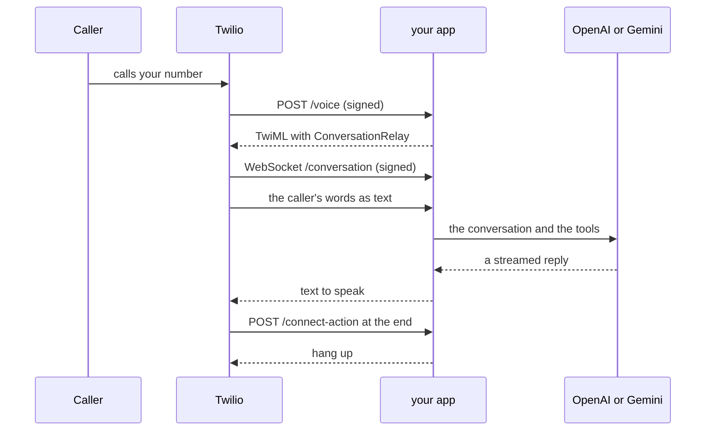
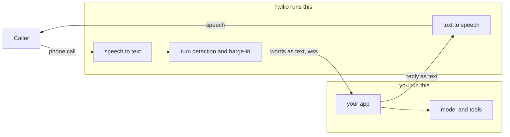
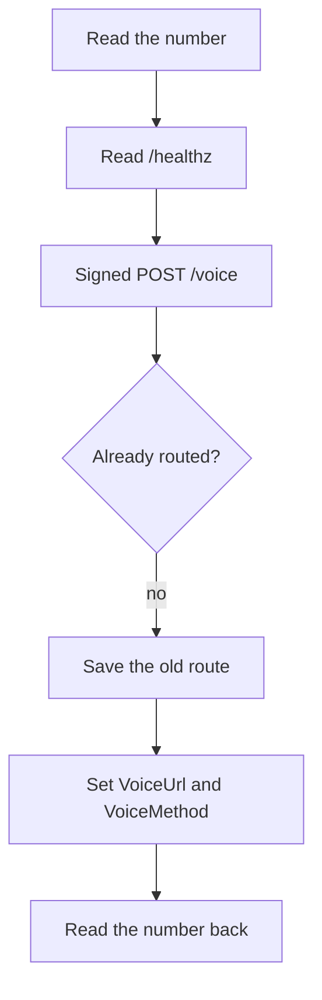
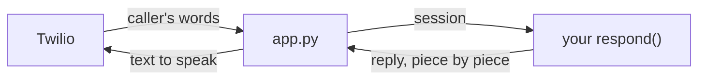
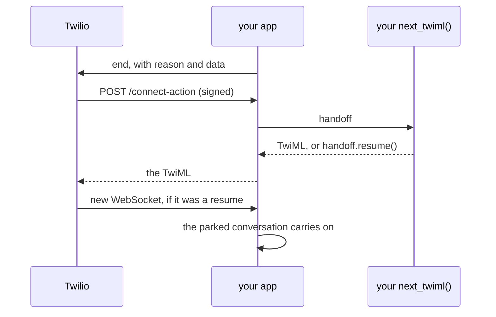

A `twilio` target writes a small Python web app. Twilio
[ConversationRelay](https://www.twilio.com/docs/voice/twiml/connect/conversationrelay)
does the listening and the speaking on Twilio's side. The app thinks with one
model, runs your local tools, and streams the reply back as text. You host the
app yourself, and it answers inbound phone calls.


```mermaid
sequenceDiagram
    participant Caller
    participant Twilio
    participant App as your app
    participant Model as OpenAI or Gemini
    Caller->>Twilio: calls your number
    Twilio->>App: POST /voice (signed)
    App-->>Twilio: TwiML with ConversationRelay
    Twilio->>App: WebSocket /conversation (signed)
    Twilio->>App: the caller's words as text
    App->>Model: the conversation and the tools
    Model-->>App: a streamed reply
    App-->>Twilio: text to speak
    Twilio->>App: POST /connect-action at the end
    App-->>Twilio: hang up
```

1. A caller rings your Twilio number, and Twilio asks your app's `/voice` what to do.
2. The app answers with TwiML that hands the call to ConversationRelay.
3. ConversationRelay opens a WebSocket to `/conversation`. It turns speech into
   text for the app, and the app's text into speech.
4. The app sends the conversation to the model, runs any tool the model asks
   for, and streams the reply back.
5. To end the session, the app sends `end` and waits up to five seconds for
   Twilio to close the WebSocket. Closing it first can fail the session with
   [error 64105](https://www.twilio.com/docs/api/errors/64105). Twilio then
   asks `/connect-action` what the call does next. The app hangs up, unless
   your own logic [answers with other TwiML](#other-twilio-services-after-the-session).

## What Twilio runs and what you run

Twilio does not host the agent. It hosts everything that touches audio, and
your app handles text only.


```mermaid
flowchart LR
    Caller -->|phone call| STT
    subgraph T [Twilio runs this]
        STT[speech to text] --> Turns[turn detection and barge-in]
        TTS[text to speech]
    end
    Turns -->|words as text, wss| App
    App -->|reply as text| TTS
    TTS -->|speech| Caller
    subgraph Y [you run this]
        App[your app] --> Model[model and tools]
    end
```

1. Twilio answers the call and turns the caller's speech into text.
2. Twilio decides when the caller has finished a turn, and stops the agent
   when the caller talks over it.
3. Your app gets the text over one WebSocket. It runs the model and your tools,
   and sends the reply back as text.
4. Twilio speaks the reply.

The names follow these layers. The target is `twilio`: the app you deploy. On
every call the app answers Twilio with
[TwiML](https://www.twilio.com/docs/voice/twiml), the markup that tells Twilio
what to do with a call. ConversationRelay is one TwiML verb in that answer, the
one the agent talks through, so it names only the voice route:
`transport: conversation-relay`. Other TwiML verbs, such as `<Dial>` or
`<Pay>`, are other Twilio services the same app can answer with.

So the app you host is one small process that handles text only. It runs no
audio pipeline, no media server and no Redis, so any container host can run
it. With the `pipecat` and `livekit` targets you host that audio pipeline too.
Twilio has no product that runs the model and the tools for you:
ConversationRelay's `url` is always "the URL of your WebSocket server".

On this page:

- [What Twilio runs and what you run](#what-twilio-runs-and-what-you-run) - what you host, and why it is small
- [The package](#the-package) - the shape, in full
- [What the package may carry](#what-the-package-may-carry) - and what is refused
- [What compiling writes](#what-compiling-writes) - the files
- [Host it](#host-it) - run the app at a public origin
- [Point the number at it](#point-the-number-at-it) - with `unmute deploy`, or by hand
- [How the app behaves](#how-the-app-behaves) - signatures, calls at once, interruptions, tools
- [Bring your own agent logic](#bring-your-own-agent-logic) - replace the turn with your own code
- [Other Twilio services after the session](#other-twilio-services-after-the-session) - any TwiML after the agent, then back to it
- [What is not verified yet](#what-is-not-verified-yet) - read before you rely on it

## The package

```yaml agent.yaml
version: 1
name: relay-desk
architecture: cascade
entry_agent: desk
models:
  think:
    reasoning:
      provider: openai
      model: gpt-5.6-luna
      params:
        reasoning_effort: none
        parallel_tool_calls: false
  listen:
    transcriber:
      provider: deepgram
      model: nova-3-general
      language: en-US
  speak:
    voice:
      provider: elevenlabs
      model: flash_v2_5
      voice: UgBBYS2sOqTuMpoF3BR0
      language: en-US
  turn:
    relay:
      params:
        speechTimeout: 800
        interruptSensitivity: medium
        ignoreBackchannel: true
agents:
  desk:
    instructions: instructions.md
    think: reasoning
    speak: voice
    tools:
      - opening_hours
      - end_call
tools:
  - opening_hours
  - end_call
conversation:
  greeting:
    speaks_first: agent
    text: "Hello, how can I help with the desk today?"
  interruption:
    enabled: true
channels:
  phone:
    kind: telephony
    inbound: true
    outbound: false
capacity:
  peak_sessions: 2
  max_sessions: 5
  peak_starts_per_second: 1
  avg_session_duration: 3m
secrets:
  - OPENAI_API_KEY
  - TWILIO_ACCOUNT_SID
  - TWILIO_AUTH_TOKEN
  - TWILIO_PHONE_NUMBER_SID
  - TWILIO_PUBLIC_URL
```

```yaml targets.yaml
targets:
  twilio:
    provider: twilio
    sdk_language: python
    connection: twilio
```

```yaml connections/twilio.yaml
transport: conversation-relay
carrier: twilio
environment:
  account_sid: TWILIO_ACCOUNT_SID
  auth_token: TWILIO_AUTH_TOKEN
  phone_number_sid: TWILIO_PHONE_NUMBER_SID
  public_url: TWILIO_PUBLIC_URL
```

The connection holds environment **names**, never values. `phone_number_sid`
is for pointing the number at the app; the app itself never reads it.

### Every key a twilio target takes

<ParamField path="provider" type="twilio" required>
  Selects this target. The app it writes runs on no framework.
</ParamField>

<ParamField path="sdk_language" type="python">
  The only language this target writes. Optional.
</ParamField>

<ParamField path="connection" type="connection file stem" required>
  The connection file with `transport: conversation-relay` and `carrier: twilio`.
  Required, because a twilio package always has its one phone channel.
</ParamField>

<ParamField path="models" type="model entry name to a model definition">
  Per target overrides of named `agent.yaml` entries, for example to think with
  Gemini on one target and OpenAI on another.
</ParamField>

<ParamField path="logic" type="folder path">
  A folder of your own Python that runs each agent turn in place of the
  generated one. See [Bring your own agent logic](#bring-your-own-agent-logic).
</ParamField>

### Every key the connection takes

<ParamField path="transport" type="conversation-relay" required>
  The only transport this target serves.
</ParamField>

<ParamField path="carrier" type="twilio" required>
  The only carrier on this transport.
</ParamField>

<ParamField path="environment" type="account_sid | auth_token | phone_number_sid | public_url to an env name" required>
  The four names the route needs. The app reads `account_sid`, `auth_token` and
  `public_url`. `phone_number_sid` is read only by `unmute deploy`.
</ParamField>

<ParamField path="region" type="us1 | ie1 | au1" default="us1">
  The [Twilio Region](https://www.twilio.com/docs/global-infrastructure/understanding-twilio-regions)
  that handles the calls. Each region keeps its own copy of the number's voice
  settings and has its own Auth Token. Outside `us1`, `auth_token` must name
  that region's token
  ([regional credentials](https://www.twilio.com/docs/global-infrastructure/manage-regional-api-credentials)),
  because Twilio signs the region's requests with it. The number's routing
  region must match too
  ([inbound processing region](https://www.twilio.com/docs/global-infrastructure/inbound-processing-console)).
  Refused on every other route.
</ParamField>

To think with Gemini instead, replace the think entry:

```yaml
    reasoning:
      provider: google
      model: gemini-3.1-flash-lite
      params:
        vertexai: true
        location: eu
        thinking_config:
          thinking_level: MINIMAL
```

and declare `GOOGLE_API_KEY` in place of `OPENAI_API_KEY`. With `vertexai:
true` and a `location`, the app calls Vertex AI with that API key. Without
them, it calls the Gemini Developer API. Only the selected provider's SDK and
key reach the project, so the other key may be missing on your machine.

To think through the [SLNG Context Router](/optimization/context-router),
bind `provider: slng`. The router answers the turns it judges repeatable from
its cache, and calls your model for the rest:

```yaml
    reasoning:
      provider: slng
      model: gpt-5.6-luna
      agent_id: relay-desk-v1
      upstream:
        provider: openai
      params:
        world_part: eu-west
        reasoning_effort: none
```

and declare `SLNG_API_KEY` beside the upstream's own key, here
`OPENAI_API_KEY`. The app calls the router's regional endpoint with Chat
Completions. It sends the router's configuration and your params in the request
body, and the cache scope and the call's session in two headers, on every
request. Each think request writes one `slng router:` log line that says
whether the cache or the model answered. The upstream `vertex` is refused on
this target for now, because the app has no helper yet for its GCP key.

In the `unmute` console, switching the think provider loads that provider's
starter: `gpt-5.6-luna` with its two params for OpenAI, or
`gemini-3.1-flash-lite` with `thinking_level: MINIMAL` on the Developer API for
Google. Add `vertexai` and `location` yourself. Picking the provider that is
already bound keeps the binding as it is.

## What the package may carry

| Section | What works |
|---|---|
| agents | one agent |
| channels | exactly one: `kind: telephony`, `inbound: true`, `outbound: false` |
| think | `slng` (the Context Router), `openai` (Chat Completions) or `google` / `gemini` (native `generateContent`); `params` are sent as written |
| listen | `deepgram`, with a model such as `nova-3-general`, an optional `language`, and the `params` `hints` and `deepgramSmartFormat` |
| speak | `elevenlabs`, with `model`, a bare voice id in `voice`, an optional `language`, and the `params` `elevenlabsTextNormalization` |
| turn | optional, `params` only: `speechTimeout` (600 to 5000 ms), `interruptSensitivity` (`high`, `medium`, `low`), `ignoreBackchannel`, and `eotThreshold` (0.5 to 0.9, listen model `flux` only) |
| greeting | a fixed `text` with `speaks_first: agent`, or `speaks_first: user` with no text |
| interruption | `enabled: true` or `false`, and `protect: [greeting]` |
| tools | local handlers with flat `input` and `output` schemas of `string`, `integer`, `number` and `boolean` fields, and the builtin `end_call` |

The app builds ConversationRelay's `voice` attribute as `<voice id>-<model>`,
for example `UgBBYS2sOqTuMpoF3BR0-flash_v2_5`. Write the id alone; a voice
that already has the suffix is refused.

### Every ConversationRelay attribute

Each row is one attribute of
[`<ConversationRelay>`](https://www.twilio.com/docs/voice/twiml/connect/conversationrelay),
and where its value comes from. A setting under `params` has the attribute's
own name.

```yaml
models:
  listen:
    transcriber:
      provider: deepgram
      model: nova-3-general
      params:
        hints:
          - relay desk
          - opening hours
        deepgramSmartFormat: true
  speak:
    voice:
      provider: elevenlabs
      model: flash_v2_5
      voice: UgBBYS2sOqTuMpoF3BR0
      params:
        elevenlabsTextNormalization: auto
```

<ParamField path="hints" type="list of strings">
  Words or phrases the caller may say. The app joins them with commas, so a
  phrase may not hold a comma.
</ParamField>

<ParamField path="deepgramSmartFormat" type="boolean">
  Deepgram's Smart Format on the transcript. Twilio's default is `true`.
</ParamField>

<ParamField path="elevenlabsTextNormalization" type="string">
  `on`, `auto` or `off`. Twilio's default is `off`.
</ParamField>

<ParamField path="eotThreshold" type="number">
  Under `models.turn` params. How sure the model must be that the caller has
  finished, from 0.5 to 0.9. Twilio uses it only when the listen model is
  `flux`, so any other model refuses it.
</ParamField>

| Attribute | Set from |
|---|---|
| `url` | the app's public origin, `wss://<host>/conversation` |
| `welcomeGreeting`, `welcomeGreetingInterruptible` | `conversation.greeting`, and `protect: [greeting]` |
| `transcriptionProvider`, `speechModel`, `transcriptionLanguage` | the listen binding |
| `ttsProvider`, `voice`, `ttsLanguage` | the speak binding |
| `interruptible`, `reportInputDuringAgentSpeech` | `conversation.interruption.enabled` |
| `interruptSensitivity`, `speechTimeout`, `ignoreBackchannel`, `eotThreshold` | turn `params` |
| `hints`, `deepgramSmartFormat` | listen `params` |
| `elevenlabsTextNormalization` | speak `params` |
| `preemptible`, `dtmfDetection` | always `false`: the app sends no preemptible text and reads no keypad digits |
| `language`, `<Language>` | not written: the two per-side languages cover one language |
| `partialPrompts` | not written: the app answers final prompts only |
| `events` | not written: Twilio does not document the event payloads |
| `intelligenceService`, `conversationConfiguration`, `conversationId` | not written: these connect other Twilio products |
| `debug` | not written |

Google and Amazon speech are not offered yet. Deepgram and ElevenLabs are.

Everything else is refused before a file is written. Each refusal says what to
do instead. The refused list:

- more agents, tasks, task groups, handoffs and transfers;
- variables, shapes and prefetch;
- webhook, MCP, knowledge and hosted tools;
- tool `announce`, `interruption: cancel`, and `effect: ends_conversation` on a local tool;
- `instructions` on `end_call`;
- inactivity and duration timers, `pace` and the other turn fields;
- tracing, realtime and live architectures, fallbacks and custom endpoints;
- the target keys `version`, `pins`, `deployment_region` and `warm_instances`.

## What compiling writes

```sh
unmute compile
```

writes `build/<target>/`:

| File | What it is |
|---|---|
| `app.py` | the whole app, on FastAPI and uvicorn: routes, WebSocket, model, tools |
| `conversation-relay.xml.tmpl` | the TwiML `/voice` returns; `app.py` fills in your public origin at startup |
| `tools/` | your local handlers, copied from the package |
| `logic/` | your own agent logic, copied as written, when the target names `logic:` |
| `pyproject.toml` | exact dependency pins for Python 3.12 |
| `Dockerfile` | a non-root image running one process |
| `.dockerignore` | keeps `.env` and local state out of the image |
| `.env.example` | every environment name the app reads |
| `README.md` | the runbook for this build |
| `compile-report.json` | what was resolved, the pins, and what is and is not verified |

The generated project has no unmute dependency and reads no YAML.

`compile` deletes `build/<target>/` and writes it again, keeping only `.env`.
A file you add there by hand is lost on the next compile. Put it in the
package's `hosting/<target>/` folder instead, for example
`hosting/twilio/render.yaml`. Every compile copies that folder into
`build/<target>/` and lists each file as `copied`. A hosting file may not use a
name compile writes, such as `app.py`, or `.env`: compile refuses it and
changes nothing. A hosting file does not change the build's `artifact_id`.

## Host it

unmute never uploads the app. You host it, on any host that runs a Dockerfile.
There is no `unmute dev` loop, because Twilio can only call a public HTTPS
origin.

What the host must give the app:

- a public **https** origin that passes WebSocket upgrades through, and keeps
  an idle WebSocket open for a whole call;
- the port in `PORT`. The app listens on `0.0.0.0:$PORT`, 8080 when it is unset;
- the app's four environment values: `TWILIO_ACCOUNT_SID`, `TWILIO_AUTH_TOKEN`,
  `TWILIO_PUBLIC_URL` and the model key;
- **one** instance. Call slots and interruptions live in the process, so two
  copies behind one number do not share them;
- a health check on `GET /healthz`;
- about 35 seconds between SIGTERM and SIGKILL. On SIGTERM the app stops taking
  calls, waits up to 20 seconds for the calls it has, ends the rest, and gives
  Twilio 5 seconds to close each socket.

Set `TWILIO_PUBLIC_URL` to the exact origin Twilio calls, with no path, for
example `https://relay.example.com`. The app checks every Twilio signature
against it. The account owner must have accepted the AI/ML addendum that turns
ConversationRelay on
([onboarding](https://www.twilio.com/docs/voice/conversationrelay/onboarding)).

`GET /healthz` answers 200 while the process is up, even when every call slot
is busy. It answers 503 only while the app drains, or when a tool handler that
outlived its call holds every slot. Both carry `artifact_id`, which names the
build. A 200 does not mean a call will be taken.

### Try it on your laptop first

1. Copy `build/<target>/.env.example` to `.env` next to it, and fill it in.
2. Start the app: `uv run --env-file .env python app.py`.
3. Start a tunnel to port 8080. Either one passes WebSockets through:

   ```sh
   ngrok http 8080
   cloudflared tunnel --url http://localhost:8080
   ```

4. Set `TWILIO_PUBLIC_URL` to the tunnel's https origin, and restart the app.
5. Run `unmute deploy --target twilio` to point the number at it, then call.

A free tunnel gets a new origin each time it starts. Set the new origin, restart
the app and deploy again.

### Host it on Render

[Render](https://render.com/docs/web-services) builds the Dockerfile from your
Git repository. So commit `build/<target>/` with the package, and keep `.env`
out of Git. Add this Blueprint as `hosting/twilio/render.yaml`, with `rootDir`
set to the build folder's path from the repository root:

```yaml
services:
  - type: web
    name: relay-desk
    runtime: docker
    rootDir: agents/relay-desk/build/twilio
    dockerfilePath: ./Dockerfile
    dockerContext: .
    numInstances: 1
    healthCheckPath: /healthz
    maxShutdownDelaySeconds: 60
    autoDeployTrigger: commit
    envVars:
      - key: TWILIO_ACCOUNT_SID
        sync: false
      - key: TWILIO_AUTH_TOKEN
        sync: false
      - key: TWILIO_PUBLIC_URL
        sync: false
      - key: OPENAI_API_KEY
        sync: false
```

1. Run `unmute compile`, then commit and push the package with `build/`.
2. In the Render Dashboard, create a Blueprint from the repository. Set its
   Blueprint path to `agents/relay-desk/build/twilio/render.yaml`
   ([Blueprints](https://render.com/docs/infrastructure-as-code)).
3. Fill in the four values Render asks for. `TWILIO_PUBLIC_URL` is the
   service's own origin, `https://<name>.onrender.com`.
4. Wait for the deploy to go live, then check
   `curl https://<name>.onrender.com/healthz`.
5. Run `unmute deploy --target twilio`.

Do not use Render's free instance type. It sleeps after 15 minutes with no
traffic and takes about a minute to wake
([free instances](https://render.com/docs/free)), and Twilio gives up on
`/voice` long before that. `maxShutdownDelaySeconds: 60` covers the app's drain.

### Update a hosted agent

1. Change the package.
2. Run `unmute compile`.
3. Commit `build/<target>/` and push. Render builds and deploys the new build.
4. Run `unmute deploy --target twilio`. It refuses until `/healthz` names the
   new build's `artifact_id`. Then it confirms the number already routes to
   `/voice`, and changes nothing on the number.

A deploy on Render starts the new instance and waits for its health check.
Only then does it move traffic and stop the old one
([deploys](https://render.com/docs/deploys)). A call that is running on the old
instance then gets the app's drain: up to 20 seconds to finish, then the agent
ends it. Push when no call is running if you can.

## Point the number at it

```sh
unmute deploy --target twilio --dry-run
unmute deploy --target twilio
```

`unmute deploy` with one twilio target sets the voice webhook of one existing
number. It uploads nothing, buys no number and places no call. It reads four
environment names from the shell or the package `.env`: `TWILIO_ACCOUNT_SID`,
`TWILIO_AUTH_TOKEN`, `TWILIO_PHONE_NUMBER_SID` and `TWILIO_PUBLIC_URL`, or
whatever names your connection declares. It needs no model key.


```mermaid
flowchart TD
    A[Read the number] --> B[Read /healthz]
    B --> C[Signed POST /voice]
    C --> D{Already routed?}
    D -- no --> E[Save the old route]
    E --> F[Set VoiceUrl and VoiceMethod]
    F --> G[Read the number back]
```

1. It reads the number
   ([IncomingPhoneNumber](https://www.twilio.com/docs/phone-numbers/api/incomingphonenumber-resource)).
   It refuses a number that takes no voice calls, or that has a TwiML App, a
   SIP trunk or a voice fallback URL. It never clears these for you. It reads
   the copy of the number in the connection's `region`, and it refuses a
   number whose calls another region handles. It never changes the routing.
2. It reads `/healthz`. A missing or different `artifact_id` means the host
   runs another build, so recompile and rehost first. The id is an unmute
   check, not a Twilio feature.
3. It sends `/voice` one request signed with your Auth Token, the way Twilio
   signs a call ([webhook security](https://www.twilio.com/docs/usage/security)).
   It compares the TwiML with this build's
   ([Connect](https://www.twilio.com/docs/voice/twiml/connect)). A 503 or a
   bare `<Hangup/>` means "busy, try again later". This proves the HTTP answer
   only, not the WebSocket, the speech or the hangup callback.
4. With `--dry-run`, it prints the change and stops. A dry run writes no file.
   Without it, it stops if the number already points at
   `https://<your origin>/voice` with `POST`.
5. It reads the number again. It stops if the voice settings moved, or if the
   number now fails a check from step 1. Then it saves the old voice URL and
   method to a new private file under your user config directory, in
   `unmute/twilio-rollback/`.
6. It sets `VoiceUrl` and `VoiceMethod` only. SMS and every other setting keep
   their values.
7. It reads the number back, and writes `build/<target>/deploy-report.json`
   with the outcome. `routed` means the number points at `/voice` with `POST`
   and still passes every check from step 1. `not_changed` means Twilio refused
   the write. Anything else, such as a timeout, is `unknown`, because the write
   may still land. An `unknown` outcome exits 1 and prints the snapshot path.
   Nothing is retried.

Two deploys to one number at the same time are not supported.

To route by hand instead, open the number in the Twilio Console (Phone Numbers,
Manage, Active Numbers). Set "A call comes in" to Webhook, HTTP POST,
`https://<your origin>/voice`.

To put the old route back, first check the number in the Console. "A call comes
in" must still be a webhook to the snapshot's `new_voice_url` with `HTTP POST`,
and the number must have no TwiML App, SIP trunk or fallback URL. If anything
differs, somebody changed the number since, so stop and ask. If it all matches,
set "A call comes in" back to the snapshot's `voice_url` and `voice_method`.

Then call the number. That call is the only check of the speech path.

## How the app behaves

- **Signatures.** Every request must carry a valid `X-Twilio-Signature`, checked
  with the official Twilio library against `TWILIO_PUBLIC_URL`, the exact path
  and query, and every form field
  ([Twilio webhook security](https://www.twilio.com/docs/usage/security)). The
  app never trusts forwarded headers for this. The WebSocket handshake is also
  accepted with a trailing slash on the path, the one variant Twilio documents.
- **Calls at once.** At most `capacity.max_sessions`, in one process. When it is
  full, `/voice` hangs up. The other capacity fields are planning numbers only.
  Run one copy per number.
- **Speech settings.** Deepgram transcribes and ElevenLabs speaks, both inside
  ConversationRelay
  ([voice configuration](https://www.twilio.com/docs/voice/conversationrelay/voice-configuration)).
  DTMF detection is off. With interruption on, the caller can
  talk over the agent; `protect: [greeting]` keeps the greeting whole.
- **Streaming.** The reply streams as text tokens
  ([WebSocket messages](https://www.twilio.com/docs/voice/conversationrelay/websocket-messages)).
  `last: true` marks the end of one reply. It means the app sent it, not that
  the caller heard it.
- **Interruptions.** The app stops sending, and keeps in history only the part
  of the reply the caller heard. Text already sent cannot be recalled.
- **Tools.** Arguments and results are checked against the tool's schemas. A
  tool always runs to the end. After 30 seconds the turn moves on and the model
  is told the outcome is unknown. A synchronous handler runs in its own thread,
  which Python cannot stop, so bound its network calls. At most 8 tool rounds
  per caller turn.
- **Ending the call.** `end_call` ends the session at once, so a goodbye said in
  the same turn may be cut off.
- **Failures.** A failed or timed-out model response gets one short fixed line.
  Three in a row end the call.

### How the app is secured

Three checks stand between the internet and your agent:

1. `/voice` and `/connect-action` check `X-Twilio-Signature` over the exact URL
   on `TWILIO_PUBLIC_URL`, and check that `AccountSid` is your account
   ([webhook security](https://www.twilio.com/docs/usage/security)).
2. The WebSocket handshake on `/conversation` is signed the same way, over the
   `wss://` URL with no form fields
   ([ConversationRelay onboarding](https://www.twilio.com/docs/voice/conversationrelay/onboarding)).
   An unsigned handshake gets HTTP 403 before the socket opens.
3. The first message must be Twilio's `setup`, for your account, with a valid
   call SID and session ID. No call state exists before it.

The Auth Token is the one shared secret. To rotate it, set the new token on
the host and restart the app. Twilio publishes no fixed IP ranges for its
webhooks
([webhooks security](https://www.twilio.com/docs/usage/webhooks/webhooks-security)),
so an IP allow list is not an option: the signature is the protection. Serve
the app over HTTPS only, which every host on this page does.

## Bring your own agent logic

The app you host is yours, so the agent turn can be too. Point the target at a
folder of your own Python:

```yaml targets.yaml
targets:
  twilio:
    provider: twilio
    connection: twilio
    logic: logic/
```

```python logic/__init__.py
async def respond(session):
    """Stream the reply to the caller's last words."""
    yield "Hello from my own agent."
```


```mermaid
flowchart LR
    Twilio -->|caller's words| App[app.py]
    App -->|session| Logic["your respond()"]
    Logic -->|reply, piece by piece| App
    App -->|text to speak| Twilio
```

1. Twilio sends the caller's words. The app adds them to the call's history.
2. The app calls `respond(session)`, once per caller turn.
3. Each string `respond()` yields is spoken as it arrives.
4. When the caller talks over the reply, the app stops `respond()` and cuts
   the reply in the history to what the caller heard.

The app still owns the call: Twilio's signatures and protocol, interruptions,
call slots, the drain on shutdown, and the fixed line when a turn fails.
`respond()` owns the turn, and it runs its own tools. Compile copies the folder
into `build/<target>/logic/` exactly as written and never changes it. The
folder counts in the build's `artifact_id`, so `unmute deploy` refuses a host
that runs older logic.

What `session` holds:

| Field | What it is |
|---|---|
| `history` | the conversation as a list of `{"role": "user" \| "assistant", "content": str}`, oldest first. The last entry is the turn to answer. An interrupted reply holds only what the caller heard. It is a copy. |
| `call` | `call_sid`, `session_id`, `from`, `to`, `direction` and `custom_parameters`, from Twilio's setup message |
| `instructions` | the package's instructions |
| `model` | the package's think binding: `model`, `base_url` (the SLNG router's, or `None`), `api_key`, `params`, and the router's `extra_body` and `extra_headers` |
| `state` | a dict of your own, kept for the whole call |
| `end(reason, **data)` | ends the session once this reply has been sent, like `end_call`. `reason` and `data` reach [`next_twiml()`](#other-twilio-services-after-the-session) |
| `twilio` | a Twilio REST client on your account and region, for any Twilio API during the call. It is synchronous, so call it through `asyncio.to_thread` |

Rules the app holds `respond()` to:

- It must be `async def respond(session)` in the folder's `__init__.py`, and
  yield strings.
- A turn has 30 seconds. A turn that raises, times out or yields nothing gets
  the fixed failure line. Three failures in a row end the call.
- `end()` ends the call right after the reply, so keep the goodbye in the
  reply before it.
- `requirements.txt` in the folder, one requirement per line, is added to the
  app's pinned dependencies. A pin that clashes with the app's own pins fails
  at install, with the installer's message.

`think:` stays required, so the package still validates on its own, and
`respond()` may ignore it. Or it can use `session.model` to call the model the
package names. This is a whole agent in Pydantic AI, with a tool and a
goodbye, on the package's own binding:

```python logic/__init__.py
from pydantic_ai import Agent
from pydantic_ai.messages import ModelRequest, ModelResponse, TextPart, UserPromptPart
from pydantic_ai.models.openai import OpenAIChatModel, OpenAIChatModelSettings
from pydantic_ai.providers.openai import OpenAIProvider

from tools.opening_hours import opening_hours as read_hours


def build(session):
    m = session.model
    model = OpenAIChatModel(m.model, provider=OpenAIProvider(base_url=m.base_url, api_key=m.api_key))
    settings = OpenAIChatModelSettings(extra_body={**m.params, **m.extra_body}, extra_headers=m.extra_headers)
    agent = Agent(model, instructions=session.instructions, model_settings=settings)

    @agent.tool_plain
    def opening_hours(day: str) -> dict:
        """Return the front desk's opening hours for one day of the week."""
        return read_hours(day)

    @agent.tool_plain
    def end_call() -> str:
        """End the call once the caller says they are done."""
        session.end("caller_done")
        return "The call ends after this reply."

    return agent


def to_messages(history):
    return [
        ModelRequest(parts=[UserPromptPart(content=e["content"])]) if e["role"] == "user"
        else ModelResponse(parts=[TextPart(content=e["content"])])
        for e in history
    ]


async def respond(session):
    if "agent" not in session.state:
        session.state["agent"] = build(session)
    *earlier, last = session.history
    async with session.state["agent"].run_stream(last["content"], message_history=to_messages(earlier)) as run:
        async for piece in run.stream_text(delta=True, debounce_by=None):
            yield piece
```

```text logic/requirements.txt
pydantic-ai-slim[openai]==2.51.0
```

The history is rebuilt from `session.history` every turn, so an interrupted
reply counts only as far as the caller heard it. `debounce_by=None` speaks
each piece as it arrives instead of in batches. Pydantic AI prints a banner at
import; set `PYDANTIC_AI_NO_BANNER=1` on the host to keep it out of the log.

With `provider: slng` on think, the same code calls the model through the SLNG
Context Router: `base_url` and the router's body and headers come in
`session.model`. For any other endpoint that speaks Chat Completions, such as
vLLM, Ollama or OpenRouter, set `base_url` and `api_key` yourself in `build()`.
Pydantic AI also has its own providers for Anthropic, Gemini and others.

## Other Twilio services after the session

When the agent's session ends, Twilio asks the app what the call does next.
The answer can be any TwiML: put the caller through with `<Dial>`, queue them
for a person with `<Enqueue>`, take a card with `<Pay>`, or play a line. It can
also hand the caller back to the agent, with the conversation kept.


```mermaid
sequenceDiagram
    participant Twilio
    participant App as your app
    participant Logic as your next_twiml()
    App->>Twilio: end, with reason and data
    Twilio->>App: POST /connect-action (signed)
    App->>Logic: handoff
    Logic-->>App: TwiML, or handoff.resume()
    App-->>Twilio: the TwiML
    Twilio->>App: new WebSocket, if it was a resume
    App->>App: the parked conversation carries on
```

1. Your logic calls `session.end("hold")`. The app sends `end` with
   `{"reasonCode": "hold"}` as the handoff data, and keeps the call's history
   aside.
2. Twilio posts to `/connect-action`. The app checks the signature, as on
   every route.
3. The app calls `next_twiml(handoff)` in your `logic/__init__.py`.
4. Your function returns TwiML as a string. `None` means hang up.
5. If it returned `handoff.resume(note)`, Twilio runs any verbs you put first,
   then opens a new session. The agent gets the kept history plus the note as
   the turn to answer, and it speaks first.

```python logic/__init__.py
import os


def next_twiml(handoff):
    if handoff.reason == "hold":
        return handoff.resume("a short hold", before="<Say>Please hold.</Say>")
    if handoff.reason == "transfer":
        # A number you set on the host, never one the model or the caller chose.
        return f"<Response><Dial>{os.environ['FRONT_DESK_NUMBER']}</Dial></Response>"
    return None  # hang up
```

What `handoff` holds:

| Field | What it is |
|---|---|
| `reason` | the reason `session.end()` sent. The app's own reasons are `end_call`, `busy` and `shutdown`. It is empty when the session ended without an `end` |
| `data` | the other keyword arguments `session.end()` sent |
| `call` | `call_sid`, `from`, `to` and `direction` |
| `status` | Twilio's `SessionStatus`: `completed`, `ended` or `failed` |
| `twilio` | the same REST client as `session.twilio` |
| `resume(note, before="")` | TwiML that hands the caller back to the agent. `before` is TwiML verbs Twilio runs first |

Rules the app holds `next_twiml()` to:

- It may be `def` or `async def`. Twilio waits 15 seconds for the answer, so an
  `async` one gets 10 and a slow one should hand work to a thread.
- The answer must be well-formed XML. An exception, a non-string or broken XML
  is logged, and the call hangs up.
- The kept history waits 10 minutes, in this process only. A resume that
  reaches another copy of the app starts a fresh conversation. Run one copy
  per number, as for calls at once.
- Never put card numbers or other secrets in `session.end()` data: it travels
  through Twilio as the session's handoff data.
- Build TwiML from values you trust. A number to dial, or text to put in the
  XML, that came from the model or the caller needs checking and escaping first.

## What is not verified yet

- A call behind a proxy other than Render and a cloudflared quick tunnel.
- How Twilio plays tokens already sent when an interrupt arrives. One live
  interrupt was heard, on OpenAI.
- A second call refused while `max_sessions` calls are running. The refusal
  is tested offline only.
- A call in `ie1` or `au1`. The docs list ConversationRelay in both regions.
  They do not say whether Deepgram and ElevenLabs run there.
- The Gemini Developer API path, with no `vertexai`, against a real key.
- A real call on the built-in agent turn since the move to FastAPI. The one
  hosted call so far ran custom logic.
- The drain on a real SIGTERM, such as a redeploy during a call. It is tested
  in process only.
- A resume from `next_twiml()` on a real call. It is tested in process, with
  the real model.

## Where to go next

<CardGroup cols={2}>
  <Card title="Take a call with ConversationRelay" icon="phone-call" href="/telephony/twilio-conversation-relay">
    The example package, from compile to a real call, on OpenAI or Gemini.
  </Card>
  <Card title="Connections" icon="plug" href="/reference/connections-yaml">
    The route keys each transport takes.
  </Card>
  <Card title="Telephony" icon="phone" href="/telephony/overview">
    Every phone route, side by side.
  </Card>
</CardGroup>
