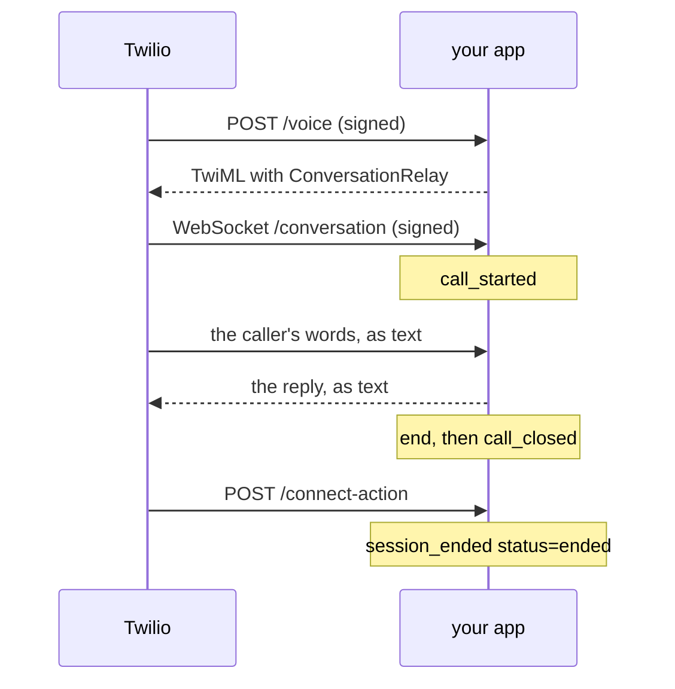

This is the `conversation-relay` transport with the `twilio` carrier, on the
[Twilio target](/targets/twilio). Twilio answers the call, listens and speaks.
A Python app that unmute compiles and you host does the thinking.

```text
caller -> your Twilio number -> POST /voice -> ConversationRelay <-> wss:// your app -> OpenAI or Gemini
```

Every command below uses the
[twilio example](https://github.com/slng-ai/unmute/tree/main/examples/twilio):
a front desk with one tool, `opening_hours`, and `end_call`. To start your own
package in the same shape, run:

```sh
unmute init my-desk --target twilio
```

There is no `unmute dev` loop for this route. Twilio can only call a public
https origin, so the first test is a real phone call.

On this page:

- [Before you start](#before-you-start) - accounts, the AI addendum, four values
- [1. Compile](#1-compile) - validate and build the app
- [2. Try it on your laptop](#2-try-it-on-your-laptop) - the app behind a tunnel
- [3. Host it on Render](#3-host-it-on-render) - straight from the build folder
- [4. Check the number in the Twilio Console](#4-check-the-number-in-the-twilio-console) - its SID and voice settings
- [5. Point the number at it](#5-point-the-number-at-it) - `unmute deploy`
- [6. Call it](#6-call-it) - the tool, an interruption, the hangup
- [7. Read the call back](#7-read-the-call-back) - the app's log and Twilio's call log
- [8. Switch to Gemini](#8-switch-to-gemini) - recompile, rehost, deploy again
- [9. Put the old route back](#9-put-the-old-route-back) - the rollback snapshot
- [10. Clean up](#10-clean-up) - the service and the test repository
- [Troubleshooting](#troubleshooting) - symptoms, causes and fixes

## Before you start

You need `unmute`, `uv` with Python 3.12, a Twilio account with a test voice
number, and an `OPENAI_API_KEY`
([Chat Completions](https://developers.openai.com/api/reference/resources/chat)).
To host on Render as step 3 does, you also need the
[GitHub CLI](https://cli.github.com/) and the
[Render CLI](https://render.com/docs/cli), both logged in.

Twilio has two consoles, and their menus differ. This page names both: the
Twilio Console at `1console.twilio.com`, and the legacy Console at
`console.twilio.com`. They show the same account.

Turn ConversationRelay on for the account once, following Twilio's
[onboarding guide](https://www.twilio.com/docs/voice/conversationrelay/onboarding).
In the Console, open Voice, Settings, Privacy & Security, accept the Predictive
and Generative AI/ML Features Addendum, and save. Skip the guide's TwiML App
steps: this route sets the number's own voice webhook, and deploy refuses a
number that has a TwiML App.

The connection names four environment values:

| Name | Value | Read by |
|---|---|---|
| `TWILIO_ACCOUNT_SID` | Account SID, on the Console home page | the app and deploy |
| `TWILIO_AUTH_TOKEN` | Auth Token, next to it | the app and deploy |
| `TWILIO_PUBLIC_URL` | the host's https origin, no path | the app and deploy |
| `TWILIO_PHONE_NUMBER_SID` | the number's SID, `PN` and 32 characters | deploy only |

## 1. Compile

```sh
unmute validate examples/twilio
unmute compile examples/twilio
```

`build/twilio/` now holds `app.py`, the TwiML
([`<ConversationRelay>`](https://www.twilio.com/docs/voice/twiml/connect/conversationrelay))
the app answers `/voice` with, the tool handler, exact pins, a `Dockerfile` and
a runbook. The app installs only the SDK of the model the agent thinks with.

## 2. Try it on your laptop

Copy `build/twilio/.env.example` to the package's `.env`, and fill it in. Then,
from `build/twilio/`:

```sh
uv run --env-file ../../.env python app.py
```

Twilio can only reach a public https origin, so put a tunnel in front of port
8080. Either of these passes WebSockets through:

```sh
ngrok http 8080
cloudflared tunnel --url http://localhost:8080
```

Set `TWILIO_PUBLIC_URL` to the tunnel's https origin, restart the app, and go on
to step 4. A free tunnel gets a new origin each time it starts, so set the new
one and deploy again after a restart.

## 3. Host it on Render

Render builds a service from a Git repository
([web services](https://render.com/docs/web-services)). The build folder is a
complete project, so it can be that repository on its own. For your own
package, commit `build/twilio/` with it instead, and point Render at that path.


1. Copy the compiled files into a new repository. Leave `.env` and local state
   out:

   ```sh
   mkdir relay-test
   rsync -a --exclude .venv --exclude uv.lock --exclude __pycache__ --exclude .env \
     examples/twilio/build/twilio/ relay-test/
   cd relay-test
   printf '.env\n.venv/\n__pycache__/\n' > .gitignore
   git init -b main && git add -A && git commit -m "Compiled twilio target"
   ```

2. Push it as a private repository:

   ```sh
   gh repo create relay-test --private --source . --push
   ```

   Render reads it through its GitHub app. If that app does not reach every
   repository of yours, add this one to it in the Render Dashboard.

3. Create the service. The secret values come from your shell, so the command
   line holds only their names:

   ```sh
   render services create --name relay-test --type web_service --runtime docker \
     --repo https://github.com/<you>/relay-test --branch main \
     --region frankfurt --plan starter --num-instances 1 \
     --health-check-path /healthz --max-shutdown-delay 60 \
     --env-var "TWILIO_ACCOUNT_SID=$TWILIO_ACCOUNT_SID" \
     --env-var "TWILIO_AUTH_TOKEN=$TWILIO_AUTH_TOKEN" \
     --env-var "OPENAI_API_KEY=$OPENAI_API_KEY" \
     --env-var "TWILIO_PUBLIC_URL=https://relay-test.onrender.com" \
     -o json --confirm
   ```

   Keep the `id` it prints, `srv-` and some characters. Check that the `url` it
   prints is the one you set as `TWILIO_PUBLIC_URL`. Use a paid plan: a free
   instance sleeps after 15 minutes without traffic
   ([free instances](https://render.com/docs/free)), and Twilio does not wait
   for it to wake.

4. Wait until the deploy is live, then check the app from anywhere:

   ```sh
   render deploys list <service id> -o json
   curl https://relay-test.onrender.com/healthz
   ```

   `/healthz` answers `{"ok":true,"artifact_id":"sha256:..."}`. The id matches
   `artifact_id` in `build/twilio/compile-report.json`.

A Blueprint does the same from a file you keep in the package: see
[Host it on Render](/targets/twilio#host-it-on-render).

## 4. Check the number in the Twilio Console

Open the number:

- Twilio Console: **Communications**, **Numbers & senders**, then the number.
- Legacy Console: **Phone Numbers**, **Manage**, **Active numbers**, then the
  number.

Then check three things
([respond to incoming calls](https://www.twilio.com/docs/voice/tutorials/how-to-respond-to-incoming-phone-calls)):

1. Copy the number's **SID**, `PN` and 32 characters.
2. Under **Voice Configuration**, the number has no TwiML App, no SIP trunk,
   and no URL under "Primary handler fails". Deploy refuses a number with any
   of them, and never clears one for you.
3. In **Voice**, **Settings**, **Privacy & Security**, the Predictive and
   Generative AI/ML Features Addendum is accepted
   ([ConversationRelay onboarding](https://www.twilio.com/docs/voice/conversationrelay/onboarding)).

The API gives the same three answers
([IncomingPhoneNumber](https://www.twilio.com/docs/phone-numbers/api/incomingphonenumber-resource)).
It prints the SID, then `None` three times for an eligible number:

```sh
curl -s -u "$TWILIO_ACCOUNT_SID:$TWILIO_AUTH_TOKEN" \
  "https://api.twilio.com/2010-04-01/Accounts/$TWILIO_ACCOUNT_SID/IncomingPhoneNumbers.json?PhoneNumber=%2B<number>" \
  | python3 -c "import json,sys; n=json.load(sys.stdin)['incoming_phone_numbers'][0]; print(n['sid'], n['voice_application_sid'], n['trunk_sid'], n['voice_fallback_url'])"
```

## 5. Point the number at it

Set the four values deploy reads, from your shell or the package's `.env`:

```sh
export TWILIO_ACCOUNT_SID=AC...
export TWILIO_AUTH_TOKEN=...
export TWILIO_PHONE_NUMBER_SID=PN...
export TWILIO_PUBLIC_URL=https://relay-test.onrender.com
```

Then run it twice, first as a dry run:

```sh
unmute deploy examples/twilio --target twilio --dry-run
unmute deploy examples/twilio --target twilio
```

`--target` is required, because a bare `unmute deploy` is an SLNG deploy. The
dry run makes every check and writes nothing. It checks:

- the number;
- its routing region;
- that `/healthz` names this build;
- that a `POST /voice` signed with your Auth Token returns this build's TwiML.

The second run saves the old route to a private file, then sets `VoiceUrl` and
`VoiceMethod` on that one number, and nothing else. It ends like this:

```text
twilio: routed +15005550006 (PN<sid>) to POST https://relay-test.onrender.com/voice
twilio: old route saved to <config dir>/unmute/twilio-rollback/PN<sid>-<time>-<n>.json
twilio: wrote build/twilio/deploy-report.json
twilio: no call was placed; call +15005550006 to check speech, the WebSocket and the hangup
```

Keep the `old route saved to` path for step 9. Every check is on
[the Twilio target page](/targets/twilio#point-the-number-at-it).

## 6. Call it

Watch the app's log in a second terminal:

```sh
render logs -r <service id> --tail
```

Then call the number with the handset at your ear. A speakerphone makes the
agent hear itself.

1. ConversationRelay speaks the greeting.
2. Ask "Are you open on Friday?" The agent calls `opening_hours` and answers
   from it.
3. Talk over a long answer. The agent stops, and keeps only what you heard.
4. Say you are done. The agent says goodbye and ends the call.

## 7. Read the call back

### In the app's log



1. Twilio asks `/voice` what to do. The app answers with the
   [`<ConversationRelay>`](https://www.twilio.com/docs/voice/twiml/connect/conversationrelay)
   TwiML. Its attributes carry your `listen`, `speak` and `turn` settings and
   the greeting.
2. ConversationRelay opens the WebSocket, and the app logs `call_started`.
3. ConversationRelay speaks, listens and decides when you finished. The app
   sees only text
   ([WebSocket messages](https://www.twilio.com/docs/voice/conversationrelay/websocket-messages)).
   Each model request is one line in the log.
4. When the agent ends the call, the app logs `end`. Twilio closes the socket,
   and the app logs `call_closed`.
5. Twilio then asks `/connect-action`, the app hangs up, and it logs
   `session_ended status=ended error=` with no error.

The log names each call and event, and never the transcript. Render also logs
the WebSocket as one request lasting the whole call, with no response bytes.

### In Twilio

The call is in Twilio's call log with its SID, both numbers, status and
duration
([retrieve call logs](https://www.twilio.com/docs/voice/tutorials/how-to-retrieve-call-logs)):

- Twilio Console: **Communications**, **Numbers & senders**, open the number,
  and see its calls.
- Legacy Console: open the number, then its **Calls Log** tab.

Open a call for its [Call Summary](https://www.twilio.com/docs/voice/voice-insights/call-summary).
If you do not see it, check which account the Console shows: a call belongs to
the account that owns the number. The API reads one call by the `call=` SID in
the app's log:

```sh
curl -s -u "$TWILIO_ACCOUNT_SID:$TWILIO_AUTH_TOKEN" \
  "https://api.twilio.com/2010-04-01/Accounts/$TWILIO_ACCOUNT_SID/Calls/CA<sid>.json"
```

## 8. Switch to Gemini

In `agent.yaml`, replace the `reasoning:` entry under `models.think`:

```yaml
models:
  think:
    reasoning:
      provider: google
      model: gemini-3.1-flash-lite
      params:
        vertexai: true
        location: eu
        thinking_config:
          thinking_level: MINIMAL
```

### Every key the Gemini binding takes

<ParamField path="provider" type="google | gemini" required>
  Gemini's native API. `gemini` is accepted as the same provider.
</ParamField>

<ParamField path="model" type="string" required>
  The Gemini model id, passed through as written.
</ParamField>

<ParamField path="params.vertexai" type="boolean">
  `true` sends the requests to Vertex AI. Omitted or `false` uses the Gemini
  Developer API. It chooses the endpoint and is not sent with a request.
</ParamField>

<ParamField path="params.location" type="string">
  The Vertex AI location, such as `eu`. Used only with `vertexai: true`.
</ParamField>

<ParamField path="params.thinking_config" type="object">
  Sent with every request as written. The example uses
  `thinking_level: MINIMAL`.
</ParamField>

OpenAI's `reasoning_effort` and `parallel_tool_calls` are refused on this
binding, because a Gemini request has no such field.

This calls Gemini's native `generateContent` with the
[Google GenAI SDK](https://googleapis.github.io/python-genai/), on Vertex AI in
the EU. It needs a `GOOGLE_API_KEY` that is a
[Vertex AI API key](https://cloud.google.com/vertex-ai/generative-ai/docs/start/api-keys),
and a model its [location](https://cloud.google.com/vertex-ai/generative-ai/docs/learn/locations)
serves. Without `vertexai` and `location`, the binding uses the Gemini Developer
API, which is supported but not yet tested with a real key.

Then recompile, stop the old app, start the new build at the same origin, and
deploy again. The build's `artifact_id` changed, so deploy refuses the old build
until it is replaced. One build runs at one origin. For both at once, use two
origins and two numbers. The same holds for any change to the package.

Twilio's own tutorials split the work the same way, for
[OpenAI](https://www.twilio.com/en-us/blog/developers/tutorials/product/integrate-openai-twilio-voice-using-conversationrelay-python)
and [Gemini](https://www.twilio.com/en-us/blog/developers/tutorials/product/integrate-google-gemini-twilio-voice-conversationrelay).
The generated app also streams replies, checks every signature, and handles
interruptions.

## 9. Put the old route back

Deploy printed the snapshot path. First check the number in the Console: "A call
comes in" must still be a webhook to the snapshot's `new_voice_url` with
`HTTP POST`, and the number must have no TwiML App, SIP trunk or fallback URL.
If anything differs, somebody changed it since, so stop and ask. If it matches,
set "A call comes in" back to the snapshot's `voice_url` and `voice_method`.

## 10. Clean up

A Render service on a paid plan is billed while it exists. Delete it, and the
test repository, when you are done:

```sh
render services delete <service id>
gh repo delete <you>/relay-test
```

Deleting a repository needs the `delete_repo` scope on the GitHub CLI:
`gh auth refresh -s delete_repo`.

## Troubleshooting

| Symptom | Cause | Fix |
|---|---|---|
| Deploy says the app "names no build" or "runs build ..." | The host runs another build | Recompile, rehost, then deploy |
| Deploy says the app "refused a signed /voice" | The host has different Twilio values | Use the same four values on both sides |
| Deploy names a TwiML App, SIP trunk or fallback URL | The number has one | Remove it in the Console, then deploy again |
| Deploy says the number "routes its calls to" another region | The number's routing region is not the connection's `region` | Change one of them. Use Re-route in the number's [routing settings](https://www.twilio.com/docs/global-infrastructure/inbound-processing-console) |
| Deploy answers 401 on an `ie1` or `au1` package | The Auth Token is the US1 one | Use that region's [Auth Token](https://www.twilio.com/docs/global-infrastructure/manage-regional-api-credentials), on the host too |
| The Connect callback reports [error 64105](https://www.twilio.com/docs/api/errors/64105) | The WebSocket closed during the session | Read the host log. Check the proxy keeps an idle WebSocket open for a whole call |
| Deploy says "the write's outcome is unknown" | The write timed out or the readback failed | Check the number in the Console, then run `--dry-run` |
| The call reports an application error | Twilio could not reach `/voice` | Check `/healthz` from outside the host |
| The call fails after `/voice` answered | ConversationRelay is off for the account, or the WebSocket was refused | Accept the addendum, then read the Twilio Debugger and the host log |
| The call is missing from the Console | The Console shows another account | Switch to the account that owns the number, or read the call through the API as in step 7 |
| `/healthz` does not answer on Render | The deploy is not live yet, or it failed | Run `render deploys list <service id>`, then `render logs -r <service id>` |
| The first call after a quiet spell fails | A free instance was asleep | Use a paid instance type |

## Where to go next

<CardGroup cols={2}>
  <Card title="The Twilio target" icon="phone" href="/targets/twilio">
    Every key the target takes, and everything it refuses.
  </Card>
  <Card title="unmute deploy" icon="upload" href="/reference/cli/deploy">
    The command reference.
  </Card>
</CardGroup>
