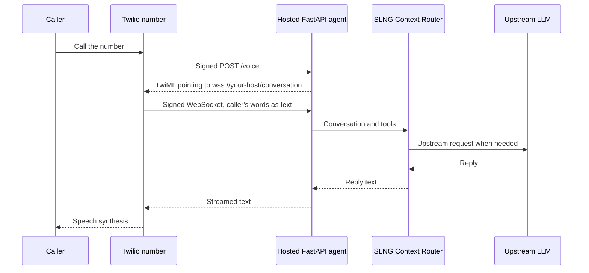

```sh
unmute --version
```

Start with [Unmute installed](/start/installation), a Twilio account, and SLNG
and OpenAI API keys. You choose where the generated app runs.

## 1. Set up Twilio

1. [Create a Twilio account](https://www.twilio.com/try-twilio), then
   [buy a voice-capable number](https://www.twilio.com/docs/numbers-and-senders/phone-number-senders).
   Follow the account and country requirements linked there.
2. In Twilio Console, copy the **Account SID** and **Auth Token**. Open your
   active number and copy its **Phone Number SID** (`PN…`).
3. Accept the Predictive and Generative AI/ML Features Addendum in Voice
   settings, following [ConversationRelay onboarding](https://www.twilio.com/docs/voice/conversationrelay/onboarding).
   This integration uses the number's webhook, so skip the TwiML App setup.
4. Use a number without a TwiML App, SIP trunk, or voice fallback URL. These
   conflict with the webhook; Unmute refuses to overwrite them.

## 2. Create an agent

```sh
unmute init my-agent --target twilio
cd my-agent
```

Edit `instructions.md`: replace the starter's browser identity with your
telephone assistant's role. Keep replies short and suitable for speech. Add
this instruction: “When the caller is finished, call `end_call` in the same
turn as your goodbye.” The starter includes that tool; saying goodbye alone
does not hang up.

The default LLM binding is **SLNG Context Router**, with OpenAI upstream.
SLNG reuses answers it judges cacheable and calls the upstream model for other
requests. Twilio handles speech; SLNG optimizes the LLM side. The app forwards
your upstream key to SLNG on every model request. Keep `agent_id` stable for
cache reuse, and change it when prompt edits should invalidate old answers.
See [Context Router](/optimization/context-router).

## 3. Compile and configure

```sh
unmute validate
unmute compile
cp .env.example .env
```

Fill the package's `.env` with these values. Keep it out of version control.
Supply the application values separately in your host's secret settings.

| Variable | Value | Used by |
|---|---|---|
| `SLNG_API_KEY` | SLNG API key | App |
| `OPENAI_API_KEY` | Upstream OpenAI API key | App, forwarded to SLNG |
| `TWILIO_ACCOUNT_SID` | Account SID | App and deploy |
| `TWILIO_AUTH_TOKEN` | Account Auth Token | App and deploy |
| `TWILIO_PUBLIC_URL` | Exact public HTTPS origin, without a path | App and deploy |
| `TWILIO_PHONE_NUMBER_SID` | Voice number's SID | Deploy only |

`build/twilio/` contains the FastAPI app, Dockerfile, dependencies, and runbook.

## 4. Host the application

Twilio requires a reachable **secure WebSocket server**. FastAPI is Unmute's
implementation choice. Choose any container service, VM, or Python host that
supports public HTTPS/WSS and long-lived WebSocket connections. See
[Twilio's requirements](https://www.twilio.com/docs/voice/twiml/connect/conversationrelay).

Build and run the container from the package directory:

```sh
docker build -t my-agent build/twilio
docker run --rm --env-file .env -e PORT=8080 -p 8080:8080 --stop-timeout 35 my-agent
```

Or run Python with [uv](https://docs.astral.sh/uv/):

```sh
cd build/twilio
uv run --env-file ../../.env python app.py
```

Configure your host or reverse proxy to serve HTTPS and forward WebSocket
upgrades to the app's `PORT` (default `8080`). Set `TWILIO_PUBLIC_URL` to that
exact origin, such as `https://relay.example.com`, in both the host and local
`.env`. Restart after changing it. The generated server does not terminate TLS.

Run **one process and one instance per number**, keep it available when calls
arrive, set `/healthz` as the health check, and allow about **35 seconds** for
shutdown. Sessions live in memory. Sleeping services can miss incoming calls.

```sh
curl https://relay.example.com/healthz
```

Expect HTTP 200 and an `artifact_id`. Return to the package directory before
the next step.

<Accordion title="Try it on a laptop with a tunnel">

Start a tunnel that supports WebSockets:

```sh
cloudflared tunnel --url http://localhost:8080
```

Set `TWILIO_PUBLIC_URL` in `.env` to the tunnel's HTTPS origin, then start the
app with either command above. Keep both processes running during calls.
When the tunnel origin changes, update `.env`, restart the app, and deploy
again. This is a public phone test, not an `unmute dev` browser loop.

</Accordion>

## 5. Connect the number

From the package directory:

```sh
unmute deploy --target twilio --dry-run
unmute deploy --target twilio
```

Unmute checks the number, routing region, hosted build ID, and signed `/voice`
response. It saves the previous route before setting the number's voice
webhook to `POST https://your-host/voice`. It uploads no application and
purchases no number. [Routing and rollback details](/targets/twilio#point-the-number-at-it)
are in the target reference.

### How a call reaches your agent



The app manages history, tools, and model requests. It validates Twilio
signatures and streams responses with completion markers. A marker means
text was sent, not that playback finished. Failed model turns get a short
fallback response; three consecutive failures end the call.

## 6. Make the first call

Call your number. Check the greeting, ask a question, interrupt a reply, and
ask the agent to end the call. Confirm that it disconnects. `end_call` can
cut off a goodbye spoken in the same turn; do not rely on final speech being
fully played.

If something fails, read the app's logs and the call in Twilio Console's call
inspector. A signature error usually means `TWILIO_PUBLIC_URL` or the Auth
Token differs between Twilio, the host, and your local configuration. A build
ID mismatch means you need to host the newly compiled app. A silent or failed
model turn calls for checking both model keys and the model error in the log.

For Twilio's own guidance, see [best practices](https://www.twilio.com/docs/voice/conversationrelay/best-practices),
the [Python/FastAPI tutorial](https://www.twilio.com/en-us/blog/developers/tutorials/product/integrate-openai-twilio-voice-using-conversationrelay-python),
and its [example code](https://github.com/rishabkumar7/cr-demo-python).
