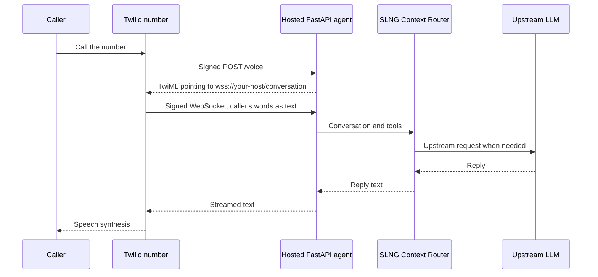

```sh
unmute --version
```

Start with [Unmute installed](/start/installation), a Twilio account, and SLNG
and OpenAI API keys. There are three separate steps: **compile locally →
deploy the app to your host → connect the Twilio number**. You choose the host;
`unmute deploy --target twilio` performs only the last step.

## 1. Set up Twilio

1. [Create a Twilio account](https://www.twilio.com/try-twilio), then
   [buy a voice-capable number](https://www.twilio.com/docs/numbers-and-senders/phone-number-senders).
   Follow the account and country requirements linked there.
2. In Twilio Console, copy the **Account SID** and **Auth Token**. Open your
   active number and copy its **Phone Number SID** (`PN…`).
3. Accept the Predictive and Generative AI/ML Features Addendum in Voice
   settings, following [ConversationRelay onboarding](https://www.twilio.com/docs/voice/conversationrelay/onboarding).
   This integration uses the number's webhook, so skip the TwiML App setup.
4. Use a number without a TwiML App, SIP trunk, or voice fallback URL. These
   conflict with the webhook; Unmute refuses to overwrite them.

ConversationRelay supports **United States (`us1`, the default), Ireland
(`ie1`), and Australia (`au1`)**. This is where Twilio processes calls, separate
from your app host and SLNG's `world_part`. For Ireland, use the
[regional setup steps](/targets/twilio#regional-configuration) before connecting
the number. See [Twilio's regional support](https://www.twilio.com/docs/voice/twiml/connect).

## 2. Create an agent

```sh
unmute init my-agent --target twilio
cd my-agent
```

Edit `instructions.md`: replace the starter's browser identity with your
telephone assistant's role. Keep replies short and suitable for speech. Add
this instruction: “When the caller is finished, call `end_call` in the same
turn as your goodbye.” The starter includes that tool; saying goodbye alone
does not hang up.

The default LLM binding is **SLNG Context Router**, with OpenAI upstream.
SLNG reuses answers it judges cacheable and calls the upstream model for other
requests. Twilio handles speech; SLNG optimizes the LLM side. The app forwards
your upstream key to SLNG on every model request. Keep `agent_id` stable for
cache reuse, and change it when prompt edits should invalidate old answers.
See [Context Router](/optimization/context-router).

## 3. Compile and configure

```sh
unmute validate
unmute compile
cp .env.example .env
```

Fill the package's `.env` with these values. Leave `TWILIO_PUBLIC_URL` blank
until your host assigns a URL in step 4. Keep `.env` out of version control.

| Variable | Value | Used by |
|---|---|---|
| `SLNG_API_KEY` | SLNG API key | App |
| `OPENAI_API_KEY` | Upstream OpenAI API key | App, forwarded to SLNG |
| `TWILIO_ACCOUNT_SID` | Account SID | App and deploy |
| `TWILIO_AUTH_TOKEN` | Account Auth Token | App and deploy |
| `TWILIO_PUBLIC_URL` | Exact public HTTPS origin, without a path | App and deploy |
| `TWILIO_PHONE_NUMBER_SID` | Voice number's SID | Deploy only |

This runs on **your computer**. `unmute compile` writes the deployable project
in `build/twilio/`: `app.py` and the modules beside it, a Dockerfile,
dependencies, tools, and a runbook.
It creates the FastAPI HTTP and WebSocket endpoints for you; you do not write
another server. Compile again after changing the source agent.

## 4. Host the application

Twilio requires a reachable **secure WebSocket server**. FastAPI is Unmute's
implementation choice; Twilio does not run your Python app.
[Twilio's requirements](https://www.twilio.com/docs/voice/twiml/connect/conversationrelay)
apply whichever host you choose.

| Deployment | What you send to the host | Where the app runs |
|---|---|---|
| Managed container service | Generated project from Git, or an image pushed to a registry | The host builds/pulls and runs the container; Render is one example |
| VM or Python service | Contents of `build/twilio/` | Your server runs Python behind an HTTPS/WebSocket proxy |
| Laptop and tunnel | Nothing to upload | Your laptop runs the app while a tunnel exposes it; temporary testing only |

### Deploy the generated project

Choose one path. Running `docker build` or `docker run` on your laptop alone
does not publish the app to the internet.

<Tabs>
<Tab title="Container host (Render example)">

1. Create an empty Git repository for the generated app. From `my-agent/`,
   copy the build to a separate deployment folder, excluding local secrets:

   ```sh
   rsync -a --exclude='.env' --exclude='.venv' --exclude='__pycache__' \
     build/twilio/ ../my-agent-deploy/
   cd ../my-agent-deploy
   git init -b main
   git add .
   git commit -m "Add compiled Twilio app"
   git remote add origin https://github.com/YOUR-ACCOUNT/my-agent-deploy.git
   git push -u origin main
   ```

   Replace the repository URL with yours. Keep editing the original
   `my-agent/` package; compile replaces its build folder.
2. In Render, choose **New → Web Service**, connect that repository and its
   `main` branch, and select **Docker**. Leave Root Directory empty, use
   `./Dockerfile` with build context `.`, and leave Docker Command empty.
   The Dockerfile installs dependencies and starts `python app.py`.
   [Render Docker setup](https://render.com/docs/docker).
3. Choose one always-on instance. Set Health Check Path to `/healthz` and
   `PORT=8080`. In **Environment**, add the four keys from step 3:
   `SLNG_API_KEY`, `OPENAI_API_KEY`, `TWILIO_ACCOUNT_SID`, `TWILIO_AUTH_TOKEN`.
4. Create the service and copy its assigned HTTPS URL. Set
   `TWILIO_PUBLIC_URL` in Render's **Environment** to that exact origin,
   for example `https://my-agent.onrender.com`, with no path or trailing slash.
   Save and deploy the updated environment. The app requires this value to
   start; if the first attempt ran without it, redeploy after setting it.
   [Render web services](https://render.com/docs/web-services).
5. Allow at least 35 seconds for shutdown. With the
   [Render CLI](https://render.com/docs/cli), use your service's `srv-…` ID:

   ```sh
   render services update YOUR-SERVICE-ID --max-shutdown-delay 60 --confirm -o json
   ```

   Render supplies HTTPS and forwards [WebSocket connections](https://render.com/docs/websocket)
   to the same app port. No separate WebSocket service is needed. Wait until
   the deployment is **Live**, then return to `my-agent/` on your computer.

</Tab>
<Tab title="VM or Python host">

Upload the contents of `build/twilio/` to a directory on your server using
SSH/SCP or your host's deployment workflow. Supply the app values from step 3
through the host's environment settings. On a VM, you can create a private
`.env` in that directory instead.

From that directory **on the host**, build and run Docker:

```sh
docker build -t my-agent .
docker run --env-file .env -e PORT=8080 -p 8080:8080 --stop-timeout 35 my-agent
```

Or install Python 3.12 and [uv](https://docs.astral.sh/uv/) and start Python:

```sh
uv run --env-file .env python app.py
```

For the Python command, omit `--env-file .env` when your host injects the
variables. Configure the host
or reverse proxy with your public domain and TLS certificate. Forward HTTPS
requests and WebSocket upgrades to the app on port `8080` (for a proxy on the
same server, `http://127.0.0.1:8080`), keeping
connections open for whole calls. The generated app does not terminate TLS.
Set `TWILIO_PUBLIC_URL=https://YOUR-HOST` in the app's environment and restart.

Keep the process running with your host's service manager. Use one process
and one instance, `/healthz` as the health check, and at least 35 seconds of
shutdown grace. Return to `my-agent/` on your computer for step 5.

</Tab>
</Tabs>

<Accordion title="Try it on a laptop with a tunnel">

From `my-agent/`, build locally:

```sh
docker build -t my-agent build/twilio
cloudflared tunnel --url http://localhost:8080
```

Copy the tunnel's HTTPS origin into `TWILIO_PUBLIC_URL` in your local `.env`.
In a second terminal, from `my-agent/`, start the app:

```sh
docker run --rm --env-file .env -e PORT=8080 -p 8080:8080 --stop-timeout 35 my-agent
```

Keep both terminals running. Continue to step 5 using that tunnel URL.
When it changes, update `.env`, restart the app, and reconnect the number.

</Accordion>

### Set the public URL and check the hosted app

For **every deployment**, put the host's exact HTTPS origin in the original
`my-agent/.env` on your computer as well as the running app's environment:

```dotenv
TWILIO_PUBLIC_URL=https://YOUR-HOST
```

Replace `YOUR-HOST` with the real hostname, such as `my-agent.onrender.com`.
Check it from your computer:

```sh
curl https://YOUR-HOST/healthz
```

Continue only when the public endpoint returns HTTP 200 and an `artifact_id`.
A local health check does not establish that Twilio can reach the app.
Keep the service available when calls arrive; sleeping services can miss calls.

## 5. Connect the number

Now the app is hosted. From the original `my-agent/` directory on your computer,
set `TWILIO_PHONE_NUMBER_SID` in `.env` to the number's `PN…` SID and run:

```sh
unmute deploy --target twilio --dry-run
unmute deploy --target twilio
```

Unmute uses your Account SID and Auth Token to update that number through
Twilio's API. It checks the hosted build and signed `/voice` response, saves
the previous route, and sets the number's incoming-call webhook. It uploads
no application. [Routing and rollback details](/targets/twilio#point-the-number-at-it).

| Where | Value for a host named `my-agent.onrender.com` | Who sets it |
|---|---|---|
| Host environment **and** local `my-agent/.env` | `TWILIO_PUBLIC_URL=https://my-agent.onrender.com` | You |
| Twilio number → Voice Configuration → A call comes in | Webhook: `https://my-agent.onrender.com/voice`, method **HTTP POST** | `unmute deploy` |
| TwiML returned by the app's `/voice` endpoint | `wss://my-agent.onrender.com/conversation` | Generated app, from `TWILIO_PUBLIC_URL` |

You can verify the webhook under **Phone Numbers → Manage → Active numbers →
your number → Configure** in Twilio Console. The WebSocket URL belongs in the
app's generated TwiML, not the number's webhook field. Both endpoints already
exist in the generated app and use the same host and port.

After edits: compile locally, publish the updated build to your host, wait for
it to become healthy, then run `unmute deploy` again to verify the matching build.

### How a call reaches your agent



The app manages history, tools, and model requests. It validates Twilio
signatures and streams responses with completion markers. A marker means
text was sent, not that playback finished. Failed model turns get a short
fallback response; three consecutive failures end the call.

## 6. Make the first call

Call your number. Check the greeting, ask a question, interrupt a reply, and
ask the agent to end the call. Confirm that it disconnects. `end_call` can
cut off a goodbye spoken in the same turn; do not rely on final speech being
fully played.

If something fails, read the app's logs and the call in Twilio Console's call
inspector. A signature error usually means `TWILIO_PUBLIC_URL` or the Auth
Token differs between Twilio, the host, and your local configuration. A build
ID mismatch means you need to host the newly compiled app. A silent or failed
model turn calls for checking both model keys and the model error in the log.

For Twilio's own guidance, see [best practices](https://www.twilio.com/docs/voice/conversationrelay/best-practices),
the [Python/FastAPI tutorial](https://www.twilio.com/en-us/blog/developers/tutorials/product/integrate-openai-twilio-voice-using-conversationrelay-python),
and its [example code](https://github.com/rishabkumar7/cr-demo-python).
