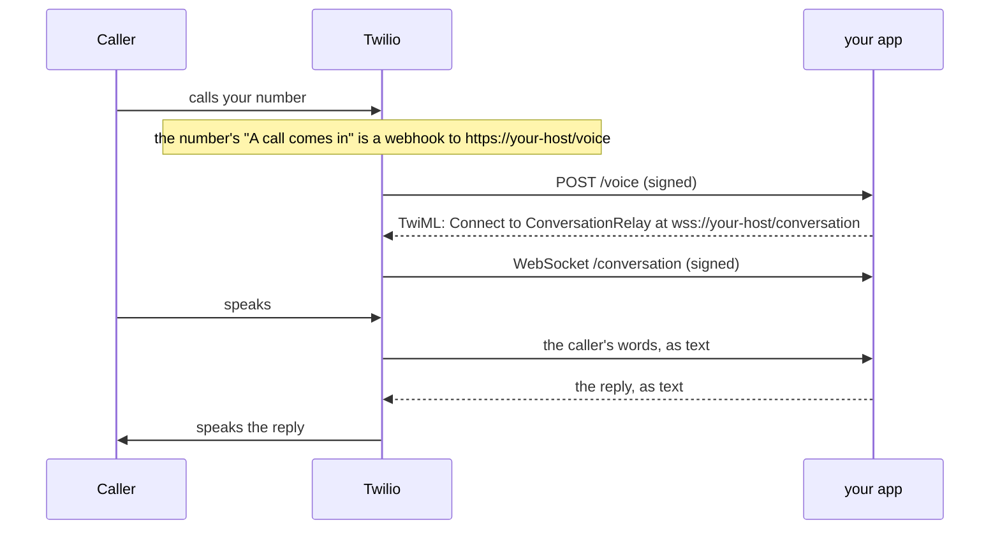
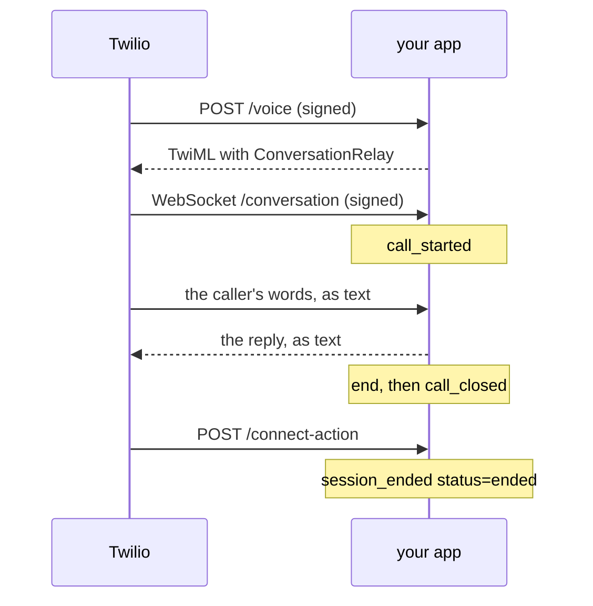

This is the `conversation-relay` transport with the `twilio` carrier, on the
[Twilio target](/targets/twilio). Twilio answers the call, listens and speaks.
A Python app that unmute compiles, and you host, is the agent.

## How a call reaches your agent

The routing is one setting on the number. TwiML is what your app answers with
on each call.



1. You set the number's **A call comes in** to a webhook:
   `https://<your host>/voice`, `HTTP POST`. You do this once. It is the only
   routing there is, and `unmute deploy` can set it for you.
2. On every call, Twilio asks that URL what to do.
3. The app answers with [TwiML](https://www.twilio.com/docs/voice/twiml), the
   markup that tells Twilio what to do with a call. It writes it fresh on each
   call: one
   [`<ConversationRelay>`](https://www.twilio.com/docs/voice/twiml/connect/conversationrelay)
   that points back at the app's WebSocket.
4. Twilio opens that WebSocket. From then on it turns the caller's speech into
   text for the app, and the app's replies into speech.

You never write TwiML, and nothing is stored in Twilio but the webhook. No
TwiML Bin and no TwiML App are involved.

So there are three things to do, in this order: get a number, host the app,
point the number at it. Then call it.

On this page:

- [How a call reaches your agent](#how-a-call-reaches-your-agent) - the webhook and the TwiML
- [Before you start](#before-you-start) - tools, keys and the example
- [1. Get a number](#1-get-a-number) - and turn ConversationRelay on
- [2. Compile](#2-compile) - build the app
- [3. Host the app](#3-host-the-app) - on Render, or your laptop behind a tunnel
- [4. Point the number at the app](#4-point-the-number-at-the-app) - `unmute deploy`, or by hand
- [5. Call it](#5-call-it) - the tool, an interruption, the goodbye
- [6. Read the call back](#6-read-the-call-back) - the app's log and Twilio's call log
- [7. Change the agent](#7-change-the-agent) - recompile, rehost, deploy
- [8. Put the old route back](#8-put-the-old-route-back) - the rollback snapshot
- [9. Clean up](#9-clean-up) - the service and the test repository
- [Troubleshooting](#troubleshooting) - symptoms, causes and fixes

## Before you start

Every command below uses the
[twilio example](https://github.com/slng-ai/unmute/tree/main/examples/twilio):
a front desk with one tool, `opening_hours`, and `end_call`. It thinks with
OpenAI. To start your own package in the same shape, run
`unmute init my-desk --target twilio`. That one thinks through the
[SLNG Context Router](/optimization/context-router), so it also needs an
`SLNG_API_KEY`.

You need:

- `unmute`, and `uv` with Python 3.12;
- a Twilio account;
- an `OPENAI_API_KEY`
  ([Chat Completions](https://developers.openai.com/api/reference/resources/chat));
- to host on Render as step 3 does: the [GitHub CLI](https://cli.github.com/)
  and the [Render CLI](https://render.com/docs/cli), both logged in.

The app and deploy read four Twilio values:

| Name | Value | Read by |
|---|---|---|
| `TWILIO_ACCOUNT_SID` | Account SID, on the Console home page | the app and deploy |
| `TWILIO_AUTH_TOKEN` | Auth Token, next to it | the app and deploy |
| `TWILIO_PUBLIC_URL` | the host's https origin, no path | the app and deploy |
| `TWILIO_PHONE_NUMBER_SID` | the number's SID, `PN` and 32 characters | deploy only |

There is no `unmute dev` loop for this route. Twilio can only call a public
https origin, so the first test is a real phone call.

Twilio has two consoles, and their menus differ. This page names both: the
Twilio Console at `1console.twilio.com`, and the legacy Console at
`console.twilio.com`. They show the same account.

## 1. Get a number

1. Buy a voice-capable number, or pick one you already have
   ([phone numbers](https://www.twilio.com/docs/phone-numbers)).
2. Open it:
   - Twilio Console: **Communications**, **Numbers & senders**, then the number.
   - Legacy Console: **Phone Numbers**, **Manage**, **Active numbers**, then
     the number.
3. Copy its **SID**, `PN` and 32 characters. That is `TWILIO_PHONE_NUMBER_SID`.
4. Under **Voice Configuration**, make sure it has no TwiML App, no SIP trunk
   and no URL under "Primary handler fails". Each of those takes the call away
   from the webhook. Deploy refuses such a number, and never clears one for you.
5. Turn ConversationRelay on for the account, once: in **Voice**,
   **Settings**, **Privacy & Security**, accept the Predictive and Generative
   AI/ML Features Addendum, and save
   ([ConversationRelay onboarding](https://www.twilio.com/docs/voice/conversationrelay/onboarding)).
   Skip that guide's TwiML App steps: this route uses the number's own webhook.

## 2. Compile

```sh
unmute validate examples/twilio
unmute compile examples/twilio
```

`build/twilio/` now holds the whole app:

- `app.py`, the agent;
- the TwiML template it answers `/voice` with;
- the tool handler;
- exact pins and a `Dockerfile`;
- a runbook, `README.md`.

The app installs only the SDK of the model the agent thinks with.

## 3. Host the app

The app needs a public https origin that also passes WebSockets. Render is the
tested host. Your laptop behind a tunnel works for a first try.

### On Render

Render builds a service from a Git repository
([web services](https://render.com/docs/web-services)). The build folder is a
complete project, so it can be that repository on its own. For your own
package, commit `build/twilio/` with it instead, and point Render at that path.


1. Copy the compiled files into a new repository. Leave `.env` and local state
   out:

   ```sh
   mkdir relay-test
   rsync -a --exclude .venv --exclude uv.lock --exclude __pycache__ --exclude .env \
     examples/twilio/build/twilio/ relay-test/
   cd relay-test
   printf '.env\n.venv/\n__pycache__/\n' > .gitignore
   git init -b main && git add -A && git commit -m "Compiled twilio target"
   ```

2. Push it as a private repository:

   ```sh
   gh repo create relay-test --private --source . --push
   ```

   Render reads it through its GitHub app. If that app does not reach every
   repository of yours, add this one to it in the Render Dashboard.

3. Create the service. The secret values come from your shell, so the command
   line holds only their names:

   ```sh
   render services create --name relay-test --type web_service --runtime docker \
     --repo https://github.com/<you>/relay-test --branch main \
     --region frankfurt --plan starter --num-instances 1 \
     --health-check-path /healthz --max-shutdown-delay 60 \
     --env-var "TWILIO_ACCOUNT_SID=$TWILIO_ACCOUNT_SID" \
     --env-var "TWILIO_AUTH_TOKEN=$TWILIO_AUTH_TOKEN" \
     --env-var "OPENAI_API_KEY=$OPENAI_API_KEY" \
     --env-var "TWILIO_PUBLIC_URL=https://relay-test.onrender.com" \
     -o json --confirm
   ```

   Keep the `id` it prints, `srv-` and some characters. Check that the `url` it
   prints is the one you set as `TWILIO_PUBLIC_URL`. Use a paid plan: a free
   instance sleeps after 15 minutes without traffic
   ([free instances](https://render.com/docs/free)), and Twilio does not wait
   for it to wake.

4. Wait until the deploy is live, then check the app from anywhere:

   ```sh
   render deploys list <service id> -o json
   curl https://relay-test.onrender.com/healthz
   ```

   `/healthz` answers `{"ok":true,"artifact_id":"sha256:..."}`. The id matches
   `artifact_id` in `build/twilio/compile-report.json`.

A Blueprint does the same from a file you keep in the package: see
[Host it on Render](/targets/twilio#host-it-on-render).

### On your laptop, for a first try

Copy `build/twilio/.env.example` to the package's `.env`, and fill it in. Then,
from `build/twilio/`:

```sh
uv run --env-file ../../.env python app.py
```

Put a tunnel in front of port 8080. Either of these passes WebSockets through:

```sh
ngrok http 8080
cloudflared tunnel --url http://localhost:8080
```

Set `TWILIO_PUBLIC_URL` to the tunnel's https origin, and restart the app. A
free tunnel gets a new origin each time it starts, so after a restart set the
new one and point the number again.

## 4. Point the number at the app

This is the routing from the top of the page: the number's webhook becomes
`https://<your host>/voice`. `unmute deploy` sets it after checking the host.
You can also set it by hand.

### With unmute deploy

Set the four values, from your shell or the package's `.env`:

```sh
export TWILIO_ACCOUNT_SID=AC...
export TWILIO_AUTH_TOKEN=...
export TWILIO_PHONE_NUMBER_SID=PN...
export TWILIO_PUBLIC_URL=https://relay-test.onrender.com
```

Then run it twice, first as a dry run:

```sh
unmute deploy examples/twilio --target twilio --dry-run
unmute deploy examples/twilio --target twilio
```

`--target` is required, because a bare `unmute deploy` is an SLNG deploy. The
dry run makes every check and writes nothing:

- the number takes voice calls, and has no TwiML App, SIP trunk or fallback URL;
- its routing region is the connection's;
- `/healthz` names this build;
- a `POST /voice` signed with your Auth Token returns this build's TwiML.

The second run saves the old route to a private file, then sets `VoiceUrl` and
`VoiceMethod` on that one number, and nothing else. It ends like this:

```text
twilio: routed +15005550006 (PN<sid>) to POST https://relay-test.onrender.com/voice
twilio: old route saved to <config dir>/unmute/twilio-rollback/PN<sid>-<time>-<n>.json
twilio: wrote build/twilio/deploy-report.json
twilio: no call was placed; call +15005550006 to check speech, the WebSocket and the hangup
```

Keep the `old route saved to` path for step 8. Every check is on
[the Twilio target page](/targets/twilio#point-the-number-at-it).

### By hand

Open the number as in step 1. Under **Voice Configuration**, set **A call comes
in** to **Webhook**, the URL `https://<your host>/voice`, and **HTTP POST**,
then save
([respond to incoming calls](https://www.twilio.com/docs/voice/tutorials/how-to-respond-to-incoming-phone-calls)).
That is all deploy writes. By hand, nothing checks that the host runs the
right build, so check `/healthz` first.

## 5. Call it

Watch the app's log in a second terminal:

```sh
render logs -r <service id> --tail
```

Then call the number with the handset at your ear. A speakerphone makes the
agent hear itself.

1. ConversationRelay speaks the greeting.
2. Ask "Are you open on Friday?" The agent calls `opening_hours` and answers
   from it.
3. Talk over a long answer. The agent stops, and keeps only what you heard.
4. Say you are done. The agent says goodbye, and the call hangs up a moment
   later, once the goodbye has played.

## 6. Read the call back

### In the app's log



1. Twilio asks `/voice` what to do, and the app answers with the TwiML. Its
   attributes carry your `listen`, `speak` and `turn` settings and the
   greeting.
2. ConversationRelay opens the WebSocket, and the app logs `call_started`.
3. ConversationRelay speaks, listens and decides when you finished. The app
   sees only text
   ([WebSocket messages](https://www.twilio.com/docs/voice/conversationrelay/websocket-messages)).
   Each model request is one line in the log.
4. When the agent ends the call, the app logs `end`. Twilio closes the socket,
   and the app logs `call_closed`.
5. Twilio then asks `/connect-action` what comes next. The app hangs up, and
   logs `session_ended status=ended error=` with no error.

The log names each call and event, and never the transcript. Render also logs
the WebSocket as one request lasting the whole call, with no response bytes.

### In Twilio

The call is in Twilio's call log with its SID, both numbers, status and
duration
([retrieve call logs](https://www.twilio.com/docs/voice/tutorials/how-to-retrieve-call-logs)):

- Twilio Console: **Communications**, **Numbers & senders**, open the number,
  and see its calls.
- Legacy Console: open the number, then its **Calls Log** tab.

Open a call for its [Call Summary](https://www.twilio.com/docs/voice/voice-insights/call-summary).
At the bottom of the call's page, the Request Inspector lists the `POST /voice`
and `POST /connect-action` requests with the TwiML the app returned
([troubleshooting calls](https://www.twilio.com/docs/voice/troubleshooting)).
If you do not see the call, check which account the Console shows: a call
belongs to the account that owns the number. The API reads one call by the
`call=` SID in the app's log:

```sh
curl -s -u "$TWILIO_ACCOUNT_SID:$TWILIO_AUTH_TOKEN" \
  "https://api.twilio.com/2010-04-01/Accounts/$TWILIO_ACCOUNT_SID/Calls/CA<sid>.json"
```

## 7. Change the agent

Any change to the package is the same three moves: recompile, rehost, deploy
again.

1. Edit the package, for example the prompt, a tool or the model. The
   [Twilio target page](/targets/twilio#the-package) shows the Gemini and
   SLNG Context Router bindings.
2. `unmute compile examples/twilio`, then host the new build at the same
   origin. On Render, push it to the repository.
3. `unmute deploy examples/twilio --target twilio`. The build's `artifact_id`
   changed, so deploy refuses the old build until the host serves the new one.

The webhook itself does not change, so the number keeps working throughout.
One build runs at one origin. For two builds at once, use two origins and two
numbers.

## 8. Put the old route back

Deploy printed the snapshot path. First check the number in the Console: "A call
comes in" must still be a webhook to the snapshot's `new_voice_url` with
`HTTP POST`, and the number must have no TwiML App, SIP trunk or fallback URL.
If anything differs, somebody changed it since, so stop and ask. If it matches,
set "A call comes in" back to the snapshot's `voice_url` and `voice_method`.

## 9. Clean up

A Render service on a paid plan is billed while it exists. Delete it, and the
test repository, when you are done:

```sh
render services delete <service id>
gh repo delete <you>/relay-test
```

Deleting a repository needs the `delete_repo` scope on the GitHub CLI:
`gh auth refresh -s delete_repo`.

## Troubleshooting

| Symptom | Cause | Fix |
|---|---|---|
| Deploy says the app "names no build" or "runs build ..." | The host runs another build | Recompile, rehost, then deploy |
| Deploy says the app "refused a signed /voice" | The host has different Twilio values | Use the same four values on both sides |
| Deploy names a TwiML App, SIP trunk or fallback URL | The number has one | Remove it in the Console, then deploy again |
| Deploy says the number "routes its calls to" another region | The number's routing region is not the connection's `region` | Change one of them. Use Re-route in the number's [routing settings](https://www.twilio.com/docs/global-infrastructure/inbound-processing-console) |
| Deploy answers 401 on an `ie1` or `au1` package | The Auth Token is the US1 one | Use that region's [Auth Token](https://www.twilio.com/docs/global-infrastructure/manage-regional-api-credentials), on the host too |
| The Connect callback reports [error 64105](https://www.twilio.com/docs/api/errors/64105) | The WebSocket closed during the session | Read the host log. Check the proxy keeps an idle WebSocket open for a whole call |
| Deploy says "the write's outcome is unknown" | The write timed out or the readback failed | Check the number in the Console, then run `--dry-run` |
| The call reports an application error | Twilio could not reach `/voice` | Check `/healthz` from outside the host |
| The call fails after `/voice` answered | ConversationRelay is off for the account, or the WebSocket was refused | Accept the addendum, then read the Twilio Debugger and the host log |
| The agent says goodbye but the call stays open | The model answered without calling `end_call` | Say in the instructions that the call only ends when it calls `end_call`, in the same reply as its goodbye |
| The call is missing from the Console | The Console shows another account | Switch to the account that owns the number, or read the call through the API as in step 6 |
| `/healthz` does not answer on Render | The deploy is not live yet, or it failed | Run `render deploys list <service id>`, then `render logs -r <service id>` |
| The first call after a quiet spell fails | A free instance was asleep | Use a paid instance type |

## Where to go next

<CardGroup cols={2}>
  <Card title="The Twilio target" icon="phone" href="/targets/twilio">
    Every key the target takes, and everything it refuses.
  </Card>
  <Card title="unmute deploy" icon="upload" href="/reference/cli/deploy">
    The command reference.
  </Card>
</CardGroup>
