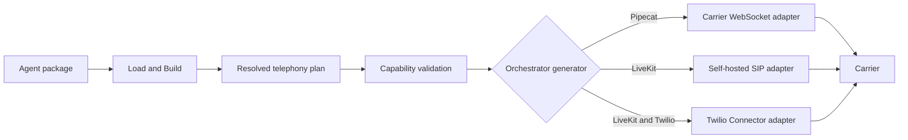
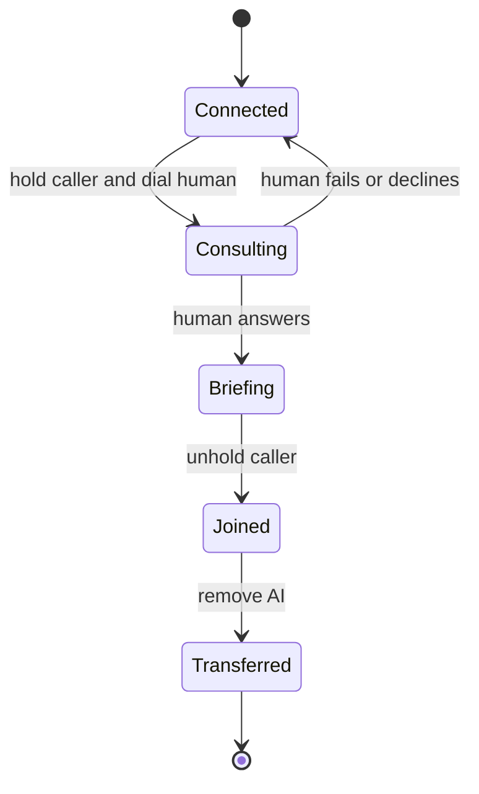

# Telephony architecture and implementation plan

Status: Adopted design; implementation in progress. Updated July 22, 2026
(zero-step local development amendment: managed cloudflared tunnel, automatic
Twilio webhook configuration, automatic local LiveKit trunk records).

Unmute must share telephony intent, planning, and call context across
orchestrators while keeping carrier media and call-control behavior in small,
carrier-specific adapters. This design supports local and self-hosted
deployments for Pipecat and LiveKit without requiring Pipecat Cloud or LiveKit
Cloud. It also scales from Twilio to Telnyx, Plivo, and Exotel without building
a new media gateway.

<!-- prettier-ignore -->
> [!NOTE]
> A route with a real adapter stays provisional until its credentialed L4 smoke
> passes, but provisional no longer blocks use: `validate`, `compile`, and
> `dev --telephony` run it and print an `unverified` warning. Only a gated route
> with no adapter (Exotel, the LiveKit Twilio Connector) fails closed. L1–L3
> tests do not require credentials and cannot promote a route to verified by
> themselves.

## Decision

Unmute will share the control plane and leave the media plane with each
orchestrator's supported transport. The implementation follows these rules:

- Compile one resolved telephony plan before target generation.
- Keep carrier-specific webhook, metadata, outbound, and transfer behavior in
  carrier adapters.
- Reuse Pipecat's existing carrier serializers inside the Pipecat target only.
- Use self-hosted LiveKit SIP as the default multi-carrier LiveKit route.
- Run every local telephony target through a route-derived Docker Compose graph.
  Every graph gets its generated application and Redis. LiveKit SIP also gets
  LiveKit Server and LiveKit SIP.
- Treat LiveKit's Twilio Connector as an optional Twilio-only route while it is
  Beta.
- Run the same generated application files locally and in production. Public
  ingress, environment values, and infrastructure remain deployment concerns.
- Make local development zero-step for a promoted route. When a carrier
  WebSocket route runs without `--public-url`, the dev command starts a
  managed cloudflared quick tunnel as a child process and supplies
  `UNMUTE_PUBLIC_URL` itself. cloudflared is the only supported tunnel
  client (Apache 2.0, no account or token needed, one output parser, one
  failure mode); `--public-url` stays as the bring-your-own-tunnel path for
  any other client, ngrok included.
- Configure the carrier voice webhook automatically where the carrier
  definition records that fact. In v1 only the Pipecat carrier WebSocket
  route with Twilio carries it: the dev command looks up the configured
  number, sets its voice webhook to the plan's inbound endpoint, and prints
  the previous value so the user can restore it. Other carriers keep printed
  manual steps until their fact and implementation are added.
- Create the local LiveKit SIP trunk and dispatch records automatically. For
  the LiveKit SIP route, after the local infrastructure services are
  healthy, the dev command creates or reuses (idempotently, by content) the
  inbound trunk, outbound trunk, and individual-room dispatch rule against
  the local server with the generated development key pair, and injects the
  returned IDs as `LIVEKIT_SIP_INBOUND_TRUNK` and
  `LIVEKIT_SIP_OUTBOUND_TRUNK`. Users never supply these two values for
  local development. Carrier-side (Twilio console) trunk setup stays manual
  and one-time.
- Fail during validation when a carrier and route cannot provide a requested
  direction or control.
- Don't create a universal audio gateway or reimplement carrier serializers.

The provider seam is real because at least four carriers need separate
implementations. The media gateway is speculative and remains excluded.

## Scope

The first complete telephony implementation covers the behavior users need to
test and deploy phone agents.

### Goals

The implementation must provide the following behavior:

- Receive inbound calls.
- Start outbound calls.
- Hydrate call-start system variables.
- Hang up calls reliably.
- Perform cold human transfers where the selected route supports them.
- Perform warm human transfers where the selected route supports them.
- Detect voicemail for outbound calls where the selected route supports it.
- Run carrier WebSocket routes locally through a public HTTPS/WSS tunnel.
- Start generated Pipecat and LiveKit telephony applications through Docker
  Compose whenever `unmute dev --telephony` runs.
- Run LiveKit SIP only where the carrier can reach public SIP signaling and
  RTP; an HTTPS tunnel is insufficient.
- Boot and fault-test the local LiveKit SIP control topology without LiveKit
  Cloud or carrier credentials.
- Run on customer infrastructure through route-appropriate public ingress.
- Scale horizontally with shared Redis coordination while keeping the media and
  conversation session in the active worker.
- Emit all Python code through Go `text/template` files.

### Non-goals

The first implementation deliberately excludes work that a carrier or
orchestrator already performs.

- Unmute does not provision carrier-side resources: it never buys phone
  numbers and never creates carrier applications or carrier SIP trunks. The
  one-time carrier console setup stays manual. Automatic setup applies only
  to Unmute-owned local development state: the number's voice webhook value
  (restorable, previous value printed) and trunk records inside the user's
  own self-hosted LiveKit SIP bridge.
- Unmute does not proxy or transcode audio between Pipecat and LiveKit.
- Unmute does not bundle a tunnel binary. The dev command manages an
  external `cloudflared` found on PATH; installing it is the user's one-time
  step, and `--public-url` works with any other tunnel.
- The local Compose file is not a production deployment recipe.
- Unmute does not promise the same transfer implementation on every route.
- Unmute does not expose raw carrier webhook payloads to agent prompts or tools.
- Unmute does not claim a carrier capability until an official source and a
  smoke test prove it.

## Current repository state

Telephony routes with a real adapter are usable in the public CLI. No selectable
Pipecat or LiveKit route has passed its exact credentialed L4 smoke yet, so
`unmute validate`, `unmute compile`, and `unmute dev --telephony` run them and
print an `unverified` warning per feature. Only gated routes with no adapter
(Exotel, the LiveKit Twilio Connector) are rejected before an artifact is
written or Docker is invoked.

- Strict Connection loading and exact route resolution produce one
  `TelephonyPlan` per selected target.
- Pipecat emits selected Twilio, Telnyx, or Plivo carrier WebSocket ingress,
  outbound control, authentication, and normalized context. Exotel is gated.
- LiveKit emits selected Twilio, Telnyx, or Plivo SIP trunk and dispatch inputs,
  native outbound/voicemail/transfers, and normalized SIP participant context.
  Exotel and the separate Twilio Connector remain gated.
- Direct generator tests render the Pipecat and LiveKit artifacts described in
  this document. Those test artifacts are implementation evidence, not an
  obtainable or supported deployment escape hatch.
- `unmute dev --telephony` validates and attempts generation before checking a
  public URL, credentials, local topology conflicts, or Docker. The current
  error therefore explains the provisional or gated route instead of asking a
  user to provision credentials for an unusable path.
- Generated and compile-report files contain environment-variable names, not
  credential values.
- Every implemented carrier route remains provisional until its credentialed
  inbound, outbound, authentication, hangup, and advertised-control smokes
  pass.
- The offline LiveKit SIP and Pipecat projects include
  `compose.telephony.yaml`, and their plans report exact services plus closed
  coordination reasons and consumers. Once an exact route is promoted, the
  dev command will execute that file, wait for Compose health, follow logs, and
  perform project-scoped cleanup without deleting volumes.
- Promotion requires the exact framework/transport/carrier route to pass
  credentialed inbound, outbound, signature/authentication, hangup, and every
  advertised control smoke, with its capability evidence changed from
  provisional to enabled. Credential-free generation and syntax tests alone
  cannot promote a route.

## Route matrix and package cardinality

A package can declare any number of named telephony targets and Connections.
Each target still selects exactly one Connection and one route, so every build
contains one carrier adapter and one credential vocabulary. To use several
carriers, add several target instances, such as `pipecat_twilio`,
`pipecat_telnyx`, and `livekit_plivo`. After those routes are promoted,
`unmute compile` will write each one to its own `build/<target-name>/`
directory and `unmute dev --telephony` will run one selected target at a time.
Today, each telephony target fails closed before either action.

The compiler has no package-level carrier count limit. The closed route matrix,
not the number of targets, is the limit:

| Framework | Transport | Carrier | Emitted integration | Current status |
|---|---|---|---|---|
| Pipecat | `carrier-websocket` | Twilio | Direct carrier adapter and Pipecat Twilio serializer | Generated in offline tests; provisional |
| Pipecat | `carrier-websocket` | Telnyx | Direct carrier adapter and Pipecat Telnyx serializer | Generated in offline tests; provisional |
| Pipecat | `carrier-websocket` | Plivo | Direct carrier adapter and Pipecat Plivo serializer | Generated in offline tests; provisional |
| Pipecat | `carrier-websocket` | Exotel | None | Gated |
| LiveKit | `sip` | Twilio | Self-hosted LiveKit SIP and Twilio trunk inputs | Generated in offline tests; provisional |
| LiveKit | `sip` | Telnyx | Self-hosted LiveKit SIP and Telnyx trunk inputs | Generated in offline tests; provisional |
| LiveKit | `sip` | Plivo | Self-hosted LiveKit SIP and Plivo trunk inputs | Generated in offline tests; provisional |
| LiveKit | `sip` | Exotel | None | Gated |
| LiveKit | `connector` | Twilio | No generated adapter | Recognized Beta route; gated |

"Generated in offline tests" does not mean the route is enabled. Every
generated row still fails public validation until its exact credentialed smoke
promotes the requested features. The Pipecat adapters contain inbound,
outbound, hangup, and cold-transfer paths; voicemail and warm transfer remain
gated. The LiveKit SIP emitter contains inbound, outbound, voicemail, hangup,
cold-transfer, and warm-transfer paths. The Twilio Connector has only route and
credential vocabulary today, so validation stops before generation.

## What scales across carriers

Twilio, Telnyx, Plivo, and Exotel share enough behavior for one plan and one
normalized call context. They don't share enough behavior for one media or
call-control implementation.

### Shared call shape

All four Pipecat integrations follow the same broad sequence:

1. The carrier receives or creates a phone call.
2. The carrier obtains call instructions from configured markup or a webhook.
3. The instructions open a bidirectional WebSocket to the generated artifact.
4. Pipecat parses the first messages and selects the carrier serializer.
5. The agent runs until the stream ends or a call-control operation ends it.

Local and deployed artifacts use this sequence unchanged. Local development
uses a tunnel that forwards public HTTPS and WSS traffic to the container.
Production uses TLS ingress that supports long-lived WebSockets.

### Carrier differences

Each carrier adapter owns the differences listed below. The compiler never
tries to hide them behind unchecked configuration.

| Concern | Twilio | Telnyx | Plivo | Exotel |
|---|---|---|---|---|
| Inbound setup | TwiML or webhook | TeXML application | XML answer server | App Bazaar Voicebot |
| Primary call ID | Call SID | Call Control ID | Call UUID | Call SID |
| Caller metadata | Webhook or lookup | WebSocket start data | Webhook and stream data | WebSocket start data |
| Outbound control | Calls resource | Voice Call Control | Calls resource | Voice call resource |
| Pipecat serializer | Twilio | Telnyx | Plivo | Exotel |
| Stream encoding | Carrier serializer owns it | Carrier serializer owns it | Carrier serializer owns it | Carrier serializer owns it |
| Custom call data | Stream parameters | Query or encoded body | Query or encoded body | Gated; query data may be removed |
| Cold transfer | Verified carrier control | Verified carrier control | Verified carrier control | Gated; unverified |
| Warm primitives | Conference participants | Conference participants | Multi-party call | Unverified |

The relevant Pipecat guides document inbound, outbound, local tunnel, and
self-hosted WebSocket behavior:

- [Twilio WebSocket integration](https://docs.pipecat.ai/pipecat/telephony/twilio-websockets)
- [Telnyx WebSocket integration](https://docs.pipecat.ai/pipecat/telephony/telnyx-websockets)
- [Plivo WebSocket integration](https://docs.pipecat.ai/pipecat/telephony/plivo-websockets)
- [Exotel WebSocket integration](https://docs.pipecat.ai/pipecat/telephony/exotel-websockets)

Official carrier documentation must remain the source for call-control claims.
Twilio documents
[Media Streams](https://www.twilio.com/docs/voice/media-streams), active
[Call updates](https://www.twilio.com/docs/voice/api/call-resource), and
[Conference participants](https://www.twilio.com/docs/voice/conference).
Telnyx documents both its
[transfer command](https://developers.telnyx.com/api-reference/call-commands/transfer-call)
and [conference commands](https://developers.telnyx.com/docs/voice/programmable-voice/voice-api-commands-and-resources).
Plivo documents
[active call control](https://docs.plivo.com/docs/voice/api/calls) and
[multi-party calling](https://docs.plivo.com/docs/voice/xml/conference). Exotel
documents inbound and outbound streaming, but its warm-transfer behavior is not
verified. Unmute must fail that capability until it is proven.

## Credentials

Unmute stores only environment variable names in Connection files. Put the
values in the source package's ignored `.env` for `unmute dev`, or in your
deployment secret store. Never commit them or copy them into `targets.yaml`.

The initial route adapters use these names:

| Route | Environment variables | Where to get them |
|---|---|---|
| Pipecat or LiveKit Connector with Twilio | `TWILIO_ACCOUNT_SID`, `TWILIO_AUTH_TOKEN`, `TWILIO_PHONE_NUMBER` | Twilio Console → Account dashboard and Phone Numbers. The Auth Token is also required to validate Twilio webhook signatures. Twilio recommends scoped API keys for production REST calls, but the Auth Token remains necessary for request validation. |
| Pipecat with Telnyx | `TELNYX_API_KEY`, `TELNYX_PUBLIC_KEY`, `TELNYX_CONNECTION_ID`, `TELNYX_PHONE_NUMBER` | Telnyx Mission Control Portal → API Keys, Public Key, and the Voice API Application details page. The application ID is the Connection ID. |
| Pipecat with Plivo | `PLIVO_AUTH_ID`, `PLIVO_AUTH_TOKEN`, `PLIVO_PHONE_NUMBER` | Plivo Console dashboard → API Keys and Phone Numbers. The Auth Token validates V3 webhook signatures. |
| Pipecat with Exotel | `EXOTEL_API_KEY`, `EXOTEL_API_TOKEN`, `EXOTEL_ACCOUNT_SID`, `EXOTEL_SUBDOMAIN`, `EXOTEL_PHONE_NUMBER`, `EXOTEL_APP_ID` | Exotel Dashboard → API Settings for the key, token, Account SID, and regional subdomain; use the ExoPhone and call-flow application ID from the Voice dashboard. |
| All Pipecat telephony routes | `REDIS_URL` | Generated Compose supplies the local value. In production, use the connection URL from the Redis service managed by your infrastructure operator. Store any password in the deployment secret store. |
| LiveKit Cloud or Twilio Connector | `LIVEKIT_URL`, `LIVEKIT_API_KEY`, `LIVEKIT_API_SECRET` | LiveKit Cloud project settings, or run `lk app env -w`. The Connector also needs the Twilio variables above. |
| Self-hosted LiveKit SIP topology | `LIVEKIT_URL`, `LIVEKIT_API_KEY`, `LIVEKIT_API_SECRET`, `REDIS_URL`, `LIVEKIT_SIP_URI` | Create the API key and secret in the LiveKit Server `keys` configuration and use the same pair in LiveKit SIP. Set `LIVEKIT_URL` to that server, `REDIS_URL` to their shared Redis deployment, and `LIVEKIT_SIP_URI` to the SIP service's public DNS name or SIP URI. |
| LiveKit SIP with Twilio | `TWILIO_SIP_ADDRESS`, `TWILIO_SIP_USERNAME`, `TWILIO_SIP_PASSWORD`, `TWILIO_PHONE_NUMBER` | Twilio Console → Elastic SIP Trunking. Use the termination URI, Credential List username and password, and associated number. |
| LiveKit SIP with Telnyx | `TELNYX_SIP_ADDRESS`, `TELNYX_SIP_USERNAME`, `TELNYX_SIP_PASSWORD`, `TELNYX_PHONE_NUMBER` | Telnyx Mission Control → SIP Trunking. Use the SIP connection address and credentials, and its assigned number. |
| LiveKit SIP with Plivo | `PLIVO_SIP_ADDRESS`, `PLIVO_SIP_USERNAME`, `PLIVO_SIP_PASSWORD`, `PLIVO_PHONE_NUMBER` | Plivo Console → Zentrunk. Use the termination domain, outbound credential, and linked number. |
| LiveKit SIP resource IDs | `LIVEKIT_SIP_INBOUND_TRUNK`, `LIVEKIT_SIP_OUTBOUND_TRUNK` | For local development, `unmute dev --telephony` creates the records itself and supplies both IDs; do not set them. For production, copy each `SIPTrunkID` printed by the generated `lk sip ... create` setup commands. Only requested directions and controls require their corresponding ID. |

The generated Pipecat carrier-WebSocket outbound HTTP endpoint also requires
`UNMUTE_OUTBOUND_TOKEN`. Generate this secret yourself with a cryptographically
secure password generator; it does not come from a carrier. LiveKit SIP doesn't
use this token. Every generated telephony Compose graph also supplies
`REDIS_URL`. Redis is always present so the same application remains correct
across independently routed requests and multiple replicas; it is never part
of the media path.

The local LiveKit SIP Compose stack needs no LiveKit Cloud or carrier
credentials to boot. It supplies an obvious non-production LiveKit API key pair
to its own services and local Agent process. Those values must never be reused
outside the generated local stack. Starting a conversational Agent may still
require the selected model providers' credentials. Placing a real phone call
still requires the selected carrier credentials and public SIP/RTP reachability.

Direct carrier WebSocket routes also require `UNMUTE_PUBLIC_URL`. For local
development the dev command supplies it from the managed cloudflared tunnel,
or from `--public-url` when you bring your own tunnel. In production, set it
to the exact externally visible HTTPS origin (including any fixed path
prefix, but no query or fragment). It is not a credential. Generated
signature validation derives its HTTP and WSS callback URLs only from this
value and never trusts a forwarded host header.

The source pages are the
[Twilio credential guide](https://www.twilio.com/docs/iam/api-keys),
[Telnyx Voice API guide](https://developers.telnyx.com/docs/voice/programmable-voice/get-started),
[Plivo Voice API guide](https://docs.plivo.com/docs/voice/api/overview),
[Exotel Voice API guide](https://developer.exotel.com/api/outgoing-call-to-connect-number-to-a-call-flow),
[LiveKit startup-mode guide](https://docs.livekit.io/agents/server/startup-modes/),
and
[LiveKit self-hosted SIP guide](https://docs.livekit.io/transport/self-hosting/sip-server/).

No carrier or LiveKit credentials were available during the initial build.
The generated Pipecat Twilio, Telnyx, and Plivo adapters and LiveKit SIP
topology therefore have offline tests only. Exotel remains gated because its
documented static App Bazaar Voicebot URL doesn't provide a proven
authenticated WebSocket upgrade, custom URL data may be stripped, and no
provider-specific LiveKit SIP route has been proven. Every live route stays
provisional until its corresponding inbound, outbound, hangup,
authentication, and advertised-control smoke completes.

## Architecture

The architecture resolves portable intent once, then selects a route and emits
only the carrier and orchestrator code needed by that target.



### Authoring layer

The Agent declares what a phone channel must do. A Connection declares which
carrier account supplies it. The target selects the media route used by the
orchestrator.

The package uses one file per external connection:

```text
connections/
  primary_phone.yaml
```

The connection shape stores environment variable names, never secret values:

```yaml
# connections/primary_phone.yaml
kind: telephony
environment:
  account_sid: TWILIO_ACCOUNT_SID
  auth_token: TWILIO_AUTH_TOKEN
  from_number: TWILIO_PHONE_NUMBER
```

The target binds its carrier and connection while preserving the existing
transport vocabulary:

```yaml
targets:
  pipecat:
    provider: pipecat
    version: "1.5.0"
    transport: carrier-websocket
    carrier: twilio
    connection: primary_phone
```

The `environment` keys are provider vocabulary. Build validates required and
unknown keys against the selected carrier definition. The values are
environment variable names and remain safe to commit.

The first implementation supports one telephony Connection per target. A
package can add any number of targets and Connections for supported routes, but
one generated target never combines carriers. It must fail clearly when a
single target requests multiple telephony channels that need different
connections. A LiveKit or Pipecat target with a telephony channel must bind a
Connection, and a target cannot bind a telephony Connection when the package
has no telephony channel. Add per-channel target bindings only when a real
agent needs that topology.

### Resolved telephony plan

`ir.Build` must turn channel, Connection, target, and capacity inputs into one
resolved plan. Validation and generation consume this same value.

The plan contains the following resolved facts:

- Channel name and inbound or outbound directions.
- Connection name and carrier.
- Media route: carrier WebSocket, LiveKit SIP, or LiveKit Connector.
- Required controls and their proven capability results.
- Symbolic transfer destinations resolved for the target.
- Required environment variable names.
- Environment names supplied by the generated local topology rather than by
  the operator.
- Public HTTP and WSS endpoint descriptions.
- Normalized call-context sources.
- Generated process and file requirements.
- Manual carrier or trunk configuration steps.
- Capacity ownership, `coordination: shared`, and the applicable reasons and
  consuming services from the closed coordination-reason set.

The plan belongs in `internal/ir`, close to the other resolved target facts.
The existing `internal/target` table remains the single capability rulebook.
Don't create a second telephony capability table.

### Carrier definition

The compiler needs a small carrier definition for validation and rendering. It
is data, not a runtime client interface.

Each definition records these facts:

- Canonical carrier name.
- Required and optional Connection environment keys.
- Supported Pipecat serializer and package extra.
- Supported media routes.
- Runtime process, endpoint, required-environment, local-environment, and
  manual-setup facts, with feature conditions where a route emits them only
  for inbound, outbound, or transfer use.
- Inbound and outbound support.
- Control support by route.
- Call-context field mapping.
- Verified documentation URL and verification date.

Add Twilio directly first. When Telnyx is added, extract only the duplicated
definition and rendering logic. Don't build a carrier framework before two
working implementations prove the seam.

### Generated carrier adapter

The generated Python project contains only the selected carrier adapter. It
doesn't ship every carrier SDK or a runtime plugin registry.

Every generated adapter provides the same behavior to its orchestrator without
requiring a Python base class:

- Validate inbound webhook authenticity.
- Return or describe the carrier's stream instructions.
- Start an outbound call.
- Normalize the initial call context.
- End the active call.
- Perform a cold transfer when supported.
- Coordinate a warm transfer when supported.
- Translate provider errors into stable runtime errors.

The Go generator selects and renders the implementation with a `switch`, which
matches the repository's existing target-generator pattern. The generated
runtime doesn't interpret Unmute configuration.

### Normalized call context

Carrier payloads use different names and identifiers. The adapter normalizes
only the fields the Agent can use portably.

```text
session_id
carrier
connection
call_id
stream_id
direction
from_number
to_number
```

Transfer coordination may also retain provider-private call-leg and conference
IDs. Those values stay inside the telephony runtime and never become portable
Agent variables.

The normalized values hydrate matching explicit system sources before the
greeting or first model turn runs. Authored `source: call_start` variables come
from outbound job input instead. Missing requested values cause the call to
fail before conversation starts.

### Pipecat route

Pipecat receives carrier audio directly over WebSocket. Unmute reuses Pipecat's
parser, transport, and carrier serializer instead of implementing audio frames.

The generated Pipecat project adds these routes to its existing application:

- An inbound instruction or webhook route when the carrier requires one.
- A carrier WebSocket route.
- An authenticated outbound trigger route.
- Carrier status callback routes when required.
- Health and readiness routes.

The Pipecat adapter constructs the upstream serializer with the normalized
stream and call identifiers. The serializer continues to own carrier audio
messages and automatic call termination where Pipecat provides it.

Warm transfer is not an automatic extension of that path. A Twilio call using
bidirectional `<Connect><Stream>` cannot simultaneously be a Conference
participant. The route must therefore prove a separate Pipecat media leg that
can join the Conference, hold and restore the caller, brief the human, and
remove only the AI leg. Until successful, declined, unanswered, failure, and
duplicate-callback smokes prove that topology, `warm_transfer` remains
provisional even if inbound, outbound, hangup, and cold transfer later pass.

### LiveKit routes

LiveKit needs two explicit routes because its provider-neutral production path
and its Twilio WebSocket path have different feature sets.

#### Self-hosted SIP

Self-hosted SIP is the default LiveKit route for multiple carriers and full
telephony features. The generated Agent keeps LiveKit's native outbound,
voicemail, and transfer behavior.

The generated artifact documents or emits configuration for these runtime
processes:

- LiveKit Server.
- Redis required by the self-hosted LiveKit deployment.
- LiveKit SIP.
- The generated LiveKit Agent worker.

For local development, it also emits `compose.telephony.yaml` based on
LiveKit's official
[self-hosting overview](https://docs.livekit.io/transport/self-hosting/) and
[SIP Docker Compose guide](https://docs.livekit.io/transport/self-hosting/sip-server/).
The file runs all four services, including the generated Agent. Compose passes
runtime environment values into the Agent container without baking them into
the image.

The Compose images use explicit versions, not `latest`. The stack exposes the
local LiveKit endpoint plus SIP signaling and the documented RTP range. It uses
one named Redis data volume so a normal stop and restart doesn't discard local
trunk and dispatch state. The generated non-production API key pair is local
configuration, not a user credential.

Carrier-side trunk and number changes remain manual. Unmute emits
deterministic trunk and dispatch configuration files for production use. For
local development, `unmute dev --telephony` creates the same records
automatically against the local server (see Local development below); it
never touches the carrier console. See the
[LiveKit SIP server guide](https://docs.livekit.io/transport/self-hosting/sip-server/)
for the underlying deployment topology and public SIP and RTP requirements.

The implemented route uses one Connection vocabulary for Twilio, Telnyx, and
Plivo: `sip_address`, `sip_username`, `sip_password`, and `from_number`. It
emits inbound-trunk, outbound-trunk, and individual-room dispatch JSON only
when the authored directions and controls need them. Credentials remain
environment placeholders; outbound authentication is passed to `lk` rather
than written into the generated JSON.

The Agent waits for the SIP participant and normalizes LiveKit's
`sip.callID`, `sip.phoneNumber`, and `sip.trunkPhoneNumber` attributes before
the entry greeting. Outbound jobs use authenticated LiveKit Agent dispatch
metadata with `direction`, `phone_number`, and authored `call_start` values.
The route remains provisional until credentialed smokes prove these paths.

#### Twilio Connector

The LiveKit Twilio Connector mirrors the Pipecat Media Streams topology and can
target a self-hosted LiveKit server. It is currently Beta and Twilio-specific.

The generated webhook creates a connector session, receives a WSS URL, and
returns TwiML that points Twilio at that URL. The connector creates a LiveKit
participant and dispatches the Agent. The
[LiveKit Twilio Connector guide](https://docs.livekit.io/telephony/connectors/twilio/)
documents inbound and outbound calls and states that self-hosted LiveKit is
supported.

This route requires a spike before it can claim warm-transfer parity. If the
spike fails, LiveKit SIP remains the supported transfer route.

## Human transfers

Human transfer is a route capability, not an orchestrator-wide or
carrier-wide boolean. Validation resolves the requested mode against the full
combination of orchestrator, media route, and carrier.

### Cold transfer

Cold transfer replaces or redirects the active caller leg and removes the AI
after the carrier accepts the transfer.

- Pipecat carrier WebSocket routes use the selected carrier's call-control
  operation.
- LiveKit SIP uses LiveKit's native SIP transfer.
- LiveKit Twilio Connector uses Twilio call control only after the connector
  spike proves cleanup behavior.

The operation must preserve the original call if the destination fails when
the carrier supports that behavior. Otherwise, validation or generated docs
must state the carrier limitation.

### Warm transfer

Warm transfer needs at least three participants and a durable state transition.
For carrier WebSocket routes, the common behavior is conference-first even
though every carrier uses different operations.



The carrier adapter implements these operations:

1. Put the caller and AI media leg in a conference or multi-party call.
2. Hold the caller without ending the AI media stream.
3. Dial the human destination.
4. Brief the human using the selected supported briefing mode.
5. Join the caller and human.
6. Remove the AI participant.
7. Restore the original call or end cleanly when any step fails.

Twilio, Telnyx, and Plivo expose conference primitives that can support this
shape. Each implementation still requires an independent smoke test. Exotel
warm transfer remains gated until official documentation and a runtime proof
establish the required operations.

### Transfer coordination state

Pipecat keeps the active media WebSocket, conversation state, tasks, and agent
handoffs inside one worker. Redis does not move those objects between workers.
It exists because telephony control crosses independent HTTP requests,
WebSockets, callbacks, call legs, and admission decisions even when the audio
session itself stays on one process.

Generated Pipecat code uses Redis only for these bounded records:

- Pending-call correlation and the minimum normalized call-start context.
- Callback replay and idempotency markers.
- Human-transfer state transitions and short-lived locks.
- Active-session admission counters.

Every record expires. Phone numbers and call-start values never appear in key
names or logs. Redis never stores credentials, raw webhook bodies, audio,
transcripts, prompts, model context, task state, or agent-handoff state.

LiveKit SIP is different: Redis is required by the self-hosted LiveKit Server
and SIP service topology even for simple calls. They use it for distributed
room state, routing, and service coordination. Redis isn't in the RTP or
LiveKit audio path, and the generated Agent worker doesn't use it as an audio
buffer.

Both orchestrators select the same version-pinned coordination service
definition, but different components consume it. Generated Pipecat code uses
it for Unmute's telephony control records. LiveKit Server and LiveKit SIP use
it for LiveKit's distributed control plane. The pinned image is Valkey
(BSD-3-Clause), because Redis images are source-available (RSALv2/SSPLv1)
since 7.4 and the whole local stack must stay open source. Valkey speaks the
Redis protocol, so the service name, `REDIS_URL`, and the coordination reason
names keep the Redis name.

The reason-to-consumer mapping is closed and inspectable:

| Coordination reason | Consumer |
|---|---|
| `livekit_control_plane` | LiveKit Server and LiveKit SIP |
| `call_correlation` | Generated telephony application |
| `callback_idempotency` | Generated telephony application |
| `human_transfer` | Generated telephony application |
| `admission` | Generated Pipecat telephony application |

Every emitted plan has at least one applicable reason. Each reason's consumer
must be present in the Compose graph, receive the Redis connection, and fail
readiness when Redis is unavailable. A route cannot emit Redis as an unused
sidecar merely to satisfy the common graph shape.

Redis key identities are opaque hashes of route-native IDs. Records expire
after the maximum call duration plus a short cleanup window. Provider callbacks
may be retried, so every transition must be idempotent.

An admitted Pipecat session refreshes its Redis lease while the media WebSocket
is alive and releases it when the session ends. LiveKit reports a worker full
only when active jobs reach `capacity.max_sessions`, so both runtimes accept
exactly the declared number of concurrent sessions, including a limit of one.

## Local development

The intended promoted-route interface is:

```text
unmute dev ./agent --target pipecat --telephony
unmute dev ./agent --target livekit --telephony
```

Both commands currently stop at route validation because every emitted route
is provisional and the remaining recognized routes are gated. They do not
write `compose.telephony.yaml`, check credentials, or invoke Docker. There is
no emitted Compose file to run directly through a supported CLI flow.

Once an exact route is promoted, Docker Compose is the required local executor
for both orchestrators. The first command will build and start the generated
Pipecat application with Redis, plus a managed cloudflared quick tunnel. The
second will build and start the generated LiveKit Agent, Redis, LiveKit
Server, and LiveKit SIP in one Compose project, then create the local trunk
and dispatch records itself. Pipecat carrier WebSocket routes still need an
HTTPS/WSS tunnel; the dev command supplies one. LiveKit SIP instead needs
carrier-reachable SIP and RTP; a tunnel and `--public-url` are neither
required nor sufficient for that route.

For carrier WebSocket routes the dev command manages the tunnel:

- With no `--public-url`, it requires `cloudflared` on PATH. If missing, it
  fails with install instructions (macOS: `brew install cloudflared`; Linux:
  distribution package or a binary from the cloudflare/cloudflared releases
  page) and points at `--public-url` as the alternative.
- It spawns `cloudflared tunnel --url http://127.0.0.1:<port>` as a child
  process, parses the `https://<random>.trycloudflare.com` origin from the
  child's output, and injects it as `UNMUTE_PUBLIC_URL`. Quick tunnel URLs
  rotate on every run, so anything derived from them is reconfigured on
  every start.
- The tunnel child is killed on every exit path, exactly like the Compose
  stack.
- `--public-url` skips all tunnel management. Use it for ngrok or any other
  tunnel you already run.

`UNMUTE_TELEPHONY_PORT` selects the generated application health/API host port
for either route. LiveKit local topology also accepts `UNMUTE_LIVEKIT_PORT`,
`UNMUTE_LIVEKIT_SIP_PORT`, and `UNMUTE_LIVEKIT_RTP_PORT_RANGE`. Its local RTP
default is the smaller `10000-10100` range; production must configure and expose
the range sized for its traffic. Set distinct values for all occupied host
ports when running two stacks. Compose project names use
`unmute-<source-dir>-<target>-<path-hash>`, so networks and preserved volumes
remain isolated after ports are separated.

For a promoted route, the command performs these steps in this order:

1. Validate and generate the selected target.
2. Resolve and print the provider-neutral runtime plan.
3. Validate required carrier and model environment variables. Values the
   command supplies itself (`UNMUTE_PUBLIC_URL` under the managed tunnel,
   `LIVEKIT_SIP_INBOUND_TRUNK`, `LIVEKIT_SIP_OUTBOUND_TRUNK`) are not
   demanded from the user.
4. Verify Docker Compose is available.
5. Start the managed cloudflared tunnel when the plan has public endpoints
   and `--public-url` is absent, or take the `--public-url` origin as given.
6. Print the exact inbound webhook, WSS, outbound trigger, and status URLs.
7. Build or update the exact generated Compose graph. For LiveKit SIP, bring
   up the infrastructure services first (Redis, LiveKit Server, LiveKit
   SIP) and wait for their health checks.
8. For LiveKit SIP, create or reuse the inbound trunk, outbound trunk, and
   individual-room dispatch rule against the local server with the
   generated development key pair, and inject the returned IDs into the
   application environment. Creation is idempotent: an existing
   content-identical record is reused, never duplicated.
9. Wait for every declared service health check and application readiness.
10. Configure the carrier voice webhook automatically where the carrier
    definition supports it (Twilio today), printing the previous webhook URL
    so it can be restored. Print the remaining manual carrier configuration
    for adapters without that fact.
11. Print the call line ("call +1XXXXXXXXXX, ctrl-c to stop") and stream
    Compose logs using the existing `--verbose` behavior.
12. Stop only the project-scoped Compose stack on interruption, preserve its
    named data volumes, and kill the managed tunnel.

After promotion, `unmute dev --telephony` will fail before application
readiness if Docker Compose is unavailable, a service is unhealthy, or
explicit external LiveKit values conflict with the generated local topology.
There is no flag or native-process fallback for local telephony in v1.

LiveKit SIP trunk IDs create a local bootstrap dependency. The dev command
resolves it itself: it brings up the infrastructure services first, creates
or reuses the trunk and dispatch records over the local server's SIP API
with the generated development key pair, injects the returned IDs, and only
then starts the application service. The Redis data volume persists across
restarts, so records survive a normal stop; the list-before-create check is
what keeps every restart from duplicating them. The emitted `sip-*.json`
files and the printed `lk` commands remain the manual path for production
deployments. The current validation gate still prevents obtaining that
Compose file through `unmute compile` until a route is promoted.

The CLI does not install or run ngrok. cloudflared is the only managed
tunnel client: it is Apache 2.0 licensed and needs no account or token for
quick tunnels, so one client means one output parser and one failure mode.
For any other tunnel, run it yourself and pass its HTTPS origin with
`--public-url`.

A healthy local stack proves process wiring, not telephony reachability. A real
call still needs carrier credentials, a voice-enabled number, and the route's
public HTTP/WSS or SIP/RTP ingress. Docker Desktop and NAT behavior may prevent
carrier-reachable SIP even when every local health check passes.

## Self-hosted deployment

The generated artifact remains independent of Unmute after compilation. The
deployment must expose carrier ingress and provide the selected orchestrator
infrastructure.

### Pipecat deployment

The Pipecat container terminates one long-lived WebSocket per active phone call.
The deployment must provide the following runtime behavior:

- Public HTTPS and WSS on TCP 443.
- WebSocket upgrade support and timeouts longer than the maximum call duration.
- Graceful shutdown that stops accepting calls and drains active streams.
- A stop grace period at least as long as the compiled call duration. The
  generated adapter rejects new calls as soon as SIGTERM arrives and reports
  any active sessions it must force-close at its drain deadline.
- Horizontal scaling based on active sessions, not HTTP request rate alone.
- Carrier credentials and model credentials through environment secrets.
- Redis for pending-call correlation, callback idempotency, human-transfer
  state, and admission.
- `INFO` logging by default. `UNMUTE_LOG_LEVEL=DEBUG` can expose phone numbers
  through upstream Pipecat parser diagnostics and is only for controlled use.

### LiveKit deployment

The LiveKit Agent worker connects to the selected self-hosted LiveKit Server.
The SIP route additionally requires reachable SIP and RTP infrastructure. An
HTTP tunnel alone doesn't make a local SIP deployment reachable from a carrier.
The generated Compose file is for local development and L4 topology smokes;
production uses the deployment model selected by the operator.

The Twilio Connector route requires public webhook ingress, but Twilio sends
media to the connector URL returned by LiveKit. It doesn't send media to the
Agent worker container.

### Scaling model

One carrier call maps to one Pipecat WebSocket session or one LiveKit room
participant. Capacity reporting must include the selected route and any extra
edge process without storing machine sizes in the Agent package.

The first production implementation uses these scaling rules:

- Scale Pipecat workers by active call sessions.
- Scale LiveKit Agent workers with LiveKit's worker dispatch model.
- Scale stateless webhook handlers by request load.
- Keep a WebSocket on the replica that accepted it for its lifetime.
- Use Redis for every telephony control plane while keeping audio and
  conversation state on the active worker.
- Use carrier call IDs as correlation IDs in logs and traces.

## Security and reliability

Telephony endpoints cross public trust boundaries. These protections are part
of the minimum implementation and cannot be deferred.

- Validate each carrier's webhook signature before returning call instructions.
- Reject stale signed requests where the carrier supports timestamps.
- Authenticate outbound trigger routes independently of carrier credentials.
- Validate phone numbers and SIP destinations before placing calls.
- Resolve model-invoked transfers through authored symbolic destinations.
- Redact credentials, phone numbers, and raw webhook bodies from normal logs.
- Treat duplicate carrier callbacks as normal and process them idempotently.
- Apply short request timeouts to carrier control calls.
- Document when a carrier route cannot restore the original media stream after
  a failed cold transfer; the generated Pipecat READMEs currently identify
  that limitation for Twilio, Telnyx, and Plivo.
- Retry only operations documented as safe to retry.
- Return provider-appropriate success responses quickly, then process status
  events asynchronously when the carrier requires it.
- Drain active calls during shutdown and report forced termination.
- Expose separate liveness and readiness routes.

## Compiler and artifact changes

The implementation must deepen existing seams instead of adding carrier logic
to every generator and CLI path.

### Source and IR

The first schema and compiler changes touch these files:

- Amend `SCHEMA.md` with Connections, target connection selection, and the
  one-telephony-connection v1 invariant.
- Align `CONTEXT.md` and `ORCHESTRATOR_SHARED_CONFIGURATION.md` with the adopted
  shape.
- Add strict Connection loading under `internal/spec`.
- Add resolved Connection and telephony plan types under `internal/ir`.
- Resolve the plan in `ir.Build`.
- Validate it in `ir.Validate` through `internal/target`.

The authoring and IR schemas continue to derive from Go structs. No JSON schema
file is hand-authored.

### Capability table

`internal/target/table.go` remains the rulebook. Telephony rows must resolve by
orchestrator, route, carrier, direction, and control.

The table needs explicit facts for these features:

- Inbound calling.
- Outbound calling.
- Hangup.
- Cold transfer.
- Warm transfer.
- DTMF send and receive.
- Hold.
- Voicemail detection.
- IVR navigation.
- Supported warm-transfer briefing modes.

An emitter-agreement test must fail when validation marks a telephony feature
supported but the selected generator doesn't emit it.

### Generated artifact

The generated artifact needs a telephony runtime plan in addition to files and
notes. It records only portable runtime facts:

- Processes and their commands.
- Local health addresses.
- Public endpoint paths and protocols.
- Required environment names.
- Manual carrier configuration steps.
- Compose application and route-dependency services, health checks, and local
  environment defaults.
- `coordination: shared` and the applicable reasons and consuming services from
  the closed coordination-reason set.

The CLI consumes this plan. It must not infer Twilio, Telnyx, Pipecat, or
LiveKit behavior from provider names.

`compile-report.json` must include the resolved telephony route, required
environment names, public endpoints, manual steps, Compose service names,
`coordination: shared`, and the applicable closed coordination reasons with
their consuming service names. It must never include secret values.

### Templates

Python remains generated code under `internal/generate/templates`. The target
generators render only the selected route and carrier.

Expected generated files include these roles, although exact names may change
to match each target's existing project layout:

- Pipecat application with carrier HTTP and WSS routes.
- Carrier-specific emitted call-control module.
- LiveKit Agent worker.
- LiveKit connector webhook when selected.
- Self-hosted LiveKit and SIP configuration when selected.
- `compose.telephony.yaml` for every generated telephony target.
- Environment example and compile report.
- Deployment README with provider-specific manual steps.

Don't add a maintained Python package to this repository.

## Implementation phases

The implementation order proves the risky seams early and extracts reuse only
after duplication exists.

### Phase 0: Align the decisions

This phase changes documentation and schema decisions without emitting new
runtime behavior.

1. Amend the locked schema with Connection files and target selection.
2. Decide the compatibility path for existing `carrier` and `transport`
   strings.
3. Keep automatic carrier and trunk provisioning excluded.
4. Define the normalized call-start variables.
5. Define route-specific telephony capability rows.

Acceptance requires `SCHEMA.md`, `CONTEXT.md`, and the compiler specification to
describe one consistent ownership model.

### Phase 1: Resolve and validate the plan

This phase builds the compiler foundation without pretending telephony works.

1. Load Connections with strict filename and line-aware errors.
2. Resolve the target's telephony plan in `ir.Build`.
3. Add route and carrier capability rows.
4. Fail unsupported inbound behavior that currently validates green.
5. Add telephony details to the compile report.
6. Add table and agreement tests.

Acceptance requires `go test ./...` to pass with zero Python and every
unsupported route to fail before generation.

### Phase 2: Ship Pipecat with Twilio

This phase proves the complete carrier WebSocket route with one carrier.

1. Emit the inbound TwiML or webhook route.
2. Emit the Twilio WebSocket route using Pipecat's parser and serializer.
3. Hydrate normalized call-start variables.
4. Emit an authenticated outbound trigger.
5. Emit hangup and cold-transfer operations.
6. Add webhook signature validation and callback idempotency.
7. Add local tunnel instructions and production ingress requirements.
8. Add golden and opt-in smoke tests.

Acceptance requires one real inbound call, one real outbound call, one failed
outbound call, one hangup, and one cold transfer against Twilio.

### Phase 3: Prove warm transfer on Twilio

This phase resolves the largest call-lifecycle risk before copying it to other
carriers.

1. Prove the conference-first topology with a Pipecat media participant.
2. Hold and unhold the caller.
3. Dial and brief the human.
4. Remove the AI without ending the human call.
5. Restore or terminate cleanly after failure.
6. Add warm-transfer state and locks to the existing Redis control store.
7. Record the supported briefing modes in the capability table.

Acceptance requires successful, declined, unanswered, and failed warm-transfer
smokes with duplicate callback delivery.

### Phase 4: Add Telnyx as the second carrier

This phase proves that the carrier seam scales. Extract shared template data
and normalized behavior only where Twilio and Telnyx duplicate it.

1. Add the verified Telnyx carrier definition.
2. Emit TeXML and use Pipecat's Telnyx serializer.
3. Map Telnyx call metadata to normalized call context.
4. Add outbound, hangup, and cold transfer through Telnyx call control.
5. Prove conference warm transfer independently.
6. Run the same carrier contract and smoke scenarios.

Acceptance requires adding Telnyx without changing Pipecat pipeline logic or
LiveKit Agent logic.

### Phase 5: Add Plivo and Exotel

This phase adds carriers one at a time and preserves fail-loud capability
gates.

1. Add Plivo XML, serializer, call context, outbound, and verified controls.
2. Prove Plivo multi-party warm transfer before enabling it.
3. Pressure-test Exotel's static App Bazaar Voicebot URL against the
   authenticated-upgrade invariant.
4. Keep the entire Exotel route gated until a carrier-authenticated WebSocket
   pattern is proven; cold transfer, warm transfer, and custom outbound input
   remain independently gated as well.
5. Document Exotel's custom outbound data limitation and the credentials a
   future outbound adapter will need.
6. Run the shared contract and carrier-specific smoke scenarios.

Acceptance requires a selected Plivo adapter with no conditional carrier logic
outside the telephony plan, carrier rendering, and generated carrier module,
plus a validation test proving Exotel fails before generation.

### Phase 6: Complete self-hosted LiveKit telephony

This phase makes LiveKit Cloud optional for the supported SIP route.

1. Emit version-pinned local Redis, LiveKit Server, and LiveKit SIP Compose
   services with health checks and non-production local API credentials.
2. Prove credential-free startup, Redis failure propagation, and clean restart.
3. Emit deterministic trunk and dispatch inputs without applying them.
4. Hydrate call-start variables from the SIP participant.
5. Verify inbound, outbound, voicemail, cold transfer, and warm transfer.
6. Extend `unmute dev --telephony` to run the complete Compose graph and report
   which public SIP and RTP endpoints remain external.

Acceptance requires the generated Agent to run against the emitted self-hosted
LiveKit and LiveKit SIP stack without LiveKit Cloud. This does not promote a
carrier route until its credentialed call smoke also passes.

### Phase 7: Spike the LiveKit Twilio Connector

This phase decides whether the Twilio WebSocket route is useful enough to
support beside SIP.

1. Run the Connector against a self-hosted LiveKit server.
2. Prove inbound and outbound calls from the generated webhook.
3. Verify connector participant metadata and Agent dispatch.
4. Prove cold transfer cleanup.
5. Attempt the conference-first warm-transfer topology.
6. Keep unsupported controls gated and document the SIP alternative.

Acceptance requires a pinned LiveKit version, a dated documentation link, and
an opt-in smoke test. If warm transfer or self-hosted operation is unstable,
ship SIP only and keep the Connector experimental.

### Phase 8: Finish local and deployment ergonomics

This phase removes repeated manual work after both orchestrators have a proven
route.

1. Make the provider-neutral plan executor always use Compose for telephony and
   keep `--public-url` route-specific.
2. Print exact carrier configuration and test-call steps.
3. Add graceful multi-process shutdown.
4. Add deployment health, readiness, and drain behavior.
5. Update user documentation that currently says Pipecat inbound works without
   explaining the missing generated route.
6. Managed tunnel support is adopted (cloudflared quick tunnels, this
   amendment); keep `--public-url` as the bring-your-own-tunnel path.

Acceptance requires a new user to complete local inbound and outbound tests by
following generated instructions without reading target template code.

## Verification strategy

Tests follow the repository's existing L1 through L4 split. Default Go tests
remain independent of Python, carrier accounts, and network access.

### L1: Pure Go tests

L1 verifies the resolved plan and capability rulebook.

- Connection required-key and unknown-key validation.
- Route selection by orchestrator, carrier, and transport.
- Direction and control gating.
- Call-start variable satisfiability.
- Required environment collection.
- One-telephony-connection invariant.
- Carrier definition metadata and verification links.
- Redis in every Compose graph, a non-empty reason set, matching consumers, and
  exact additional dependencies by route.
- Closed coordination reasons for each selected route and feature set.

### L2: Command tests

L2 verifies the CLI without starting real carrier or Python processes.

- `unmute validate` diagnostics for unsupported carrier routes.
- `unmute compile` reports and generated file selection.
- `unmute dev --telephony` always selects Compose and fails when it is missing.
- Missing public URL and environment errors.
- Docker-disabled behavior, Compose preflight, health failure, and
  project-scoped cleanup.
- Process shutdown and readiness failures.

### L3: Golden tests

L3 verifies deterministic generated projects.

- One golden for every enabled carrier and orchestrator route.
- Provider-specific routes, environment names, and manual steps.
- No unselected carrier dependency or code.
- Compile-report endpoints, `coordination: shared`, and closed coordination
  reasons with their consuming service names.
- Compose files contain the generated application plus only selected route
  dependencies, explicit image versions, and no carrier or model credential
  values.
- Static Python syntax through the existing opt-in checks where applicable.

### L4: Smoke tests

L4 proves emitted Python against pinned upstream packages and real carrier
sandboxes or test accounts.

- Import and instantiate every selected Pipecat serializer.
- Validate signed webhook fixtures.
- Exercise inbound stream start parsing.
- Execute the generated Redis Lua admission boundary against a real Redis
  server.
- Create and cancel an outbound test call.
- End and cold-transfer an active call.
- Exercise warm-transfer success and failure when enabled.
- Run LiveKit SIP against self-hosted LiveKit.
- Boot the local LiveKit SIP Compose stack without credentials, stop Redis, and
  prove readiness fails before restarting cleanly.
- Boot Pipecat with Redis, stop Redis, and prove readiness fails before
  restarting without losing an active media process silently.
- Run the Twilio Connector only when that route is selected.

Credentialed carrier smokes remain opt-in and never enter the default PR gate.

## Adding another carrier

A carrier is complete only when its real route works. Adding a catalogue row
without emitted behavior must not make validation pass.

Use this sequence:

1. Link official inbound, outbound, media, security, and transfer docs.
2. Record a verification date in the carrier definition.
3. Define required Connection environment keys.
4. Select an existing media route or fail if none fits.
5. Map carrier IDs and numbers to normalized call context.
6. Render inbound instructions and outbound call control.
7. Reuse the orchestrator's native serializer or SIP path.
8. Enable only controls proven by official docs and smoke tests.
9. Add agreement, golden, and opt-in smoke tests.
10. Update the carrier matrix in this file and the user documentation.

This sequence makes new carriers additive. A carrier doesn't change the Agent
intent schema, Pipecat pipeline, LiveKit Agent, or another carrier adapter.

## Risks and decisions to revisit

The plan keeps uncertain behavior gated rather than designing around guesses.

- **Connection schema:** This is a locked-schema amendment and must be accepted
  before code changes begin.
- **Warm transfer:** Conference semantics and private briefing differ by
  carrier. Capability rows remain carrier- and route-specific.
- **LiveKit Connector:** It is Beta and Twilio-only. SIP remains the stable
  multi-carrier path.
- **Multiple phone channels:** The first implementation supports one telephony
  Connection per target. Add channel-to-connection target bindings when a real
  package needs more.
- **Shared coordination:** Every v1 telephony Compose graph includes Redis.
  Pipecat uses it for bounded Unmute control records; LiveKit Server and SIP use
  it as platform infrastructure. Agent handoff and media remain call-local.
- **Automatic provisioning:** Carrier-side provisioning (numbers, carrier
  applications, carrier trunks) remains excluded. Unmute-owned local
  development state is automated: the number's voice webhook (restorable)
  and trunk records inside the user's own self-hosted LiveKit SIP bridge.
- **Universal gateway:** It remains excluded unless native Pipecat serializers,
  LiveKit SIP, and the LiveKit Connector all fail a concrete requirement.

## Next steps

The plans, reports, provisional route emitters, Compose artifacts, and local
executor exist.

1. Run the credential-free topology smoke, including Redis failure and restart.
2. Keep every carrier feature provisional until its separate real-call smoke
   passes.
