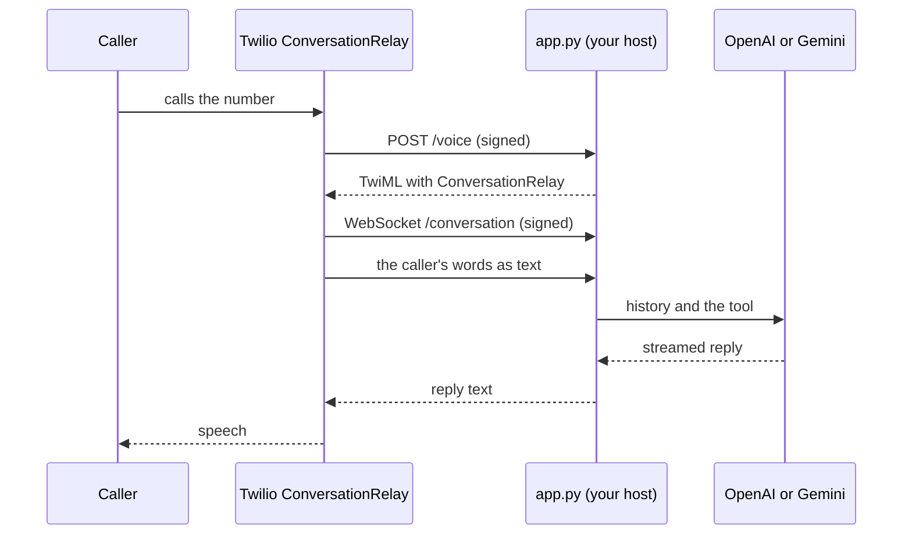

# twilio-conversation-relay

A front desk that answers a Twilio phone number. Twilio ConversationRelay
listens and speaks. A small Python app you host does the thinking, runs one
tool, and hangs up when the caller is done.

It is the smallest complete package for one question: **how do I put an agent
on a Twilio number with ConversationRelay, and host it myself?** One agent, one
read-only tool (`opening_hours`) and the builtin `end_call`. Nothing else.

The route is `conversation-relay` on carrier `twilio`. There is no browser loop:
Twilio can only call a public https origin, so the first real test is a phone
call. The app thinks with OpenAI. [Use Gemini instead](#use-gemini-instead)
shows the one block you change.

On this page:

- [Quickstart](#quickstart) - every command in order
- [How a call flows](#how-a-call-flows) - who does what
- [Before you start](#before-you-start) - accounts, the AI addendum, a test number
- [Compile and run the app](#compile-and-run-the-app) - the standalone build
- [Host it](#host-it) - what the public origin must do
- [Point the number at it](#point-the-number-at-it) - `unmute deploy`
- [Make the call](#make-the-call) - the tool, an interruption, the hangup
- [Use Gemini instead](#use-gemini-instead) - switch, recompile, rehost
- [Use another Twilio region](#use-another-twilio-region) - Ireland or Australia
- [Put the old route back](#put-the-old-route-back) - the rollback snapshot
- [Files](#files) - what each file holds
- [What it does not do](#what-it-does-not-do) - the limits of this route
- [Troubleshooting](#troubleshooting) - when something goes wrong
- [Where to go next](#where-to-go-next) - pages and packages

## Quickstart

```sh
unmute validate examples/twilio-conversation-relay
unmute compile examples/twilio-conversation-relay
cp examples/twilio-conversation-relay/build/twilio/.env.example \
   examples/twilio-conversation-relay/.env        # then fill it in

# on the host, from the build folder:
cd examples/twilio-conversation-relay/build/twilio
uv run --env-file ../../.env python app.py

# back where the package is, once the origin answers:
unmute deploy examples/twilio-conversation-relay --target twilio --dry-run
unmute deploy examples/twilio-conversation-relay --target twilio
```

Then call the number. Each step is explained below.

To start your own package the same way, `unmute init my-desk --target twilio`
writes this shape with a starter prompt and only `end_call`.

## How a call flows



1. Twilio receives the call and asks `/voice` what to do.
2. The app answers with TwiML that connects the call to ConversationRelay
   ([`<ConversationRelay>`](https://www.twilio.com/docs/voice/twiml/connect/conversationrelay)).
3. ConversationRelay opens a WebSocket to `/conversation`. Deepgram turns the
   caller's speech into text, and ElevenLabs turns the app's text into speech,
   both inside Twilio.
4. The app sends the conversation to the model, runs `opening_hours` when the
   model asks, and streams the reply back as text
   ([WebSocket messages](https://www.twilio.com/docs/voice/conversationrelay/websocket-messages)).
5. When the session ends, Twilio calls `/connect-action` and the app hangs up.

The app owns the conversation and the model call. Twilio owns the phone line and
the speech. Twilio's own tutorials show the same split for
[OpenAI](https://www.twilio.com/en-us/blog/developers/tutorials/product/integrate-openai-twilio-voice-using-conversationrelay-python)
and [Gemini](https://www.twilio.com/en-us/blog/developers/tutorials/product/integrate-google-gemini-twilio-voice-conversationrelay).
This app goes further than those tutorials: it streams every reply, checks every
signature, and keeps only the heard part of an interrupted reply.

## Before you start

You need:

- `unmute`, and `uv` with Python 3.12 on the machine that runs the app.
- A Twilio account with one voice number you can use for tests. Do not use a
  number that real callers depend on.
- An `OPENAI_API_KEY`
  ([Chat Completions](https://developers.openai.com/api/reference/resources/chat)).
  For Gemini, a `GOOGLE_API_KEY` instead, see [Use Gemini instead](#use-gemini-instead).
- A host that Twilio can reach at a public https origin, see [Host it](#host-it).

Turn ConversationRelay on for the account once
([ConversationRelay onboarding](https://www.twilio.com/docs/voice/conversationrelay/onboarding)):

1. In the Twilio Console, open Voice, Settings, Privacy & Security. In the
   legacy Console it is Voice, Settings, General.
2. Accept the Predictive and Generative AI/ML Features Addendum, and save.

Skip the guide's TwiML App steps. This package points the number's own voice
webhook at the app, and `unmute deploy` refuses a number that has a TwiML App.

Collect four values from the Console. Their names are the connection's, in
`connections/twilio_relay.yaml`:

| Name | Where it comes from | Who reads it |
|---|---|---|
| `TWILIO_ACCOUNT_SID` | Account Info on the Console home page | the app and deploy |
| `TWILIO_AUTH_TOKEN` | Account Info, next to the SID | the app and deploy |
| `TWILIO_PUBLIC_URL` | your host's https origin, no path, for example `https://relay.example.com` | the app and deploy |
| `TWILIO_PHONE_NUMBER_SID` | the number's page in Phone Numbers, Manage, Active Numbers (`PN` and 32 characters) | deploy only |

## Compile and run the app

```sh
unmute validate examples/twilio-conversation-relay
unmute compile examples/twilio-conversation-relay
```

`compile` writes a standalone app to `build/twilio/`: `app.py`, the TwiML
template, the tool handler, `pyproject.toml` with exact pins, a `Dockerfile`
and a runbook `README.md`. The app installs one model SDK, the one the think
binding names.

Put the values in the package's `.env`. The generated `.env.example` lists every
name the app reads:

```sh
cp examples/twilio-conversation-relay/build/twilio/.env.example \
   examples/twilio-conversation-relay/.env
```

Fill in `TWILIO_ACCOUNT_SID`, `TWILIO_AUTH_TOKEN`, `TWILIO_PUBLIC_URL` and
`OPENAI_API_KEY`, and uncomment `TWILIO_PHONE_NUMBER_SID` for deploy. Never
commit `.env`.

Start the app from the build folder:

```sh
cd examples/twilio-conversation-relay/build/twilio
uv run --env-file ../../.env python app.py
```

Or as an image:

```sh
docker build -t twilio-conversation-relay .
docker run --env-file ../../.env -p 8080:8080 twilio-conversation-relay
```

The app listens on port 8080 (`PORT` changes it). It refuses to start while a
name it reads is empty. `GET /healthz` answers with the build's `artifact_id`.

## Host it

Unmute does not host the app. Any host works if it does all of this:

- Serves the app at a public **https** origin with a valid certificate. Twilio
  calls `https://<origin>/voice` and `https://<origin>/connect-action`, and opens
  `wss://<origin>/conversation`.
- Passes WebSocket upgrades through on `/conversation`, and keeps an idle
  connection open for the length of a call.
- Forwards the path and query unchanged. The app checks every
  `X-Twilio-Signature` against `TWILIO_PUBLIC_URL` plus the exact path
  ([webhook security](https://www.twilio.com/docs/usage/security)), so
  `TWILIO_PUBLIC_URL` must be exactly the origin Twilio calls, with no path.
- Runs **one** process. Call slots and interruptions live in that process, so
  do not run two copies behind one number. `capacity.max_sessions` in
  `agent.yaml` (5 here) is how many calls it takes at once. When it is full,
  `/voice` answers `<Hangup/>`.
- Sets the app's four runtime names in the host's environment: the three
  `TWILIO_*` names above except the number SID, and the model key.

For a first test, the app can run on your laptop behind a tunnel that gives an
https origin and passes WebSockets through. Set `TWILIO_PUBLIC_URL` to the
tunnel's origin.

Check it from anywhere:

```sh
curl https://relay.example.com/healthz
```

## Point the number at it

```sh
unmute deploy examples/twilio-conversation-relay --target twilio --dry-run
unmute deploy examples/twilio-conversation-relay --target twilio
```

`--target twilio` is required. A bare `unmute deploy` means an SLNG deploy.
Deploy reads the four `TWILIO_*` names from the shell or the package's `.env`.
It needs no model key and uploads nothing. Before it writes, it checks three
things:

- The number takes voice calls and has no TwiML App, SIP trunk or voice
  fallback URL. It never clears one of these for you. Clear them in the
  Console first.
- The host's `/healthz` names this build's `artifact_id`.
- A `POST /voice` signed with your Auth Token answers this build's TwiML.

Then it saves the old voice URL to a private file under your user config
directory (`unmute/twilio-rollback/`), and sets only `VoiceUrl` and
`VoiceMethod` on that one number
([IncomingPhoneNumber](https://www.twilio.com/docs/phone-numbers/api/incomingphonenumber-resource)).
It reads the number back and writes `build/twilio/deploy-report.json`. The
dry run writes nothing at all.

A successful run ends like this:

```text
twilio: routed +15005550006 (PN<sid>) to POST https://relay.example.com/voice
twilio: old route saved to <config dir>/unmute/twilio-rollback/PN<sid>-<time>-<n>.json
twilio: wrote build/twilio/deploy-report.json
twilio: no call was placed; call +15005550006 to check speech, the WebSocket and the hangup
```

Deploy never places a call. `call_verified` in the report stays `false`: only a
real call checks the speech path.

## Make the call

Call the number from a phone. Use a headset or the handset, not a speakerphone:
a phone line has no echo cancellation, so the agent can hear itself.

1. The agent greets you: "Hello, how can I help with the desk today?"
2. Ask "Are you open on Friday?" The agent calls `opening_hours` and answers
   from it: nine in the morning to three in the afternoon. Saturday and Sunday
   are closed.
3. Ask about Monday, and talk over the answer. The agent stops speaking, and it
   keeps only the part you heard in its history.
4. Say you are done. The agent says goodbye and calls `end_call`, which ends the
   call at once.

If something goes wrong, read the host's log first. It names the call and
session IDs and each event, never the transcript. Then read the call in the
Twilio Console (Monitor, Logs, Calls, and the Debugger for errors). The
speech settings Twilio used are in
[voice configuration](https://www.twilio.com/docs/voice/conversationrelay/voice-configuration).

## Use Gemini instead

The think model is one binding in `agent.yaml`. To think with Gemini on Vertex
AI in the EU, replace the `reasoning:` entry under `models.think` with this:

```yaml
models:
  think:
    reasoning:
      provider: google
      model: gemini-3.1-flash-lite
      params:
        vertexai: true
        location: eu
        thinking_config:
          thinking_level: MINIMAL
```

The app calls Gemini's native `generateContent` through the
[Google GenAI SDK](https://googleapis.github.io/python-genai/). It needs a
`GOOGLE_API_KEY` that is a
[Vertex AI API key](https://cloud.google.com/vertex-ai/generative-ai/docs/start/api-keys),
and a model the
[location](https://cloud.google.com/vertex-ai/generative-ai/docs/learn/locations)
serves. Without `vertexai` and `location`, the same binding uses the Gemini
Developer API. The app supports that path, but it has not been tested with a
real key yet.

Then:

1. `unmute compile examples/twilio-conversation-relay`. The new build installs
   `google-genai` in place of `openai`, and reads `GOOGLE_API_KEY` in place of
   `OPENAI_API_KEY`. Put the key in `.env` and in the host's environment.
2. Stop the old app and start the new build at the same origin. Only one build
   runs at an origin at a time. Use a second origin and a second number if you
   want both at once.
3. Run `unmute deploy ... --target twilio` again. It checks the new
   `artifact_id` against the host. An old build still running at the origin is
   refused with "recompile, rehost, then deploy". If the number already points
   at the origin, deploy reports it unchanged and writes nothing to Twilio.
4. Call again, and repeat the four steps above.

The same rule holds for any change to the package: prompt, tool, speech or
model. Recompile, rehost, then deploy.

## Use another Twilio region

Twilio handles calls in US1 by default. To keep the calls in Ireland (IE1) or
Australia (AU1), name the region in `connections/twilio_relay.yaml`:

```yaml
transport: conversation-relay
carrier: twilio
region: ie1
environment:
  # unchanged
```

Three things change with the region
([Twilio Regions](https://www.twilio.com/docs/global-infrastructure/understanding-twilio-regions)):

1. `TWILIO_AUTH_TOKEN` must be that region's Auth Token. In the Console, open
   API keys & tokens and pick the region. The US1 token is refused there, and
   the app checks signatures with the same token.
2. The number must route its calls to that region. Set it on the number's
   Regional tab in the Console. The change can take five minutes. Deploy checks
   it and refuses a mismatch. It never changes the routing for you.
3. Deploy writes the number's settings in that region, on
   `api.dublin.ie1.twilio.com` or `api.sydney.au1.twilio.com`. Each region keeps
   its own copy, so the US1 copy stays as it was.

Recompile, rehost and deploy as for any other change. No call has been placed
in IE1 or AU1 yet. Twilio lists ConversationRelay in both, but does not say
whether Deepgram and ElevenLabs run there.

## Put the old route back

Deploy printed the snapshot path. The file holds the exact old URL, which can
carry a secret, so only you can read it.

1. Open the number in the Twilio Console. Check that "A call comes in" is still
   a webhook to the snapshot's `new_voice_url` with `HTTP POST`, and that the
   number has no TwiML App, SIP trunk or fallback URL. If anything differs,
   somebody changed the number after the deploy. Stop, and decide with them.
2. Set "A call comes in" back to the snapshot's `voice_url` and `voice_method`,
   and save.

## Files

| File | What it holds |
|---|---|
| `agent.yaml` | The agent, its three models, the greeting, the phone channel and capacity. |
| `instructions.md` | The prompt: answer hours only from the tool, speak for the phone. |
| `tools/opening_hours.yaml` | The tool's flat input and output schemas. |
| `handlers/opening_hours.py` | The handler: a fixed weekly table. |
| `tools/end_call.yaml` | The builtin that ends the call. |
| `targets.yaml` | One `twilio` target on the `twilio_relay` connection. |
| `connections/twilio_relay.yaml` | Transport `conversation-relay`, carrier `twilio`, and the four environment names. |

## What it does not do

The twilio target runs this shape and refuses the rest before it writes a file,
with the reason:

- One agent. No tasks, handoffs, transfers or saved state.
- Local tools with flat inputs and outputs, and `end_call`. No webhook, MCP or
  hosted tools.
- Deepgram and ElevenLabs inside ConversationRelay. Turn settings are
  `speechTimeout`, `interruptSensitivity` and `ignoreBackchannel` only.
- OpenAI Chat Completions or Gemini `generateContent`. No fallback model, no
  custom endpoint, no tracing.
- One process. No autoscaling.

For any of those, see [salon-concierge](../salon-concierge/) on LiveKit or
Pipecat.

## Troubleshooting

| Symptom | Cause | Fix |
|---|---|---|
| The app exits at start and names a variable | A name it reads is empty | Fill it in `.env` or the host's environment |
| Deploy: "names no build" or "runs build ..." | The host runs another build | Recompile, rehost, then deploy |
| Deploy: "refused a signed /voice" | The host's Auth Token, account or public URL differ from yours | Use the same four values on both sides |
| Deploy: "configured by TwiML App", "SIP trunk" or "fallback URL" | The number has one | Remove it in the Console, then deploy again |
| Deploy: "the write's outcome is unknown" | The write timed out or the readback failed | Check the number in the Console, then run with `--dry-run` |
| The call says an application error occurred | Twilio could not reach `/voice` or the WebSocket | Check `/healthz` from outside, and that the proxy passes WebSockets |
| The call fails after `/voice` answered | ConversationRelay is not on for the account, or the WebSocket was refused | Accept the addendum ([Before you start](#before-you-start)), then read the Twilio Debugger and the host log |
| The agent interrupts itself | A speakerphone feeds its voice back | Use a headset or the handset |
| Calls hang up at once | Every call slot is busy | Wait, or raise `capacity.max_sessions` |

## Where to go next

- [The Twilio target](../../docs-site/targets/twilio.mdx) - every key it takes and refuses.
- [Take a call with ConversationRelay](../../docs-site/telephony/twilio-conversation-relay.mdx) - this walkthrough on the docs site.
- [`unmute deploy`](../../docs-site/reference/cli/deploy.mdx) - the command reference.
