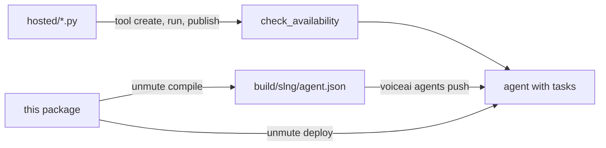

# slng-tasks

The slng target's task acceptance package. One agent with two tasks and a group:

- `verify_identity` runs from its own `when:` and confirms `phone_number`.
- `take_booking` runs only inside the `book` group. It calls `check_availability`,
  a hosted code tool that no agent lists, so SLNG attaches it hidden from the
  main agent.
- `book` skips `verify_identity` once the number is confirmed.

`hosted/check_availability.py` is that tool's source, which `voiceai tool create`
uploads. `hosted/check_availability.sample.json` is the input for its one
proving run.

It deploys as `slng-tasks-test-slng` to `eu-west`, on the three models a
working managed agent runs there.

## How to test it



1. The tool goes from the Python file to a published version with the new
   `voiceai tool` commands.
2. The package compiles, and the unreleased `voiceai` pushes it directly. That
   proves the task tool rewrite before any release.
3. `unmute deploy` pushes it through the guarded path, which is what users run.
4. After the voiceai release, the same deploy runs on the released binary.

Every command runs from the root of the unmute checkout.

### 0. Set up

```sh
# One key for both CLIs, so every read and write is the same organisation.
export SLNG_API_KEY=...            # Nicola Croon's Workspace
export VOICEAI_API_KEY="$SLNG_API_KEY"

# The voiceai branch, built as the binary that ships.
SDKS=../slng_sdks                  # your voiceai checkout
git -C "$SDKS" fetch origin && git -C "$SDKS" switch feat/push-task-tool-refs
(cd "$SDKS" && bun install && cd cli && bun test && bunx tsc --noEmit -p . && bun run build)
export PATH="$PWD/$SDKS/cli/bin:$PATH"   # use an absolute path if SDKS is not relative
voiceai --version

# The unmute branch.
git switch feat/slng-managed-tasks && make build
bin/unmute --version
```

If `voiceai whoami` fails with "Couldn't reach SLNG to check your key",
`api.slng.ai` is still down. Run `export VOICEAI_BASE_URL=https://eu-west.api.slng.ai`
and carry on.

### 1. The tool, from Python to a published version

```sh
H=internal/voice-agents-tests/slng-tasks/hosted

voiceai tool create "$H/check_availability.py" \
  --description "Check whether a day has a free slot for a service."
# Expected: "created check_availability <id>" and "arguments day (string), service (string)".
# The tool already exists in Nicola Croon's Workspace from the first run, so
# there the expected answer is a refusal naming `tool update`. Then run:
voiceai tool update check_availability --file "$H/check_availability.py"

voiceai tool run check_availability --input "$H/check_availability.sample.json" --confirm-side-effects
# Expected: "status succeeded" and "validation valid".

voiceai tool publish check_availability
# Expected: "published check_availability version N".
```

Three refusals, each with no request sent:

```sh
printf '' > /tmp/empty.py && voiceai tool create /tmp/empty.py
# Expected: "/tmp/empty.py is empty", exit 1.
voiceai tool create "$H/check_availability.py" --name "bad name"
# Expected: "is not a tool name", exit 1.
voiceai tool create "$H/check_availability.py" --name ok --dependency 'orjson>=3'
# Expected: "is not an exact pin", exit 1.
```

### 2. Push the package with the unreleased voiceai

```sh
PKG=internal/voice-agents-tests/slng-tasks
bin/unmute compile "$PKG"

voiceai agents push "$PKG" --dry-run --json \
  | jq '{ok, agent, refs: [.refs[] | {name, reused, visible_to_agent}], blockers}'
# Expected: ok true, no blockers, check_availability with visible_to_agent false.

voiceai agents push "$PKG" --json | jq '{ok, agent, version}'
# Expected: ok true, action "create" the first time.
voiceai agents push "$PKG" --json | jq .version
# Expected: "unchanged". The update path validates differently, so the second
# push is the one that proves the body round-trips.
```

Read the agent back. Every id a task lists must be an attachment on the agent,
and the task-only one must be hidden:

```sh
ID=$(voiceai agents list --json | jq -r '.[] | select(.name=="slng-tasks-test-slng") | .id')
voiceai agents get "$ID" --json | jq '{
  attached: [.tool_refs[] | {attachment_id, visible_to_agent}],
  tasks:    [.tasks[] | {name, tools}],
  groups:   [.task_groups[].name],
  types:    [.runtime_variables[] | {name, type, confirm}]
}'
# Expected: take_booking.tools holds one id, and that id is the attachment with
# visible_to_agent false. phone_number has type "Phone | None" and confirm
# "verify_identity". booking has type "Booking | None".
```

### 3. Deploy through unmute, the guarded path

```sh
bin/unmute deploy "$PKG" --dry-run
bin/unmute deploy "$PKG"
bin/unmute deploy "$PKG"
# Expected: the organisation is named, check_availability and end_call resolve
# to published versions, and the second real run changes nothing.
```

An old voiceai must be refused before anything is written:

```sh
PATH="/opt/homebrew/bin:$PATH" bin/unmute deploy "$PKG" --dry-run
# Expected, with voiceai 0.1.18: "does not write attachment ids into tasks,
# so SLNG would refuse this agent's tasks: upgrade it with
# `brew install slng-ai/tap/voiceai`".
```

Release voiceai once 1 to 3 pass.

### 4. After the voiceai release

```sh
brew upgrade voiceai && hash -r && which voiceai && voiceai --version
make test && make lint
bin/unmute deploy internal/voice-agents-tests/slng-tasks
```

Then open the agent in the SLNG dashboard, start a web session, and ask to book
a cut next Wednesday. The agent should confirm your number, say "Let me have a
look.", and call `check_availability`. Wednesday 2026-10-07 is free. A Sunday
is refused, and so is colour on a Monday.

### Clean up

`unmute-tasks-test-slng` (`767c2617-8967-4357-806b-aec0299a6b00`) is the
scratch agent from the first live run, and nothing deploys it any more:

```sh
voiceai agents delete 767c2617-8967-4357-806b-aec0299a6b00
```
