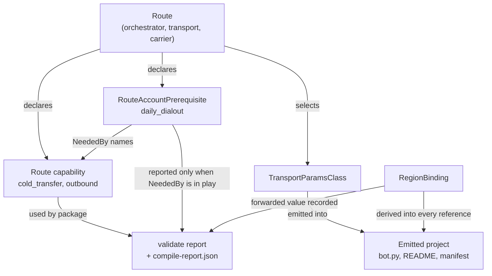
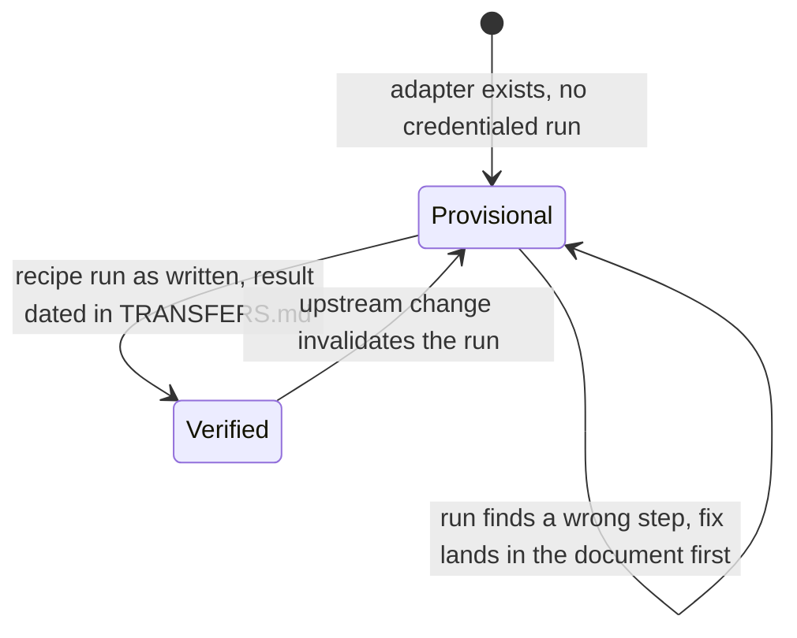

# Phase 1 Data Model: Pipecat Cloud telephony on the Daily route

No database and no persisted state. These entities are Go literals in `internal/target`, values threaded through the IR, and rows in the compile report. They are modelled here because the rules between them are what the tests have to enforce.

## Entity: RouteAccountPrerequisite

A platform feature the provider grants on request rather than by default, which a route cannot work without. New in this feature.

| Field | Type | Required | Notes |
|---|---|---|---|
| `Name` | string | yes | Short identifier, `snake_case`. Example: `daily_dialout`. |
| `Summary` | string | yes | One plain sentence an author can act on. States what to ask for and from whom. |
| `NeededBy` | list of feature or control names | yes | Which route capabilities require it. Empty is invalid: a prerequisite nothing needs must not exist. |
| `Docs` | URL | yes | The provider page that documents it. |
| `Verified` | date | yes | When the claim was last checked against that page. |

**Rules.**

- Lives on the route in `internal/target` and nowhere else. Neither the emitter nor any document may hold a second copy. Principle III.
- `NeededBy` drives whether the prerequisite is reported. A package that uses none of the named capabilities must not see it. This is what makes the report honest instead of a standing banner.
- It carries **no tag**. It is not a capability and must not be given `core`, `warn`, `gated`, or `provisional`. See research D3.
- `Verified` and `Docs` are both mandatory, matching how every other provider claim in the rulebook is recorded.

**Instances this feature adds.** Exactly one: `daily_dialout` on the Pipecat Daily route, needed by `cold_transfer` and by outbound calling.

## Entity: TransportParamsClass

Which parameter object the generated `bot.py` constructs for a transport key. Currently implicit in the template; becomes explicit so it can be tested.

| Field | Type | Required | Notes |
|---|---|---|---|
| `Key` | string | yes | The transport key in the generated map: `webrtc`, `daily`, or the carrier name. |
| `Class` | string | yes | The Python class the factory returns. |
| `Import` | string | yes | Where that class comes from. Travels with `Class` so an emitted class cannot lose its import. |

**Rules.**

- On the Daily route, the `daily` key uses the Daily-specific class, because the framework assigns inbound call fields onto whatever the factory returns and the generic class rejects them. Research D1.
- Every other key keeps the generic class. Research D2.
- `Class` and `Import` are one unit. This mirrors the existing catalogue invariant, where class, import, and install travel together precisely so a generated class structurally cannot drop its import.
- The class must be able to accept inbound call fields on any route that can receive a phone call. That is the property the test asserts, not the class name, so the test still means something if the framework renames the class.

## Entity: RegionBinding

Where the agent runs, and everything that must agree with it. Exists today as `DeploymentRegions` on the resolved target; this feature adds the agreement rules.

| Field | Type | Required | Notes |
|---|---|---|---|
| `Region` | string | no | Forwarded as declared, never checked against a list. Absent means the provider default applies. |
| `AppliesTo` | list of emitted references | yes | Every place the region has to appear consistently. |

**Rules.**

- Declared once in the package. Every emitted reference derives from it; none is authored separately.
- `AppliesTo` for this route is the deploy manifest region line and the credential-store command. Both already derive correctly today, so the rule is a regression guard rather than new behaviour. Research D4.
- More than one region stays gated, per the existing rule in `internal/ir/validate.go`.
- When absent, the emitted instructions must state which region applies by default **and** that the credential store follows the same default. Two facts, because they fail independently: a store created in the wrong region cannot be read by the agent, and the failure names neither side.
- The value appears in the compile report, because Principle II requires every forwarded-unchecked value to be inspectable.

## Entity: TransferAttemptGuard

The per-call record that a transfer has already been attempted. Added 2026-08-12 after `/speckit-analyze` found spec FR-008 had no coverage and no implementation on the Daily route.

| Field | Type | Required | Notes |
|---|---|---|---|
| `Scope` | `shared_store` or `in_process` | yes | Which mechanism the route uses. |
| `Lifetime` | duration or `call` | yes | The shared store expires records; the in-process guard lasts the call. |

**Rules.**

- The **observable property is the same on every route**: a second transfer request in the same call produces no second attempt. Tests assert the property, not the mechanism, so a route changing mechanism does not need its test rewritten.
- The carrier websocket routes use the shared control store, which already exists and holds bounded, expiring control records as the constitution requires.
- The Daily route uses an in-process guard, because it declares no shared store and must not gain one: `contracts/artifacts.md` forbids that service on this route and the constitution forbids an idle one. One process serves one call here, so in-process is sufficient rather than a compromise.
- A guard that outlives the call would be a leak; a guard that resets mid-call would be a defect. Both are the same test.

## Entity: DeploymentStance

Which hosting a document is talking about. Not code. Modelled because the two documents being corrected currently conflate two things, and the fix is a distinction rather than a deletion.

| Field | Type | Required | Notes |
|---|---|---|---|
| `Scope` | `local` or `remote` | yes | Which of the two any statement is about. |
| `RequiresCloudAccount` | bool | yes | `local` is false. `remote` is true. |
| `Dated` | date | yes | Stance changes are dated and appended, never rewritten in place. |

**Rules.**

- Every statement about hosting in `docs/DEPLOYMENT.md` and `docs/TELEPHONY.md` must be attributable to one scope. A sentence a reader cannot place is the defect being fixed.
- The `local` stance stays true and must not be deleted. Research D5.
- The superseded `remote` stance stays visible as history.

## Relationships

## Rules that cross entities

These are the ones an agreement test has to enforce, because each is a fact that would otherwise exist in two places.

1. **A prerequisite is reported if and only if the package uses something in its `NeededBy`.** Covers both directions: present when needed, absent when not.
2. **A route that can receive a phone call emits a parameter class that accepts inbound call fields.** Stated as a property so it survives an upstream rename.
3. **Every emitted region reference resolves from one declared value.** No second authored region anywhere.
4. **The rulebook, the emitted project, and `docs/user/` agree on what the route supports.** The existing emitter-versus-capability-table agreement test extends to cover prerequisites.
5. **No new authoring field exists.** Asserted against the derived authoring schema, so adding one later fails a test and forces the decision back into the open rather than arriving as a quiet patch. Spec FR-030 carries this; before 2026-08-12 the rule was stated here and in `contracts/authoring.md` with no requirement and no task behind it, which is exactly the "stated twice with nothing enforcing it" shape Principle III exists to prevent.
6. **A second transfer request produces no second attempt**, on every route that emits a transfer tool, asserted as a property rather than per mechanism.
7. **Every in-repository example emits identical output before and after this feature**, unless it fails with a message naming what to change. Spec FR-031.

## State transitions

Only one thing in this feature has states: the route's proof status, which is existing machinery.

Provisional is internal maturity tracking recorded in `compile-report.json`. It is never printed as a runtime warning, per the constitution.
