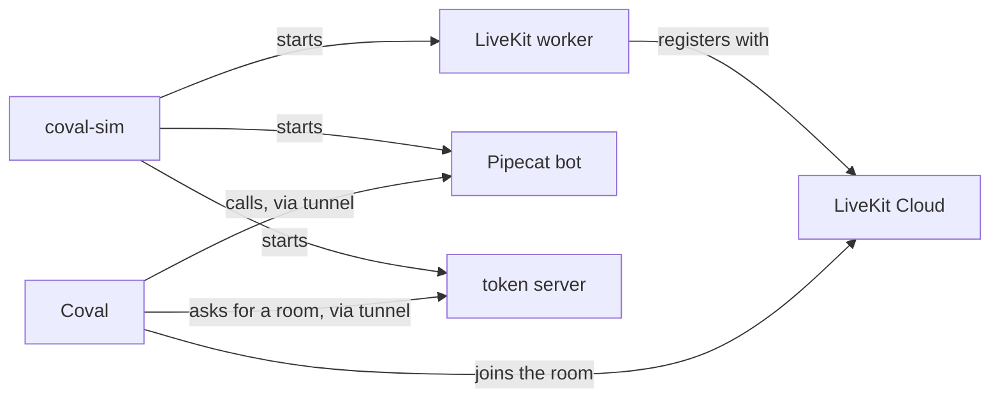

# coval-sim

Coval places simulated phone calls to the examples, running on your laptop, and
grades them. Run it before a release, or after a change to what an example says
or does.

```sh
make sim TEST_SET=KG5MJ39q
```

```
FAIL  salon-concierge  livekit  test set KG5MJ39q  run EuUuQKTSmJyHo5oBBi4REZ
      call WMeqUFWHyitVbfLYx2Q5qY: Verification digit-readback compliance answered NO
      log: /var/folders/.../coval-sim-rq0wjtjr/salon-concierge-livekit.log
FAIL  salon-concierge  pipecat  test set KG5MJ39q  run X7pm86watAttnPgRsqo72B
      call ScpMHKjZ59me2CLF5fioEh: Booking action correctness answered NO
      log: /var/folders/.../coval-sim-rq0wjtjr/salon-concierge-pipecat.log
```

One row per run, starting `ok` or `FAIL`. The command exits 1 if any row failed.

## How it works



1. The tool asks Coval which agents the test set is attached to. An agent named
   `unmute-salon-concierge-livekit` means "the salon example, LiveKit target".
2. It compiles a scratch copy of each example. The copy's name gets `-sim`, so a
   deployed worker with the real name never takes a simulated call.
3. It starts the LiveKit worker and the Pipecat bot on this laptop.
4. It opens two cloudflared tunnels: one to a small token server for LiveKit,
   one to the Pipecat bot.
5. It writes the new tunnel addresses into the Coval agents, then launches one
   run per agent and test set.
6. It waits, reads every call back, and prints the rows. Then it stops
   everything it started.

## Set it up once

1. Install the tools: `coval`, `cloudflared`, `uv` and `go` must be on your PATH.
2. Put these in the repository-root `.env`:

   ```sh
   COVAL_API_KEY=...
   LIVEKIT_URL=wss://slng-atlas-6sw2n5o2.livekit.cloud
   LIVEKIT_API_KEY=...
   LIVEKIT_API_SECRET=...
   ```

   Every provider key the examples use comes from the same `.env`. A key only one
   example needs goes in that example's own `.env`, which wins.
3. Make sure Coval has a persona named `Standard Customer`, or pass `--persona`.

## Cover a new example

1. Create its two Coval agents:

   ```sh
   uv run --project utils/coval_sim coval-sim add customer-intake
   ```

   This prints `created`, `exists` or `skipped` for each target. The connection
   settings it writes are placeholders. Every run replaces them.
2. In Coval, build a test set and metrics for it, and attach both to the two
   agents. The Coval skills help: `build-test-suite`, `configure-metrics`.
   Install them with `npx skills add coval-ai/coval-external-skills`.
3. Run it: `make sim TEST_SET=<the test set id>`.

To run one test set against two examples, attach it to both examples' agents.

## Run it

| What you want | Command |
|---|---|
| Every test set attached to any example | `make sim` |
| One test set | `make sim TEST_SET=KG5MJ39q` |
| Several test sets | `make sim TEST_SET="KG5MJ39q abc12345"` |
| One target only | `uv run --project utils/coval_sim coval-sim run KG5MJ39q --target livekit` |
| More calls per test case | `... coval-sim run KG5MJ39q --iterations 3` |
| Another caller | `... coval-sim run KG5MJ39q --persona "Impatient Customer"` |

`--concurrency` sets how many calls run at once in each run. The default is 3.
Each run takes about three to six minutes, and every call costs Coval credits and
provider usage.

## Read a failed row

A row fails for three reasons:

| The row says | What it means | What to do |
|---|---|---|
| `call ... FAILED: <error>` | The call did not finish | Read the `log:` file named under the row |
| `the agent never spoke` | Coval connected, the agent stayed silent | Read the log. A silent agent passes most "did not do X" metrics, so this check exists |
| `<metric> answered NO` | The agent finished, and a yes/no metric said no | Read the transcript before you trust it |

Write every yes/no metric so that YES means the agent did the right thing. A
metric like "Identity Question Asked Twice" is backwards, and a good call fails
on it.

To read a call's transcript:

```sh
coval --format json simulations get <call id>
```

The scratch folder named in the `log:` line also holds:

| File | What is in it |
|---|---|
| `<example>-livekit.log` | The LiveKit worker. Look for `received job request` |
| `<example>-pipecat.log` | The Pipecat bot. Look for `POST TWILIO XML` and `WebSocket connection accepted` |
| `token-server.log` | Every token request from Coval, with its simulation ID |
| `tunnel-<port>.log` | cloudflared |

## When something does not work

| Symptom | Cause |
|---|---|
| Every LiveKit call fails with "did not produce a transcript" | The token dispatched no agent. Check `token-server.log`: the body must carry `agent_name`. Coval never sends `room_config`, so the tool puts the name in the agent's `token_request_payload` |
| `cloudflared on port ... was not ready` | Cloudflare did not register the tunnel within two minutes. Run it again |
| `Missing environment for a phone call: <NAME>` in the Pipecat log | The example needs a value in its own `.env` |
| `no unmute-<example>-<target> agent has this test set attached` | Attach the test set to the agents in Coval |
| `Coval agent ... exists, but <example> has no <target> target` | The Coval agent names a target the example does not declare. Delete that agent, or add the target |

## What it does not do

- It does not run in CI. It needs a laptop, network, tunnels and real keys. CI
  runs only the tests in `tests/`, which need none of that.
- It does not test the SLNG hosted target (`hotel-concierge`). Nothing of that
  target runs locally.
- Pipecat traces do not link to their Coval run. The runner's webhook reply
  carries no simulation ID and no caller number.

## Develop it

```sh
cd utils/coval_sim
uv run pytest
uv run --with ruff ruff check .
uvx ty check
```
